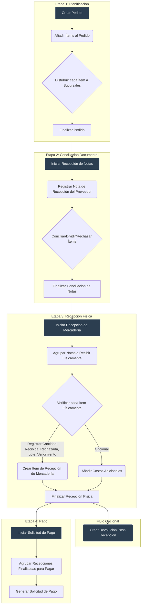

# Manual de Implementación Frontend: Flujo de Compras Refactorizado (Versión 2.0)

## 1. Introducción y Filosofía

Este documento es la guía definitiva para el desarrollo de la interfaz de usuario (UI) del módulo de compras. El nuevo backend está diseñado bajo un principio de **desacoplamiento de responsabilidades**, separando claramente la *planificación* (el pedido), la *realidad documental* (la nota del proveedor) y la *realidad física* (la mercadería recibida).

La UI debe reflejar esta separación, guiando al usuario a través de un flujo lógico y granular, donde cada etapa es un evento discreto y auditable. El estado del proceso se gestiona principalmente a través de la entidad `ProcesoEtapa`.

## 2. Diagrama de Flujo Conceptual



---

## 3. Flujo de Trabajo Detallado

### **Etapa 1: Creación del Pedido (Planificación)**

-   **Objetivo:** Crear una orden de compra formal con todos los detalles de los productos solicitados y su distribución planificada.
-   **Entidades Clave:** `Pedido`, `PedidoItem`, `PedidoItemDistribucion`, `ProcesoEtapa`, `PedidoSucursalInfluencia`, `PedidoSucursalEntrega`.

#### Flujo de Trabajo:
1.  **Iniciar Creación:**
    *   El usuario selecciona un `Proveedor`, `Moneda` y `FormaPago`. Si es a plazo, debe indicar los `plazoCredito` (días).
    *   La UI debe permitir seleccionar múltiples sucursales de **entrega** (`PedidoSucursalEntrega`) y de **influencia** (`PedidoSucursalInfluencia`).
    *   Al guardar esta cabecera, se crean registros en `Pedido`, `PedidoSucursalEntrega` y `PedidoSucursalInfluencia`.
    *   Simultáneamente, se crea un registro en `ProcesoEtapa` con `tipo_etapa` = `CREACION`, y `estado_etapa` = `EN_PROGRESO`.

2.  **Añadir Ítems (`PedidoItem`):**
    *   El usuario busca y añade productos. Por cada uno, se crea un `PedidoItem` con:
        *   `productoId`, `cantidadSolicitada`, `precioUnitarioSolicitado`, `vencimientoEsperado`, `observacion`.
        *   **Bonificación:** La UI debe incluir un checkbox para marcar el ítem como `esBonificacion`. Si está marcado, el `precioUnitarioSolicitado` debe ser `0`.

3.  **Distribuir Ítems (`PedidoItemDistribucion`):**
    *   Por cada `PedidoItem`, la UI debe permitir su distribución a las sucursales definidas como de **entrega**.
    *   **Lógica de Discrepancia:** Si al finalizar la distribución, `sum(cantidadAsignada)` no es igual a `cantidadSolicitada`, la UI debe mostrar un diálogo: *"La cantidad distribuida (X) no coincide con la solicitada (Y). ¿Desea actualizar la cantidad solicitada a X?"*. Esto permite al usuario corregir la solicitud original basándose en la distribución.

4.  **Finalizar Etapa de Creación:**
    *   El usuario hace clic en "Finalizar Pedido".
    *   **Validación Suave:** A diferencia de antes, **no es obligatorio** que todos los ítems estén distribuidos para finalizar esta etapa.
    *   **Backend:** Actualiza el `ProcesoEtapa` de `CREACION` a `COMPLETADA` y el de `RECEPCION_NOTA` a `PENDIENTE`.
    *   **UI:** El pedido se vuelve de solo lectura y avanza a la siguiente etapa.

---

### **Etapa 2: Recepción de Notas (Conciliación Documental)**

-   **Objetivo:** Registrar las facturas del proveedor y conciliarlas con el pedido original.
-   **Entidades Clave:** `NotaRecepcion`, `NotaRecepcionItem`, `ProcesoEtapa`.

#### Flujo de Trabajo:
1.  **Iniciar Etapa:**
    *   Al hacer clic en "Iniciar Recepción de Notas", el sistema primero valida dos condiciones:
        1.  Todos los `PedidoItem` deben tener su distribución completa (`sum(cantidadAsignada) == cantidadSolicitada`).
        2.  Si la validación falla, la UI debe mostrar un error claro indicando qué ítems necesitan ser distribuidos.
    *   Si la validación es exitosa, el `ProcesoEtapa` de `RECEPCION_NOTA` pasa a `EN_PROGRESO`.

2.  **Registrar Notas (`NotaRecepcion`):**
    *   El usuario registra los datos de la factura del proveedor.

3.  **Conciliar Ítems (`NotaRecepcionItem`):**
    *   La UI presenta una tabla de `PedidoItem` pendientes. La tabla debe tener **checkboxes** para selección múltiple.
    *   **Lógica de División de Ítems:** Un `PedidoItem` puede ser conciliado parcialmente en múltiples `NotaRecepcionItem` a través de diferentes notas.
        *   **Ejemplo:** Se piden 100 unidades. El usuario selecciona el `PedidoItem`. La UI muestra "100 unidades pendientes". El usuario crea un `NotaRecepcionItem` en la Nota A por 40 unidades. El `PedidoItem` original ahora mostrará "60 unidades pendientes" para futuras conciliaciones en otras notas.
    *   **Lógica de Rechazo Documental:** Para cada `NotaRecepcionItem` que se está creando/conciliando, la UI debe ofrecer las acciones:
        *   **Conciliar:** Crea el `NotaRecepcionItem` con estado `CONCILIADO`.
        *   **Rechazar:** Crea el `NotaRecepcionItem` con estado `RECHAZADO` y exige un `motivoRechazo`. Un ítem rechazado aquí no pasará a la etapa de recepción física.

4.  **Finalizar Etapa de Conciliación:**
    *   El usuario hace clic en "Finalizar Conciliación".
    *   **Validaciones Estrictas:**
        1.  No puede quedar ningún `PedidoItem` del pedido original sin haber sido completamente conciliado (cantidad total asignada a `NotaRecepcionItem`s) o explícitamente rechazado.
        2.  Todos los ítems deben tener su distribución de sucursales completa (doble chequeo).
    *   Si las validaciones pasan, el backend actualiza los `ProcesoEtapa`.

---

### **Etapa 3: Recepción de Mercadería (Verificación Física)**

-   **Objetivo:** Registrar el evento físico de recibir productos.
-   **Entidades Clave:** `RecepcionMercaderia`, `RecepcionMercaderiaItem`, `RecepcionMercaderiaNota`.

#### Flujo de Trabajo:
1.  **Crear Evento de Recepción (`RecepcionMercaderia`):**
    *   Tras iniciar la etapa, el usuario crea la cabecera del evento.
    *   **Lógica de Filtrado:** La UI debe permitir seleccionar `NotaRecepcion`s para agrupar. La consulta al backend para obtener esta lista debe filtrar solo notas que:
        *   Pertenezcan al mismo `Proveedor`.
        *   No hayan sido completamente recepcionadas o finalizadas.

2.  **Verificar Ítems Físicos (`RecepcionMercaderiaItem`):**
    *   Para cada `NotaRecepcionItem` (que no fue rechazado en la etapa anterior), el usuario registra la realidad física.
    *   **Rechazo y Modificación:** El usuario puede registrar una `cantidadRecibida` menor a la esperada y una `cantidadRechazada` con su `motivoRechazo`.
    *   **Impacto en el Costo:** El valor final a pagar por una `NotaRecepcion` **se basará en la suma de `precio * cantidadRecibida` de sus ítems**, no en el valor original de la nota. La UI debe reflejar esto en los resúmenes.

3.  **Finalizar Etapa Física:**
    *   Al finalizar, el backend crea los `MovimientoStock` y actualiza los costos. El `ProcesoEtapa` de `RECEPCION_MERCADERIA` se completa.

---

### **Etapa 4: Solicitud de Pago**

-   **Objetivo:** Agrupar recepciones finalizadas para generar una orden de pago.
-   **Entidades Clave:** `SolicitudPago`, `SolicitudPagoRecepcion`.

#### Flujo de Trabajo:
1.  **Agrupar Recepciones:**
    *   El usuario selecciona una o más `RecepcionMercaderia` con estado `FINALIZADA`.
2.  **Calcular y Guardar:**
    *   La UI calcula el `montoTotal` a pagar, que ya refleja las cantidades realmente recibidas (ver punto de "Impacto en el Costo" de la Etapa 3).
    *   Se guarda la `SolicitudPago`.
    *   Se completa el `ProcesoEtapa` final. Si todas las etapas están completas, el `Pedido` pasa a `CONCLUIDO`.

---

## 4. Propuesta de Implementación Visual (UI/UX) - v2

### **Principios Generales de Diseño**

-   **Componente Único:** Un componente principal `GestionComprasComponent` gestionará todo el flujo.
-   **Cabecera Persistente:** En la parte superior de la pantalla, una cabecera fija mostrará siempre la información clave del pedido (`Proveedor`, `Nro Pedido`, `Fecha`, `Monto Total`, `Estado del Proceso`), independientemente del paso actual en el stepper.
-   **Stepper Horizontal:** Debajo de la cabecera, un `mat-stepper` horizontal guiará al usuario a través de las etapas.
-   **Acciones en Tablas:** Para mantener las tablas limpias, todas las acciones por fila se agruparán dentro de un `mat-menu` (un botón con tres puntos `...` que despliega un menú).

### **Vista Principal: `GestionComprasComponent`**

#### **1. Cabecera Fija del Pedido**
-   **Contenido:**
    *   `Proveedor`: `[Nombre del Proveedor]`
    *   `Pedido Nro`: `[ID del Pedido]`
    *   `Fecha Creación`: `[Fecha]`
    *   `Estado`: Chip de color (`mat-chip`) indicando el estado general (Ej: `EN PLANIFICACIÓN`, `EN RECEPCIÓN`, `CONCLUIDO`).
    *   `Monto Total`: `[Suma de ítems]`
-   **Comportamiento:** Visible en todo momento.

#### **2. Stepper de Proceso (`mat-horizontal-stepper`)**

---

### **UI del Step 1: Datos del Pedido**

-   **Título del Step:** "1. Datos Generales"
-   **Contenido:**
    *   Un `formGroup` para los datos principales.
    *   Campos: `Proveedor` (autocomplete), `Moneda` (select), `FormaPago` (select).
    *   Campo condicional: `plazoCredito` (input numérico) si `FormaPago` es a plazo.
    *   Selects múltiples: `Sucursales de Entrega` y `Sucursales de Influencia`.
-   **Pie del Step:**
    *   Botón "Guardar y Continuar" que guarda la cabecera, valida los datos y avanza al siguiente paso.

---

### **UI del Step 2: Ítems del Pedido**

-   **Título del Step:** "2. Ítems del Pedido"
-   **Contenido:**
    *   Botón "Añadir Ítem" que abre un diálogo.
    *   **Tabla de Ítems (`mat-table`):**
        *   Columnas: Producto, Cantidad Solicitada, Precio, Bonificación, Vencimiento, **Distribución**, Acciones.
        *   **Columna "Distribución"**: Mostrará un chip (`mat-chip`) de color para indicar el estado:
            *   Verde: "Completa"
            *   Naranja: "Incompleta"
            *   Rojo: "Pendiente"
        *   **Columna "Acciones" (`mat-menu`):**
            *   "Distribuir Ítem"
            *   "Editar Ítem"
            *   "Eliminar Ítem"
-   **Diálogos:**
    *   Se mantienen los diálogos de "Añadir/Editar Ítem" y "Distribuir Ítem" de la propuesta anterior.
-   **Pie del Step:**
    *   Botón "Finalizar Planificación" para avanzar a la siguiente etapa principal.

---

### **UI del Step 3: Conciliación Documental**

-   **Título del Step:** "3. Recepción de Notas"
-   **Contenido:**
    *   Botón de inicio "Iniciar Conciliación" si la etapa está pendiente.
    *   **Layout de dos paneles (visible si está `EN_PROGRESO`):**
        1.  **Panel Izquierdo (60% ancho): Ítems del Pedido Pendientes de Conciliar**
            *   **Tabla (`mat-table`):** Muestra `PedidoItem` con cantidad > 0 por conciliar.
            *   **Selección:** Checkbox en cada fila y un checkbox "Seleccionar Todos" en la cabecera.
            *   **Columnas:** Checkbox, Producto, Cant. Pendiente, **Estado Distribución**, Acciones (`mat-menu`).
            *   **Indicador de Distribución:** Un icono de advertencia (`warning`) junto a los ítems con distribución "Incompleta" o "Pendiente".
            *   **Acciones en Ítems (`mat-menu`):**
                *   "Editar Ítem" (abre diálogo)
                *   "Dividir Ítem" (abre diálogo para conciliación parcial)
                *   "Rechazar Ítem" (abre diálogo para rechazo documental)
            *   **Botones de Acción (encima de la tabla):**
                *   "Crear nueva nota para ítems" (habilitado si se seleccionan ítems).
                *   "Asignar ítems a la nota" (habilitado si se seleccionan ítems Y una nota en el panel derecho).
                *   "Añadir Nuevo Ítem al Pedido" (botón para casos excepcionales).

        2.  **Panel Derecho (40% ancho): Notas de Recepción Registradas**
            *   **Tabla (`mat-table`):** Muestra las `NotaRecepcion` creadas.
            *   **Selección:** Al hacer clic en una fila, esta cambia de color para indicar la selección. Solo se puede seleccionar una a la vez.
            *   **Columnas:** Nro. Factura, Fecha, Total, Acciones (`mat-menu`).
            *   **Acciones en Notas (`mat-menu`):**
                *   "Editar Nota" (abre diálogo con datos de la cabecera de la nota).
                *   "Gestionar Ítems de la Nota" (abre diálogo para ver/editar/remover ítems ya asignados a esa nota).
                *   "Eliminar Nota" (con confirmación).

-   **Flujo de Trabajo y Diálogos:**
    1.  **Asignar a Nota Existente:** Usuario selecciona ítems (izquierda) -> selecciona nota (derecha) -> clic en "Asignar ítems a la nota". El sistema asigna automáticamente los ítems, copiando los datos.
    2.  **Asignar a Nota Nueva:** Usuario selecciona ítems (izquierda) -> clic en "Crear nueva nota para ítems". Se abre un diálogo para crear la nota, y al confirmar, los ítems se asignan.
    3.  **Modificar Asignación:** Para modificar cantidad/precio de un ítem en una nota, el usuario debe usar la acción "Gestionar Ítems de la Nota" y editarlo desde ahí. El diálogo de gestión debe mostrar claramente qué ítems tienen distribución pendiente.

-   **Pie del Step:**
    *   Botón "Finalizar Conciliación". Realiza validaciones estrictas antes de avanzar.

---

### **UI del Step 4: Recepción de Mercadería**

-   **Título del Step:** "4. Verificación Física"

-   **Contenido (Fase de Configuración):**
    *   Si la etapa está `EN_PROGRESO`, primero se muestra una pantalla de configuración.
    1.  **Selección de Sucursales:**
        *   Un campo `mat-select` múltiple para que el usuario elija una o más sucursales para la recepción.
        *   Los ítems a recibir se filtrarán según esta selección.
    2.  **Selección de Modo de Recepción:**
        *   Un `mat-button-toggle-group` para que el usuario elija el modo de trabajo:
            *   **Opción A: "Agrupar por Notas"**
            *   **Opción B: "Agrupar por Productos"**
    3.  **Botón de Inicio:**
        *   Un botón "Iniciar Verificación" que se habilita una vez que se han seleccionado sucursales y un modo.

-   **Layout (Modo "Agrupar por Notas"):**
    *   Una vez iniciada la verificación en este modo, se presenta un layout de dos paneles.
    1.  **Panel Derecho: Lista de Notas**
        *   Muestra una tabla con las `NotaRecepcion` que tienen ítems pendientes de recibir para las sucursales seleccionadas.
        *   Al hacer clic, la nota se resalta, indicando que está seleccionada, y se carga su contenido en el panel izquierdo.
    2.  **Panel Izquierdo: Ítems de la Nota Seleccionada**
        *   **Tabla (`mat-table`):** Muestra los `NotaRecepcionItem` de la nota y sucursales seleccionadas.
        *   **Columnas:** Producto, Cant. Esperada, Cant. Recibida, Sucursal, Acciones (`mat-menu`).
        *   **Acciones en Ítems (`mat-menu`):**
            *   **"Verificar Ítem":** Abre el diálogo de verificación.
            *   **"Rechazar Ítem":** Abre el diálogo de rechazo.

-   **Layout (Modo "Agrupar por Productos"):**
    *   *Propuesta:* Una única tabla que agrupa todos los ítems de todas las notas por producto.
    *   **Tabla (`mat-table`):**
        *   **Columnas:** Producto, Cant. Total Esperada, Cant. Total Recibida, Acciones (`mat-menu`).
        *   **Acciones en Ítems (`mat-menu`):**
            *   **"Verificar Producto":** Abre un diálogo similar al de "Verificar Ítem", pero podría mostrar un desglose de las cantidades por nota de origen.

-   **Diálogos Clave:**
    1.  **Diálogo "Verificar Ítem":**
        *   **Título:** "Verificar: [Nombre del Producto]".
        *   **Contenido:** Una tabla simple o lista que muestra las cantidades **por sucursal** (de las seleccionadas en la configuración).
        *   **Columnas del Diálogo:** Sucursal, Cantidad Esperada, Cantidad Recibida (input numérico), Cantidad Rechazada (input numérico).
        *   **Lógica:**
            *   Las cantidades `Recibida` y `Rechazada` vienen pre-cargadas (`Recibida` = `Esperada`, `Rechazada` = `0`).
            *   Si el usuario modifica cualquier cantidad, aparece un campo de texto obligatorio `Motivo de la Modificación`.
            *   El usuario puede aceptar con un solo clic si todo está correcto.
    2.  **Diálogos "Rechazar Ítem":**
        *   Permite registrar el rechazo total o parcial de un ítem, exigiendo un motivo.

-   **Pie del Step:**
    *   Botón "Finalizar Recepción Física".

---

### **UI del Step 5: Solicitud de Pago**

-   **Título del Step:** "5. Solicitud de Pago"
-   **Contenido:**
    *   Botón de inicio "Iniciar Solicitud de Pago".
    *   **Layout (visible si está `EN_PROGRESO`):**
        1.  **Tabla de Notas Disponibles (`mat-table`):**
            *   Muestra las `NotaRecepcion` con estado `FINALIZADA` que aún no han sido incluidas en una solicitud de pago.
            *   **Selección:** Checkbox en cada fila y un checkbox "Seleccionar Todos" en la cabecera.
            *   **Columnas:** Checkbox, Nro. Factura, Fecha, Monto a Pagar (calculado en base a la mercadería recibida), Estado.
            *   La tabla debe ser paginada y soportar filtros en el backend.
        2.  **Botón de Acción (encima de la tabla):**
            *   "Crear Solicitud de Pago" (habilitado si se selecciona al menos una nota).

-   **Diálogos:**
    1.  **Diálogo "Crear Solicitud de Pago":**
        *   **Título:** "Confirmar y Generar Solicitud de Pago".
        *   **Contenido (Formulario):**
            *   `Proveedor`: `[Nombre del Proveedor]` (Solo lectura).
            *   `Total a Pagar`: `[Suma de los montos de las notas seleccionadas]` (Solo lectura).
            *   `Moneda`: `mat-select` pre-cargado con la moneda del pedido (editable).
            *   `Forma de Pago`: `mat-select` pre-cargado con la forma de pago del pedido (editable).
            *   `Plazo (días)`: `input` numérico, visible y editable si la forma de pago es a crédito.
        *   **Botones del Diálogo:**
            *   "Cancelar".
            *   "Generar Solicitud".

-   **Pie del Step:**
    *   Texto indicativo: "El pedido se marcará como 'Concluido' una vez que todas las solicitudes de pago asociadas sean procesadas."

---

## 5. Estándares Técnicos y de Estilo

Esta sección define las reglas obligatorias y las guías de estilo para asegurar la consistencia, el rendimiento y la mantenibilidad de la aplicación.

### **Reglas Técnicas Obligatorias**

1.  **Prohibido el Uso de Funciones/Getters en Templates:**
    *   **Regla:** Nunca se deben usar llamadas a funciones, métodos o `getters` directamente en el template HTML (`*.html`). Esto incluye `*ngIf`, `*ngFor`, `[class]`, `{{...}}`, etc.
    *   **Razón:** Angular evalúa estas expresiones en cada ciclo de detección de cambios, causando graves problemas de rendimiento.
    *   **Solución:** Utilizar propiedades pre-calculadas en el componente (`.ts`). Cuando los datos cambien, recalcular los valores en una única función (ej. `updateComputedProperties()`) y almacenarlos en propiedades simples. Los templates solo deben hacer binding a estas propiedades.

2.  **Paginación y Filtros en el Backend:**
    *   **Regla:** Todas las listas y tablas de datos deben ser paginadas. La lógica de paginación y filtrado debe residir exclusivamente en el backend.
    *   **Razón:** Cargar grandes volúmenes de datos en el frontend para luego filtrarlos consume una cantidad excesiva de memoria y ancho de banda, y degrada la experiencia del usuario.
    *   **Solución:** Los componentes de frontend deben enviar los parámetros de paginación (página, tamaño) y los criterios de filtro al API. El backend se encarga de realizar la consulta a la base de datos y devolver solo el subconjunto de datos solicitado.

### **Guía de Estilo Visual Explícita**

Para mantener una apariencia visual coherente, los nuevos componentes deben seguir los siguientes patrones de estilo.

#### **1. Colores Principales**

| Uso                  | Color Hex | Variable (si aplica) |
| -------------------- | --------- | -------------------- |
| Fondo Primario       | `#2d2d2d` | -                    |
| Fondo Secundario     | `#3a3a3a` | -                    |
| Acento Naranja       | `#f57c00` | -                    |
| Texto Primario       | `#ffffff` | -                    |
| Texto Secundario     | `#f0f0f0` | -                    |
| Texto Tenue          | `#bbbbbb` | -                    |
| Borde Primario       | `#555555` | -                    |
| Verde (Éxito)        | `#4caf50` | -                    |
| Rojo (Error/Alerta)  | `#f44336` | -                    |

#### **2. Cabecera Principal (Componente `GestionComprasComponent`)**

La cabecera debe usar un fondo con gradiente.

```scss
.pedido-header .header-card {
  background: linear-gradient(135deg, #667eea89 0%, #764ba29a 100%);
  color: #ffffff;
  box-shadow: 0 4px 12px rgba(0, 0, 0, 0.3);
  border-radius: 8px;
}

.pedido-header .mat-card-title {
  font-size: 1.75rem;
  font-weight: 500;
}

.info-label {
  color: #f57c00;
  font-size: 1.2rem;
  font-weight: 600;
  text-transform: uppercase;
}
```

#### **3. Diálogos**

La cabecera de los diálogos debe replicar el gradiente principal.

```scss
.dialog-header {
  background: linear-gradient(135deg, #667eea 0%, #764ba2 100%);
  padding: 20px 24px;

  h2 {
    margin: 0;
    font-size: 22px;
    font-weight: 600;
    color: #ffffff;
    text-shadow: 0 1px 2px rgba(0, 0, 0, 0.3);
  }
}

.dialog-content {
  background-color: #2d2d2d;
  padding: 16px;
}
```

#### **4. Tablas (`mat-table`)**

Las tablas deben tener un estilo oscuro y limpio, con un resaltado claro para las filas seleccionadas o activas.

```scss
.mat-table {
  background-color: transparent;
}

.mat-header-cell {
  color: #f57c00; // Naranja de acento para cabeceras
  font-size: 14px;
  font-weight: 600;
  text-transform: uppercase;
}

.mat-cell {
  color: #f0f0f0; // Texto primario
  border-bottom-color: #555555; // Borde sutil
}

// Estilo para una fila seleccionada
.mat-row.selected-row, .mat-row:hover {
  background-color: rgba(245, 124, 0, 0.15); // Naranja con opacidad
}

// Estilo para el paginador
.mat-paginator {
  background-color: #3a3a3a;
  color: #bbbbbb;
}
```

#### **5. Botones (`mat-button`)**

Los botones deben seguir una jerarquía visual clara.

```scss
// Botón primario (Ej: Finalizar, Generar)
button[color="accent"].mat-raised-button {
  background-color: #f57c00;
  color: white;
  font-weight: 600;
}

// Botón secundario (Ej: Añadir)
button[color="primary"].mat-raised-button {
  background-color: #667eea;
  color: white;
}

// Botón de peligro/cancelación
button[color="warn"].mat-raised-button {
  background-color: #f44336;
  color: white;
}

// Botón estándar/de texto
button.mat-button {
  color: #f0f0f0;
}
```

#### **6. Formularios (`mat-form-field`)**

Los campos de formulario deben ser claramente visibles sobre el fondo oscuro.

```scss
.mat-form-field {
  // Color de la etiqueta flotante y la línea inferior cuando está activo
  ::ng-deep .mat-form-field-outline-thick,
  ::ng-deep .mat-form-field.mat-focused .mat-form-field-label {
    color: #667eea !important;
  }

  // Color del texto del input
  ::ng-deep .mat-input-element {
    color: #ffffff;
  }

  // Color de la etiqueta estándar
  ::ng-deep .mat-form-field-label {
    color: rgba(255, 255, 255, 0.7);
  }

  // Color de la línea inferior
  ::ng-deep .mat-form-field-underline {
    background-color: rgba(255, 255, 255, 0.42);
  }
}
```

#### **7. Chips (`mat-chip`)**

Los chips se usan para mostrar estados o contadores.

```scss
.mat-chip {
  font-weight: 600;

  &.estado-activo {
    background-color: #4caf50; // Verde
    color: white;
  }

  &.estado-pendiente, &.distribution-pending {
    background-color: #f57c00; // Naranja
    color: white;
  }

  &.estado-cancelado {
    background-color: #f44336; // Rojo
    color: white;
  }
}
```

---

## 6. Checklist de Implementación

Esta es la lista de tareas detallada para la construcción del nuevo módulo de compras. Se debe seguir en orden para asegurar una implementación estructurada.

### **Fase 1: Estructura Principal y Layout (`GestionComprasComponent`)**
-   [ ] **Layout:** Crear el componente `GestionComprasComponent` que contendrá toda la lógica.
-   [ ] **Layout:** Implementar la cabecera fija superior y el `mat-horizontal-stepper`.
-   [ ] **Layout:** Aplicar los estilos de la guía de estilo a la cabecera (gradiente, tipografía) y al stepper.
-   [ ] **Mock Data:** Crear un servicio mock o un objeto local que provea un `Pedido` de ejemplo con un `ProcesoEtapa` inicial.
-   [ ] **Lógica UI:** Cargar el pedido mock y desarrollar la lógica que controla el estado de los steps (cuál está activo, cuáles están completados o bloqueados) basándose en `ProcesoEtapa`.

### **Fase 2: Planificación del Pedido (Steps 1 y 2)**

#### Step 1: Datos Generales
-   [ ] **Layout:** Crear el formulario reactivo para los datos de la cabecera (Proveedor, Moneda, Forma de Pago, etc.).
-   [ ] **Mock Data:** Rellenar los `mat-select` (Moneda, Forma de Pago) con datos falsos.
-   [ ] **Integración Backend:** Implementar la búsqueda por autocompletado para el campo `Proveedor`.
-   [ ] **Integración Backend:** Implementar el guardado de la cabecera del pedido. Al tener éxito, se debe recibir el `Pedido` con su ID y avanzar al siguiente step.

#### Step 2: Ítems del Pedido
-   [ ] **Layout:** Crear la tabla de ítems (`mat-table`) con paginación y el `mat-menu` para las acciones por fila.
-   [ ] **Layout:** Crear el diálogo "Añadir/Editar Ítem", incluyendo todos sus campos, validaciones y la navegación por tabs interna.
-   [ ] **Layout:** Crear el diálogo "Distribuir Ítem" para asignar cantidades a las sucursales.
-   [ ] **Mock Data:** Conectar la tabla de ítems a una lista de `PedidoItem` falsos del pedido mock.
-   [ ] **Integración Backend:** Conectar la tabla de ítems para que cargue los ítems paginados del pedido actual.
-   [ ] **Integración Backend:** En el diálogo "Añadir/Editar Ítem", integrar la búsqueda de productos.
-   [ ] **Integración Backend:** Implementar la lógica para crear y actualizar un `PedidoItem`.
-   [ ] **Integración Backend:** En el diálogo "Distribuir Ítem", implementar el guardado de la distribución (`PedidoItemDistribucion`).
-   [ ] **Integración Backend:** Implementar la llamada al backend para "Finalizar Planificación", que actualiza el `ProcesoEtapa` correspondiente.

### **Fase 3: Recepción de Notas (Step 3)**
-   [ ] **Layout:** Implementar el layout de dos paneles (60% Ítems Pendientes, 40% Notas Registradas).
-   [ ] **Layout:** Implementar las dos tablas (`mat-table`) con su paginación, filtros de búsqueda, `mat-menu` y selección con checkboxes.
-   [ ] **Layout:** Implementar los botones de acción ("Asignar a Nota", "Crear Nueva Nota", "Añadir Ítem").
-   [ ] **Layout:** Crear el diálogo "Gestionar Ítems de la Nota" para ver y des-asociar ítems de una nota.
-   [ ] **Layout:** Crear los diálogos específicos para "Dividir Ítem" y "Rechazar Ítem".
-   [ ] **Mock Data:** Poblar ambas tablas con datos falsos y simular la interacción entre paneles (seleccionar ítems, seleccionar nota, habilitar botones).
-   [ ] **Integración Backend:** Implementar la carga paginada y filtrada de `PedidoItem` pendientes.
-   [ ] **Integración Backend:** Implementar la carga paginada y filtrada de `NotaRecepcion` del pedido.
-   [ ] **Integración Backend:** Implementar la lógica para asignar (asociar `notaRecepcionId` al ítem) y des-asociar (dejar `notaRecepcionId` en `null`) ítems.
-   [ ] **Integración Backend:** Implementar el flujo para crear una nueva `NotaRecepcion` y asignarle los ítems seleccionados.
-   [ ] **Integración Backend:** Implementar las acciones del `mat-menu` (división, rechazo, edición).
-   [ ] **Integración Backend:** Implementar la llamada para "Finalizar Conciliación" (actualiza `ProcesoEtapa`).

### **Fase 4: Recepción de Mercadería (Step 4)**
-   [ ] **Layout:** Crear la pantalla de configuración inicial para seleccionar sucursales y modo de recepción.
-   [ ] **Layout:** Implementar el layout de dos paneles para el modo "Agrupar por Notas".
-   [ ] **Layout:** Implementar la tabla única para el modo "Agrupar por Producto".
-   [ ] **Layout:** Crear el diálogo "Verificar Ítem", mostrando las cantidades por sucursal, los inputs y el campo de motivo.
-   [ ] **Mock Data:** Simular la selección de sucursales y la carga de datos falsos para renderizar ambos modos.
-   [ ] **Integración Backend:** Cargar los ítems a verificar filtrando por las sucursales seleccionadas.
-   [ ] **Integración Backend:** Implementar el guardado de la verificación, actualizando `cantidadRecibida`, `cantidadRechazada` y `motivoRechazo`.
-   [ ] **Integración Backend:** Implementar la llamada para "Finalizar Recepción Física" (actualiza `ProcesoEtapa` y dispara la lógica de stock en backend).

### **Fase 5: Solicitud de Pago (Step 5)**
-   [ ] **Layout:** Implementar la tabla paginada que muestra las `NotaRecepcion` finalizadas y disponibles para pago.
-   [ ] **Layout:** Crear el diálogo "Crear Solicitud de Pago" con los campos editables y de solo lectura.
-   [ ] **Mock Data:** Poblar la tabla con una lista de notas falsas en estado `FINALIZADA`.
-   [ ] **Integración Backend:** Cargar de forma paginada y filtrada las notas que están listas para ser pagadas.
-   [ ] **Integración Backend:** Implementar la creación de la `SolicitudPago` enviando las notas seleccionadas y los datos del diálogo.
-   [ ] **Integración Backend:** Asegurarse de que el `Pedido` general se actualiza a `CONCLUIDO` cuando todas las etapas han finalizado.

### **Fase 6: Revisión Final y QA**
-   [ ] **Flujo Completo:** Realizar una prueba de principio a fin del flujo de compras con un pedido de prueba.
-   [ ] **Estados de Carga:** Verificar que todos los componentes muestran indicadores de carga (`mat-spinner`, `mat-progress-bar`) mientras se espera la respuesta del backend.
-   [ ] **Manejo de Errores:** Confirmar que todos los errores del backend son capturados y se muestran notificaciones claras al usuario (`NotificacionSnackbarService`).
-   [ ] **Rendimiento:** Realizar una auditoría final para confirmar que no hay llamadas a funciones/getters en los templates.
-   [ ] **Consistencia:** Revisar que todos los estilos visuales se adhieren a la guía definida en la sección 5.
-   [ ] **Revisión de Lógica:** Doble-chequear todas las validaciones y lógicas de negocio implementadas en el frontend. 