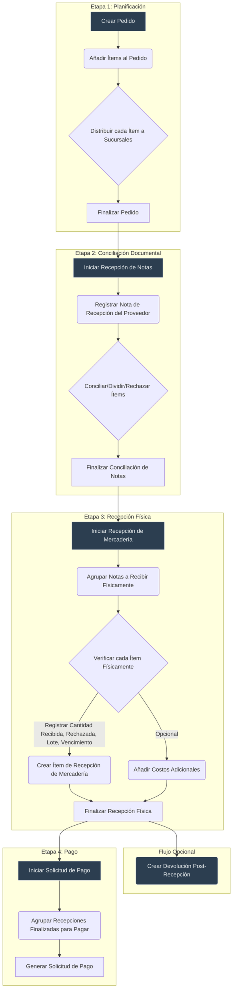

# Manual de Implementación Frontend: Flujo de Compras Refactorizado (Versión 2.0)

## 📊 **RESUMEN EJECUTIVO DEL PROGRESO**

### **Estado General del Proyecto:**
- **Fase 1 (Migración a Tabs):** ✅ **COMPLETADA**
- **Fase 2 (Planificación del Pedido):** ✅ **COMPLETADA**
- **Fase 3 (Recepción de Notas):** 🔄 **EN PROGRESO**
- **Fase 4 (Recepción Física):** ⏳ **PENDIENTE**
- **Fase 5 (Solicitud de Pago):** ⏳ **PENDIENTE**

### **Funcionalidades Implementadas:**
✅ **Tab 1 - Datos Generales:** Formulario completo con validaciones, búsquedas integradas, guardado backend
✅ **Tab 2 - Items del Pedido:** Tabla funcional, diálogos implementados, distribución de items, finalización de planificación
✅ **Tab 3 - Recepción de Notas:** Layout completo implementado, modelos creados, diálogo de nota de recepción funcional, **CRUD completo de ítems** (crear, editar, eliminar), tabla de ítems con presentación y colores de estado, detección automática de discrepancias, **diálogo de división de ítems** con conversión de cantidades y presentaciones, **sistema completo de rechazo de ítems** (rechazo desde panel de ítems pendientes, manejo de productos no entregados, notas de rechazo especiales), **diálogo de nota de recepción mejorado** (detección automática de notas de rechazo, formulario deshabilitado para rechazos, indicadores visuales de rechazo, columna distribución mostrando "Rechazado" para ítems rechazados)

### **Próximo Hito:**
**Completar Fase 3 (Recepción de Notas)** - Implementar sistema de rechazo de ítems documental y finalizar integración backend para avanzar a Fase 4.

### **🔧 INFORMACIÓN IMPORTANTE SOBRE BUILD AUTOMÁTICO:**
**Build Automático Frontend:** La aplicación Angular genera el build automáticamente cada vez que recibe cambios en archivos frontend. **NO es necesario ejecutar manualmente `npm run build` o `npm start`** para cambios de frontend.

**Build Backend:** Solo cuando se realizan cambios en archivos backend (Java, GraphQL, migraciones) es necesario recompilar el backend. En estos casos, el agente debe **avisar explícitamente** al usuario para que compile utilizando las herramientas disponibles.

**Flujo de Trabajo:**
- ✅ **Cambios Frontend:** Build automático, no requiere acción manual
- ⚠️ **Cambios Backend:** Avisar al usuario para compilación manual

### **🔧 CORRECCIÓN CRÍTICA APLICADA:**
**Problema:** Error al finalizar pedido - "Solo se pueden finalizar pedidos en estado ABIERTO"
**Causa:** El método `finalizarCreacion()` validaba `PedidoEstado` en lugar de usar `ProcesoEtapa`
**Solución:** Actualizado el método para usar `ProcesoEtapa` como sistema principal de estados
**Impacto:** Ahora el sistema usa correctamente el nuevo flujo de etapas granular

### **🗑️ ELIMINACIÓN COMPLETA DE PEDIDOESTADO:**
**Decisión:** Eliminado completamente `PedidoEstado` para evitar confusiones futuras
**Cambios aplicados:**
- ✅ Migración V78: Eliminado campo `estado` de tabla `pedido`
- ✅ Eliminado enum `PedidoEstado` del backend y frontend
- ✅ Actualizada entidad `Pedido` sin campo estado
- ✅ Actualizado `PedidoService` sin referencias a PedidoEstado
- ✅ Actualizado `PedidoRepository` sin filtros por estado
- ✅ Actualizado GraphQL schema sin PedidoEstado
- ✅ Actualizado `PedidoInput` sin campo estado
- ✅ Actualizado frontend models sin PedidoEstado

**Resultado:** Sistema completamente basado en `ProcesoEtapa` para gestión de estados

### **🔧 CORRECCIÓN CRÍTICA DE PRESENTACIÓN EN NOTA RECEPCIÓN ITEM:**
**Problema:** Al conciliar un `PedidoItem` y crear un `NotaRecepcionItem`, la presentación no se copiaba correctamente.
**Causa:** 
- Backend: El método `asignarItemsANota()` usaba `notaRecepcionItemService.save()` directamente, sin asegurar el mapeo correcto de la presentación
- Base de Datos: Campo `presentacion_en_nota_id` era `NULL` en registros existentes
**Solución:** 
- ✅ **Migración V84:** Corregir registros existentes copiando `presentacion_creacion_id` del `pedido_item` relacionado
- ✅ **Backend:** Agregado método `saveWithPresentacionMapping()` en `NotaRecepcionItemService` para asegurar mapeo correcto
- ✅ **Backend:** Modificado `NotaRecepcionService.asignarItemsANota()` para usar el nuevo método
- ✅ **Frontend:** Agregado campo `presentacionEnNota` en modelo y `presentacionEnNotaId` en `toInput()`
- ✅ **GraphQL:** Agregado mapeo de `presentacionEnNotaId` en resolver con inyección de `PresentacionService`
**Impacto:** Ahora la presentación se copia correctamente del pedido a la nota de recepción, manteniendo trazabilidad completa

### **🔧 CORRECCIÓN CRÍTICA DE ESTADOS:**
**Problema:** Error `"valor de entrada é inválido para enum operaciones.proceso_etapa_estado: FINALIZADA"`
**Causa:** Inconsistencia entre nombres de estados en BD (`COMPLETADA`) vs código (`FINALIZADA`)
**Solución:** Estandarizado todos los estados según el manual:
- ✅ `PENDIENTE`
- ✅ `EN_PROCESO` 
- ✅ `COMPLETADA` (corregido de FINALIZADA)
- ✅ `OMITIDA`
**Archivos corregidos:** Backend enum, Frontend enum, GraphQL schema, ProcesoEtapaService

### **🔧 MIGRACIÓN V82: CAMPOS FALTANTES EN NOTA_RECEPCION**
**Problema:** Discrepancias críticas entre modelo Java y estructura de BD en tablas `nota_recepcion` y `nota_recepcion_item`
**Causa:** Campos faltantes en BD que son críticos para el flujo de conciliación documental
**Solución:** Migración V82 que agrega:
- ✅ **Enum `nota_recepcion_estado`:** PENDIENTE_CONCILIACION, CONCILIADA, EN_RECEPCION, RECEPCION_PARCIAL, RECEPCION_COMPLETA, CERRADA
- ✅ **Campos en `nota_recepcion`:** moneda_id (NOT NULL), cotizacion, estado (NOT NULL)
- ✅ **Campos en `nota_recepcion_item`:** cantidad_en_nota, precio_unitario_en_nota, producto_id
- ✅ **Foreign Keys:** moneda_id → financiero.moneda, producto_id → productos.producto
- ✅ **Índices:** Para optimizar consultas por estado, moneda, producto, cantidad
- ✅ **Comentarios:** Documentación completa de cada campo
**Impacto:** Ahora la BD coincide con el modelo Java y permite implementar el flujo completo de conciliación

### **🔧 MIGRACIÓN V83: CAMPO ES_NOTA_RECHAZO**
**Problema:** Necesidad de identificar fácilmente las notas de recepción que son específicamente para rechazos
**Causa:** Las notas de rechazo se identificaban solo por `tipo_boleta = 'RECHAZO_NO_ENTREGADO'`, pero se necesita un campo más explícito
**Solución:** Migración V83 que agrega:
- ✅ **Campo `es_nota_rechazo`:** BOOLEAN DEFAULT FALSE para identificar notas de rechazo
- ✅ **Índice:** Para optimizar consultas de filtrado por rechazos
- ✅ **Actualización automática:** Registros existentes con `tipo_boleta = 'RECHAZO_NO_ENTREGADO'` se marcan como `es_nota_rechazo = true`
- ✅ **Comentarios:** Documentación del propósito del campo
- ✅ **Simplificación:** Elimina la dependencia del campo `tipo_boleta` para identificar rechazos
**Ventajas:** Más simple que crear un nuevo estado, permite filtrado fácil, mantiene flexibilidad de estados normales, código más limpio

### **🔧 SISTEMA COMPLETO DE RECHAZO DE ÍTEMS - IMPLEMENTACIÓN FRONTEND**

#### **1. Diálogo de Rechazo desde Panel de Ítems Pendientes**
**Componente:** `rechazar-item-dialog.component.ts`
**Funcionalidades Implementadas:**
- ✅ **Formulario reactivo completo:** Campos para nota de recepción, presentación, cantidad, motivo y observaciones
- ✅ **Selección de presentación:** Dropdown con todas las presentaciones del producto, conversión automática a unidades base
- ✅ **Manejo de productos no entregados:** Opción especial "🚫 Crear Nota de Rechazo (Producto no entregado)"
- ✅ **Notas de rechazo especiales:** Sistema de numeración independiente para rechazos (`tipoBoleta = 'RECHAZO_NO_ENTREGADO'`)
- ✅ **Validaciones completas:** Cantidad máxima según pendiente, motivo obligatorio, observaciones condicionales
- ✅ **Navegación por teclado:** Enter para navegar entre campos, Escape para cerrar
- ✅ **Integración backend:** Conectado con mutación `saveNotaRecepcionItem` para crear ítems rechazados
- ✅ **Corrección de moneda:** Manejo seguro de moneda por defecto para evitar errores de BD

#### **2. Diálogo de Nota de Recepción Mejorado**
**Componente:** `add-edit-nota-recepcion-dialog.component.ts`
**Funcionalidades Implementadas:**
- ✅ **Detección automática de notas de rechazo:** Campo `esNotaRechazo` incluido en todas las consultas GraphQL
- ✅ **Formulario deshabilitado para rechazos:** Campos no editables cuando `esNotaRechazo = true`
- ✅ **Resumen con indicador de rechazo:** Card informativo que muestra "Tipo de Nota: Nota de Rechazo" con chip rojo
- ✅ **Columna distribución actualizada:** Muestra "Rechazado" en rojo para ítems de notas de rechazo
- ✅ **Botones de acción deshabilitados:** Agregar, editar y distribuir ítems bloqueados para rechazos
- ✅ **Eliminación permitida:** Los ítems de notas de rechazo sí se pueden eliminar
- ✅ **Validaciones de seguridad:** Métodos de acción verifican si es nota de rechazo antes de ejecutar

#### **3. Consultas GraphQL Actualizadas**
**Archivo:** `graphql-query.ts`
**Cambios Implementados:**
- ✅ **Campo `esNotaRechazo` agregado** a todas las consultas de notas de recepción:
  - `notaRecepcionPorPedidoIdQuery`
  - `notaRecepcionPorPedidoIdAndNumeroPageQuery`
  - `getNotaRecepcionByIdQuery`
  - `getNotaRecepcionsQuery`
  - `saveNotaRecepcionMutation`
- ✅ **Modelos frontend actualizados:** Campo `esNotaRechazo` incluido en `NotaRecepcion` y `NotaRecepcionInput`
- ✅ **Propiedades computadas:** `esNotaRechazoComputed`, `notaRechazoDisplayText`, `notaRechazoChipClass`

#### **4. Lógica de Negocio de Rechazos**
**Filosofía Implementada:**
- ✅ **Rechazo documental:** Los rechazos se registran como `NotaRecepcionItem` con estado `RECHAZADO`
- ✅ **Consumo de cantidad pendiente:** Los rechazos consumen la cantidad pendiente del `PedidoItem`
- ✅ **Trazabilidad completa:** Se puede rastrear qué ítems fueron rechazados y por qué motivo
- ✅ **Separación de responsabilidades:** Rechazos documentales vs. rechazos físicos (etapa posterior)
- ✅ **Flexibilidad operativa:** Un `PedidoItem` puede ser parcialmente conciliado y parcialmente rechazado

#### **5. Indicadores Visuales de Rechazo**
**Implementaciones Visuales:**
- ✅ **Colores de estado:** Ítems rechazados muestran color rojo en tablas
- ✅ **Chips informativos:** "Nota de Rechazo" con estilo rojo en resumen
- ✅ **Columna distribución:** "Rechazado" en rojo para ítems de notas de rechazo
- ✅ **Formulario deshabilitado:** Campos grises para indicar que no son editables
- ✅ **Mensajes de error:** Notificaciones claras cuando se intentan acciones no permitidas

#### **6. Manejo de Productos No Entregados**
**Escenario Especial Implementado:**
- ✅ **Nota de rechazo especial:** Para productos que no fueron entregados por el proveedor
- ✅ **Numeración independiente:** Sistema separado para identificar notas de rechazo
- ✅ **Trazabilidad:** Permite distinguir entre rechazos de productos entregados vs. no entregados
- ✅ **Información contextual:** Caja informativa que explica el propósito de la nota especial

#### **7. Correcciones Técnicas Aplicadas**
**Problemas Resueltos:**
- ✅ **Error de moneda null:** Validación y moneda por defecto para evitar errores de BD
- ✅ **Campo esNotaRechazo faltante:** Agregado a todas las consultas GraphQL necesarias
- ✅ **Detección de rechazos:** Sistema que detecta automáticamente notas de rechazo al cargar datos
- ✅ **Validaciones de seguridad:** Métodos que verifican permisos antes de ejecutar acciones

#### **8. Experiencia de Usuario Mejorada**
**Beneficios para el Usuario:**
- ✅ **Claridad visual:** Fácil identificación de notas y ítems de rechazo
- ✅ **Prevención de errores:** Formularios deshabilitados evitan modificaciones accidentales
- ✅ **Información contextual:** Resúmenes que muestran claramente el tipo de nota
- ✅ **Acciones apropiadas:** Solo las operaciones válidas están habilitadas
- ✅ **Mensajes claros:** Notificaciones que explican por qué ciertas acciones no están disponibles

**Resultado:** Sistema completo de rechazo que mantiene la integridad de datos, proporciona trazabilidad completa y ofrece una experiencia de usuario clara y consistente.

---

## 1. Introducción y Filosofía

Este documento es la guía definitiva para el desarrollo de la interfaz de usuario (UI) del módulo de compras. El nuevo backend está diseñado bajo un principio de **desacoplamiento de responsabilidades**, separando claramente la *planificación* (el pedido), la *realidad documental* (la nota del proveedor) y la *realidad física* (la mercadería recibida).

La UI debe reflejar esta separación, guiando al usuario a través de un flujo lógico y granular, donde cada etapa es un evento discreto y auditable. El estado del proceso se gestiona principalmente a través de la entidad `ProcesoEtapa`.

## 2. Diagrama de Flujo Conceptual



---

## 3. Flujo de Trabajo Detallado

### **Etapa 1: Creación del Pedido (Planificación)**

-   **Objetivo:** Crear una orden de compra formal con todos los detalles de los productos solicitados y su distribución planificada.
-   **Entidades Clave:** `Pedido`, `PedidoItem`, `PedidoItemDistribucion`, `ProcesoEtapa`, `PedidoSucursalInfluencia`, `PedidoSucursalEntrega`.

#### Flujo de Trabajo:
1.  **Iniciar Creación:**
    *   El usuario selecciona un `Proveedor`, `Moneda` y `FormaPago`. Si es a plazo, debe indicar los `plazoCredito` (días).
    *   La UI debe permitir seleccionar múltiples sucursales de **entrega** (`PedidoSucursalEntrega`) y de **influencia** (`PedidoSucursalInfluencia`).
    *   Al guardar esta cabecera, se crean registros en `Pedido`, `PedidoSucursalEntrega` y `PedidoSucursalInfluencia`.
    *   Simultáneamente, se crea un registro en `ProcesoEtapa` con `tipo_etapa` = `CREACION`, y `estado_etapa` = `EN_PROCESO`.

2.  **Añadir Ítems (`PedidoItem`):**
    *   El usuario busca y añade productos. Por cada uno, se crea un `PedidoItem` con:
        *   `productoId`, `cantidadSolicitada`, `precioUnitarioSolicitado`, `vencimientoEsperado`, `observacion`.
        *   **Bonificación:** La UI debe incluir un checkbox para marcar el ítem como `esBonificacion`. Si está marcado, el `precioUnitarioSolicitado` debe ser `0`.

3.  **Distribuir Ítems (`PedidoItemDistribucion`):**
    *   Por cada `PedidoItem`, la UI debe permitir su distribución a las sucursales definidas como de **entrega**.
    *   **Lógica de Discrepancia:** Si al finalizar la distribución, `sum(cantidadAsignada)` no es igual a `cantidadSolicitada`, la UI debe mostrar un diálogo: *"La cantidad distribuida (X) no coincide con la solicitada (Y). ¿Desea actualizar la cantidad solicitada a X?"*. Esto permite al usuario corregir la solicitud original basándose en la distribución.

4.  **Finalizar Etapa de Creación:**
    *   El usuario hace clic en "Finalizar Pedido".
    *   **Validación:** Solo se requiere que existan ítems en el pedido. **No es obligatorio** que todos los ítems estén distribuidos para finalizar esta etapa.
    *   **Backend:** Actualiza el `ProcesoEtapa` de `CREACION` a `COMPLETADA` y el de `RECEPCION_NOTA` a `PENDIENTE`.
    *   **UI:** El pedido se vuelve de solo lectura y avanza a la siguiente etapa.

---

### **Etapa 2: Recepción de Notas (Conciliación Documental)** ✅ **COMPLETADA**

-   **Objetivo:** Registrar las facturas del proveedor y conciliarlas con el pedido original.
-   **Entidades Clave:** `NotaRecepcion`, `NotaRecepcionItem`, `NotaRecepcionItemDistribucion`, `ProcesoEtapa`.

#### Flujo de Trabajo:
1.  **Iniciar Etapa:** ✅ **IMPLEMENTADO**
    *   Al hacer clic en "Iniciar Recepción de Notas", el sistema puede proceder directamente sin validaciones de distribución.
    *   **Validación Opcional:** Si se requiere validar distribuciones, se puede implementar como una verificación opcional que informe al usuario sobre ítems pendientes sin bloquear el avance.
    *   El `ProcesoEtapa` de `RECEPCION_NOTA` pasa a `EN_PROCESO`.

2.  **Registrar Notas (`NotaRecepcion`):** ✅ **IMPLEMENTADO**
    *   El usuario registra los datos de la factura del proveedor.
    *   **Funcionalidades implementadas:**
        - ✅ Crear nueva nota de recepción
        - ✅ Editar nota existente
        - ✅ Eliminar nota (con confirmación)
        - ✅ Validación de campos obligatorios
        - ✅ Manejo de errores y notificaciones
        - ✅ Columna de monto total con valores reales desde backend

3.  **Conciliar Ítems (`NotaRecepcionItem`):** ✅ **IMPLEMENTADO**
    *   La UI presenta una tabla de `PedidoItem` pendientes. La tabla debe tener **checkboxes** para selección múltiple.
    *   **Lógica de División de Ítems:** Un `PedidoItem` puede ser conciliado parcialmente en múltiples `NotaRecepcionItem` a través de diferentes notas.
        *   **Ejemplo:** Se piden 100 unidades. El usuario selecciona el `PedidoItem`. La UI muestra "100 unidades pendientes". El usuario crea un `NotaRecepcionItem` en la Nota A por 40 unidades. El `PedidoItem` original ahora mostrará "60 unidades pendientes" para futuras conciliaciones en otras notas.
    *   **Lógica de Rechazo Documental:** Para cada `NotaRecepcionItem` que se está creando/conciliando, la UI debe ofrecer las acciones:
        *   **Conciliar:** Crea el `NotaRecepcionItem` con estado `CONCILIADO`.
        *   **Rechazar:** Crea el `NotaRecepcionItem` con estado `RECHAZADO` y exige un `motivoRechazo`. Un ítem rechazado aquí no pasará a la etapa de recepción física.
    *   **Funcionalidades implementadas:**
        - ✅ Asignar ítems individuales a notas
        - ✅ Asignar múltiples ítems seleccionados
        - ✅ Crear nota y asignar ítems automáticamente
        - ✅ Validación de asignaciones duplicadas
        - ✅ Manejo de errores parciales (algunos ítems asignados, otros no)
        - ✅ Rechazar ítems con motivo
        - ✅ Dividir ítems para asignación parcial
        - ✅ Gestión de distribuciones por sucursal

    > **Filosofía Clave de Conciliación:** ✅ **IMPLEMENTADO**
    > Para mantener la integridad y trazabilidad del proceso, es fundamental seguir esta regla:
    > *   **El `PedidoItem` es Inmutable:** Representa el plan original y no debe ser modificado después de la etapa de planificación.
    > *   **La `NotaRecepcionItem` es la Realidad Documental:** Todas las variaciones (cantidad, precio, producto) o acciones (división, rechazo) se registran creando o modificando `NotaRecepcionItem`. Un `PedidoItem` puede ser conciliado por múltiples `NotaRecepcionItem` a lo largo de varias notas, consumiendo su "cantidad pendiente" sin alterarse a sí mismo.
    > *   **La `NotaRecepcionItemDistribucion` es la Distribución Documental:** Cada `NotaRecepcionItem` puede tener múltiples distribuciones que especifican a qué sucursales debe enviarse según la documentación del proveedor. Esto permite capturar la "realidad documental" de la distribución, separándola del plan original (`PedidoItemDistribucion`).

4.  **Finalizar Etapa de Conciliación:** ✅ **IMPLEMENTADO**
    *   El usuario hace clic en "Finalizar Conciliación".
    *   **Validaciones:**
        1.  ✅ Se verifica que existan notas registradas para proceder con la siguiente etapa.
        2.  ✅ **Distribución:** La distribución de sucursales es informativa; ítems sin distribución completa pueden proceder igualmente.
    *   **Funcionalidades implementadas:**
        - ✅ Backend: `PedidoService.finalizarRecepcionNotas()`
        - ✅ GraphQL: `finalizarRecepcionNotas` mutation
        - ✅ Frontend: `onFinalizarConciliacion()` con confirmación
        - ✅ Actualización automática de `ProcesoEtapa`
        - ✅ Avance automático a etapa de Recepción de Mercadería
        - ✅ Notificaciones de éxito/error
        - ✅ Navegación automática a siguiente pestaña

#### **Funcionalidades Adicionales Implementadas:**
- ✅ **Sistema de lazy loading** para optimización de rendimiento
- ✅ **Paginación** en todas las tablas
- ✅ **Búsqueda y filtros** en ítems pendientes y notas
- ✅ **Validación de fechas** con manejo robusto de fechas inválidas
- ✅ **Cálculo de montos** en tiempo real
- ✅ **Estados visuales** con chips de colores
- ✅ **Confirmaciones** para acciones críticas
- ✅ **Manejo de errores** completo con mensajes informativos

---

### **Etapa 3: Recepción de Mercadería (Verificación Física)**

-   **Objetivo:** Registrar el evento físico de recibir productos.
-   **Entidades Clave:** `RecepcionMercaderia`, `RecepcionMercaderiaItem`, `RecepcionMercaderiaNota`.

> **Nota Importante sobre Distribuciones:** En esta etapa, el sistema debe usar las distribuciones de `NotaRecepcionItemDistribucion` como base para la recepción física, no las distribuciones originales del `PedidoItemDistribucion`. Esto asegura que la recepción física se realice contra lo que realmente dice la documentación del proveedor.

#### Flujo de Trabajo:
1.  **Crear Evento de Recepción (`RecepcionMercaderia`):**
    *   Tras iniciar la etapa, el usuario crea la cabecera del evento.
    *   **Lógica de Filtrado:** La UI debe permitir seleccionar `NotaRecepcion`s para agrupar. La consulta al backend para obtener esta lista debe filtrar solo notas que:
        *   Pertenezcan al mismo `Proveedor`.
        *   No hayan sido completamente recepcionadas o finalizadas.

2.  **Verificar Ítems Físicos (`RecepcionMercaderiaItem`):**
    *   Para cada `NotaRecepcionItem` (que no fue rechazado en la etapa anterior), el usuario registra la realidad física.
    *   **Distribución Física:** El sistema debe mostrar las cantidades esperadas por sucursal basándose en `NotaRecepcionItemDistribucion`, no en la distribución original del pedido.
    *   **Rechazo y Modificación:** El usuario puede registrar una `cantidadRecibida` menor a la esperada y una `cantidadRechazada` con su `motivoRechazo`.
    *   **Impacto en el Costo:** El valor final a pagar por una `NotaRecepcion` **se basará en la suma de `precio * cantidadRecibida` de sus ítems**, no en el valor original de la nota. La UI debe reflejar esto en los resúmenes.

3.  **Finalizar Etapa Física:**
    *   Al finalizar, el backend crea los `MovimientoStock` y actualiza los costos. El `ProcesoEtapa` de `RECEPCION_MERCADERIA` se completa.

---

### **Etapa 4: Solicitud de Pago**

-   **Objetivo:** Agrupar recepciones finalizadas para generar una orden de pago.
-   **Entidades Clave:** `SolicitudPago`, `SolicitudPagoRecepcion`.

#### Flujo de Trabajo:
1.  **Agrupar Recepciones:**
    *   El usuario selecciona una o más `RecepcionMercaderia` con estado `FINALIZADA`.
2.  **Calcular y Guardar:**
    *   La UI calcula el `montoTotal` a pagar, que ya refleja las cantidades realmente recibidas (ver punto de "Impacto en el Costo" de la Etapa 3).
    *   Se guarda la `SolicitudPago`.
    *   Se completa el `ProcesoEtapa` final. Si todas las etapas están completas, el `Pedido` pasa a `CONCLUIDO`.

---

## 4. Propuesta de Implementación Visual (UI/UX) - v2

### **Principios Generales de Diseño**

-   **Componente Único:** Un componente principal `GestionComprasComponent` gestionará todo el flujo.
-   **Cabecera Persistente:** En la parte superior de la pantalla, una cabecera fija mostrará siempre la información clave del pedido (`Proveedor`, `Nro Pedido`, `Fecha`, `Monto Total`, `Estado del Proceso`), independientemente de la pestaña actual.
-   **Navegación por Pestañas:** Debajo de la cabecera, un `mat-tab-group` organizará el flujo de trabajo. Las pestañas se habilitarán progresivamente a medida que el usuario complete las etapas, permitiendo una navegación libre entre las pestañas ya habilitadas.
-   **Acciones en Tablas:** Para mantener las tablas limpias, todas las acciones por fila se agruparán dentro de un `mat-menu` (un botón con tres puntos `...` que despliega un menú).

### **Vista Principal: `GestionComprasComponent`**

#### **1. Cabecera Fija del Pedido**
-   **Contenido:**
    *   `Proveedor`: `[Nombre del Proveedor]`
    *   `Pedido Nro`: `[ID del Pedido]`
    *   `Fecha Creación`: `[Fecha]`
    *   `Estado`: Chip de color (`mat-chip`) indicando el estado general (Ej: `EN PLANIFICACIÓN`, `EN RECEPCIÓN`, `CONCLUIDO`).
    *   `Monto Total`: `[Suma de ítems]`
-   **Comportamiento:** Visible en todo momento.

#### **2. Navegación Principal por Pestañas (`mat-tab-group`)**

---

### **UI de la Pestaña 1: Datos del Pedido**

-   **Título de la Pestaña:** "1. Datos Generales"
-   **Contenido:**
    *   Un `formGroup` para los datos principales.
    *   Campos: `Proveedor` (autocomplete), `Moneda` (select), `FormaPago` (select).
    *   Campo condicional: `plazoCredito` (input numérico) si `FormaPago` es a plazo.
    *   Selects múltiples: `Sucursales de Entrega` y `Sucursales de Influencia`.
-   **Acciones de la Pestaña:**
    *   Botón "Guardar y Continuar" que guarda la cabecera, valida los datos y habilita y selecciona la siguiente pestaña.

---

### **UI de la Pestaña 2: Ítems del Pedido**

-   **Título de la Pestaña:** "2. Ítems del Pedido"
-   **Contenido:**
    *   Botón "Añadir Ítem" que abre un diálogo.
    *   **Tabla de Ítems (`mat-table`):**
        *   Columnas: Producto, Cantidad Solicitada, Precio, Bonificación, Vencimiento, **Distribución**, Acciones.
        *   **Columna "Distribución"**: Mostrará un chip (`mat-chip`) de color para indicar el estado:
            *   Verde: "Completa"
            *   Naranja: "Incompleta"
            *   Rojo: "Pendiente"
        *   **Columna "Acciones" (`mat-menu`):**
            *   "Distribuir Ítem"
            *   "Editar Ítem"
            *   "Eliminar Ítem"
-   **Diálogos:**
    *   Se mantienen los diálogos de "Añadir/Editar Ítem" y "Distribuir Ítem" de la propuesta anterior.
-   **Acciones de la Pestaña:**
    *   Botón "Finalizar Planificación" para avanzar a la siguiente etapa principal.

---

### **UI de la Pestaña 3: Conciliación Documental**

-   **Título de la Pestaña:** "3. Recepción de Notas"
-   **Contenido:**
    *   Botón de inicio "Iniciar Conciliación" si la etapa está pendiente.
    *   **Layout de dos paneles (visible si está `EN_PROGRESO`):**
        1.  **Panel Izquierdo (60% ancho): Ítems del Pedido Pendientes de Conciliar**
            *   **Tabla (`mat-table`):** Muestra `PedidoItem` con cantidad > 0 por conciliar.
            *   **Selección:** Checkbox en cada fila y un checkbox "Seleccionar Todos" en la cabecera.
            *   **Columnas:** Checkbox, Producto, Cant. Pendiente, **Estado Distribución**, Acciones (`mat-menu`).
            *   **Indicador de Distribución:** Un icono informativo junto a los ítems con distribución "Incompleta" o "Pendiente" (solo informativo, no bloquea el proceso).
            *   **Acciones en Ítems (`mat-menu`):**
                *   "Editar Ítem" (abre diálogo)
                *   "Dividir Ítem" (abre diálogo para conciliación parcial)
                *   "Rechazar Ítem" (abre diálogo para rechazo documental)
            *   **Botones de Acción (encima de la tabla):**
                *   "Crear nueva nota para ítems" (habilitado si se seleccionan ítems).
                *   "Asignar ítems a la nota" (habilitado si se seleccionan ítems Y una nota en el panel derecho).
                *   "Añadir Nuevo Ítem al Pedido" (botón para casos excepcionales).

        2.  **Panel Derecho (40% ancho): Notas de Recepción Registradas**
            *   **Tabla (`mat-table`):** Muestra las `NotaRecepcion` creadas.
            *   **Selección:** Al hacer clic en una fila, esta cambia de color para indicar la selección. Solo se puede seleccionar una a la vez.
            *   **Columnas:** Nro. Factura, Fecha, Total, Acciones (`mat-menu`).
            *   **Acciones en Notas (`mat-menu`):**
                *   "Editar Nota e Ítems" (abre diálogo unificado para editar la cabecera de la nota y gestionar los ítems asignados).
                *   "Eliminar Nota" (con confirmación).

-   **Flujo de Trabajo y Diálogos:**
    > **Filosofía Clave de Conciliación (Aplicada a la UI):**
    > Las acciones de la UI ("Dividir Ítem", "Rechazar Ítem", "Editar Ítem") **nunca deben modificar el `PedidoItem` original**. Su propósito es abrir diálogos que faciliten la creación y modificación de `NotaRecepcionItem` que reflejen con precisión la factura del proveedor. Esto asegura que la comparación entre lo planificado y lo documentado sea siempre clara.
    
    1.  **Asignar a Nota Existente:** Usuario selecciona ítems (izquierda) -> selecciona nota (derecha) -> clic en "Asignar ítems a la nota". El sistema asigna automáticamente los ítems, copiando los datos.
    2.  **Asignar a Nota Nueva:** Usuario selecciona ítems (izquierda) -> clic en "Crear nueva nota para ítems". Se abre un diálogo para crear la nota, y al confirmar, los ítems se asignan.
    3.  **Modificar Asignación:** Para modificar cantidad/precio de un ítem en una nota, el usuario debe usar la acción "Editar Nota e Ítems" y editarlo desde ahí. El diálogo unificado debe mostrar claramente qué ítems tienen distribución pendiente.
    
    **Diálogo Unificado "Editar Nota e Ítems":**
    -   **Layout del Formulario (3 filas):**
        *   **Fila 1:** Tipo Boleta, Número, Timbrado
        *   **Fila 2:** Fecha, Moneda, Cotización
        *   **Fila 3:** Card con información adicional (Total de ítems a vincular, Monto total, Estado)
    -   **Lista de Ítems:** Visible solo si la nota ya existe. Permite gestionar los ítems asignados a la nota.
    -   **Funcionalidad:** Fusiona la edición de la cabecera de la nota con la gestión de sus ítems en una sola interfaz.

-   **Acciones de la Pestaña:**
    *   Botón "Finalizar Conciliación". Realiza validaciones estrictas antes de avanzar.

---

### **UI de la Pestaña 4: Recepción de Mercadería**

-   **Título de la Pestaña:** "4. Verificación Física"

-   **Contenido (Fase de Configuración):**
    *   Si la etapa está `EN_PROGRESO`, primero se muestra una pantalla de configuración.
    1.  **Selección de Sucursales de Entrega:**
        *   Un campo `mat-select` múltiple para que el usuario elija una o más sucursales de entrega para la recepción.
        *   Los ítems a recibir se filtrarán según esta selección.
        *   **Validación:** Al menos una sucursal debe ser seleccionada.
    2.  **Selección de Modo de Recepción:**
        *   Un `mat-button-toggle-group` para que el usuario elija el modo de trabajo:
            *   **Opción A: "Agrupar por Notas"** - Layout de dos paneles
            *   **Opción B: "Agrupar por Productos"** - Layout de un solo panel
    3.  **Toggle "Mostrar Sucursales al Verificar":**
        *   **Visibilidad:** Solo visible cuando se seleccionan más de una sucursal de entrega.
        *   **Funcionalidad:** Cuando está activado, la verificación rápida muestra un diálogo con la lista de distribuciones por sucursal.
        *   **Comportamiento:** Por defecto todas las distribuciones están marcadas, el usuario puede desmarcar para excluir sucursales específicas.
    4.  **Botón de Inicio:**
        *   Un botón "Iniciar Verificación" que se habilita una vez que se han seleccionado sucursales y un modo.

-   **Layout (Modo "Agrupar por Notas" - Dos Paneles):**
    *   Una vez iniciada la verificación en este modo, se presenta un layout de dos paneles.
    1.  **Panel Derecho (40% ancho): Lista de Notas**
        *   Muestra una tabla con las `NotaRecepcion` que tienen ítems pendientes de recibir para las sucursales seleccionadas.
        *   Al hacer clic, la nota se resalta, indicando que está seleccionada, y se carga su contenido en el panel izquierdo.
        *   **Columnas:** Nro. Factura, Fecha, Total, Estado, Acciones.
    2.  **Panel Izquierdo (60% ancho): Ítems de la Nota Seleccionada**
        *   **Tabla (`mat-table`):** Muestra los `NotaRecepcionItem` de la nota y sucursales seleccionadas.
        *   **Columnas:** Producto, Cant. Esperada, Cant. Recibida, Cant. Rechazada, Estado, Acciones.
        *   **Acciones por Ítem (3 iconos):**
            *   **✅ Check (Verificación Rápida):** Marca el ítem como verificado sin abrir diálogos.
            *   **✏️ Edit (Verificación Detallada):** Abre el diálogo de verificación para modificaciones.
            *   **❌ Rechazar:** Abre el diálogo de rechazo para registrar rechazos.

-   **Layout (Modo "Agrupar por Productos" - Un Panel):**
    *   Una única tabla que agrupa todos los ítems de todas las notas por producto.
    *   **Tabla (`mat-table`):**
        *   **Columnas:** Producto, Cant. Total Esperada, Cant. Total Recibida, Cant. Total Rechazada, Estado, Acciones.
        *   **Agrupación:** Los ítems se agrupan por producto, mostrando la suma de cantidades de todas las notas.
        *   **Acciones por Producto (3 iconos):**
            *   **✅ Check (Verificación Rápida):** Marca el producto como verificado sin abrir diálogos.
            *   **✏️ Edit (Verificación Detallada):** Abre el diálogo de verificación para modificaciones.
            *   **❌ Rechazar:** Abre el diálogo de rechazo para registrar rechazos.

-   **Diálogos Clave:**
    1.  **Diálogo "Verificación Rápida con Múltiples Sucursales":**
        *   **Visibilidad:** Solo cuando el toggle "Mostrar Sucursales al Verificar" está activado.
        *   **Contenido:** Lista de distribuciones por sucursal con checkboxes.
        *   **Comportamiento:** Todos los checkboxes marcados por defecto, usuario puede desmarcar para excluir sucursales.
        *   **Lógica:** Solo se procesan las distribuciones marcadas, las desmarcadas quedan pendientes.
    2.  **Diálogo "Verificar Ítem/Producto":**
        *   **Título:** "Verificar: [Nombre del Producto]".
        *   **Contenido:** Una tabla que muestra las cantidades **por sucursal** (de las seleccionadas en la configuración).
        *   **Columnas del Diálogo:** Sucursal, Cantidad Esperada, Cantidad Recibida (input numérico), Cantidad Rechazada (input numérico).
        *   **Campos Adicionales:** Número de Lote, Fecha de Vencimiento, Motivo de Modificación (si hay discrepancias).
        *   **Lógica:**
            *   Las cantidades `Recibida` y `Rechazada` vienen pre-cargadas (`Recibida` = `Esperada`, `Rechazada` = `0`).
            *   Si el usuario modifica cualquier cantidad, aparece un campo de texto obligatorio `Motivo de la Modificación`.
            *   Validación: `cantidadRecibida + cantidadRechazada <= cantidadEsperada`.
    3.  **Diálogo "Rechazar Ítem/Producto":**
        *   Permite registrar el rechazo total o parcial de un ítem/producto, exigiendo un motivo.
        *   **Campos:** Cantidad a rechazar, motivo de rechazo, observaciones.
        *   **Validación:** Cantidad rechazada <= cantidad esperada.

-   **Estados Visuales:**
    *   **Pendiente:** Sin color especial
    *   **Verificado:** Fondo verde claro
    *   **Rechazado:** Fondo rojo claro
    *   **Parcialmente Verificado:** Fondo naranja claro

-   **Acciones de la Pestaña:**
    *   Botón "Finalizar Recepción Física" - Solo habilitado cuando todos los ítems han sido procesados.

---

### **UI de la Pestaña 5: Solicitud de Pago**

-   **Título de la Pestaña:** "5. Solicitud de Pago"
-   **Contenido:**
    *   Botón de inicio "Iniciar Solicitud de Pago".
    *   **Layout (visible si está `EN_PROGRESO`):**
        1.  **Tabla de Notas Disponibles (`mat-table`):**
            *   Muestra las `NotaRecepcion` con estado `FINALIZADA` que aún no han sido incluidas en una solicitud de pago.
            *   **Selección:** Checkbox en cada fila y un checkbox "Seleccionar Todos" en la cabecera.
            *   **Columnas:** Checkbox, Nro. Factura, Fecha, Monto a Pagar (calculado en base a la mercadería recibida), Estado.
            *   La tabla debe ser paginada y soportar filtros en el backend.
        2.  **Botón de Acción (encima de la tabla):**
            *   "Crear Solicitud de Pago" (habilitado si se selecciona al menos una nota).

-   **Diálogos:**
    1.  **Diálogo "Crear Solicitud de Pago":**
        *   **Título:** "Confirmar y Generar Solicitud de Pago".
        *   **Contenido (Formulario):**
            *   `Proveedor`: `[Nombre del Proveedor]` (Solo lectura).
            *   `Total a Pagar`: `[Suma de los montos de las notas seleccionadas]` (Solo lectura).
            *   `Moneda`: `mat-select` pre-cargado con la moneda del pedido (editable).
            *   `Forma de Pago`: `mat-select` pre-cargado con la forma de pago del pedido (editable).
            *   `Plazo (días)`: `input` numérico, visible y editable si la forma de pago es a crédito.
        *   **Botones del Diálogo:**
            *   "Cancelar".
            *   "Generar Solicitud".

-   **Acciones de la Pestaña:**
    *   Texto indicativo: "El pedido se marcará como 'Concluido' una vez que todas las solicitudes de pago asociadas sean procesadas."

---

## 5. Estándares Técnicos y de Estilo

Esta sección define las reglas obligatorias y las guías de estilo para asegurar la consistencia, el rendimiento y la mantenibilidad de la aplicación.

### **Reglas Técnicas Obligatorias**

1.  **Prohibido el Uso de Funciones/Getters en Templates:**
    *   **Regla:** Nunca se deben usar llamadas a funciones, métodos o `getters` directamente en el template HTML (`*.html`). Esto incluye `*ngIf`, `*ngFor`, `[class]`, `{{...}}`, etc.
    *   **Razón:** Angular evalúa estas expresiones en cada ciclo de detección de cambios, causando graves problemas de rendimiento.
    *   **Solución:** Acceder directamente al objeto en el template, ejemplo, en vez de usar {{getNombre(persona)}}, directamente en el template {{persona.nombre}}. Si esto no es posible utilizar propiedades pre-calculadas en el componente (`.ts`). Cuando los datos cambien, recalcular los valores en una única función (ej. `updateComputedProperties()`) y almacenarlos en propiedades simples. Los templates solo deben hacer binding a estas propiedades.

2.  **Paginación y Filtros en el Backend:**
    *   **Regla:** Todas las listas y tablas de datos deben ser paginadas. La lógica de paginación y filtrado debe residir exclusivamente en el backend.
    *   **Razón:** Cargar grandes volúmenes de datos en el frontend para luego filtrarlos consume una cantidad excesiva de memoria y ancho de banda, y degrada la experiencia del usuario.
    *   **Solución:** Los componentes de frontend deben enviar los parámetros de paginación (página, tamaño) y los criterios de filtro al API. El backend se encarga de realizar la consulta a la base de datos y devolver solo el subconjunto de datos solicitado.

3.  **Uso del Componente Genérico de Búsqueda:**
    *   **Regla:** Para todas las búsquedas con diálogos, usar el componente `SearchListDialogComponent` ubicado en `src/app/shared/components/search-list-dialog/`.
    *   **Configuración:** Definir `TableData[]` para las columnas, proporcionar la query GraphQL, y manejar el resultado en `afterClosed()`.
    *   **Funcionalidades:** El componente incluye paginación automática, funcionalidad de búsqueda, navegación por teclado, y UI consistente.
    *   **Ejemplo de Uso:**
        ```typescript
        // Definir columnas de la tabla
        let tableData: TableData[] = [
          { id: "id", nombre: "Id" },
          { id: "nombre", nombre: "Nombre" },
          { id: "descripcion", nombre: "Descripción" }
        ];
        
        // Configurar datos del diálogo
        let data: SearchListtDialogData = {
          query: this.searchQuery, // GraphQL query
          tableData: tableData,
          titulo: "Buscar elementos",
          search: true,
          queryData: { texto: this.searchControl.value },
          inicialSearch: true,
          paginator: true
        };
        
        // Abrir diálogo y manejar resultado
        this.matDialog.open(SearchListDialogComponent, {
          data: data,
          width: "60%",
          height: "80%"
        }).afterClosed().subscribe((result) => {
          if (result != null) {
            // Manejar selección
          }
        });
        ```

### **Guía de Estilo Visual Explícita**

Para mantener una apariencia visual coherente, los nuevos componentes deben seguir los siguientes patrones de estilo.

#### **1. Colores Principales**

| Uso                  | Color Hex | Variable (si aplica) |
| -------------------- | --------- | -------------------- |
| Fondo Primario       | `#2d2d2d` | -                    |
| Fondo Secundario     | `#3a3a3a` | -                    |
| Acento Naranja       | `#f57c00` | -                    |
| Texto Primario       | `#ffffff` | -                    |
| Texto Secundario     | `#f0f0f0` | -                    |
| Texto Tenue          | `#bbbbbb` | -                    |
| Borde Primario       | `#555555` | -                    |
| Verde (Éxito)        | `#4caf50` | -                    |
| Rojo (Error/Alerta)  | `#f44336` | -                    |

#### **2. Cabecera Principal (Componente `GestionComprasComponent`)**

La cabecera debe usar un fondo con gradiente.

```scss
.pedido-header .header-card {
  background: linear-gradient(135deg, #667eea89 0%, #764ba29a 100%);
  color: #ffffff;
  box-shadow: 0 4px 12px rgba(0, 0, 0, 0.3);
  border-radius: 8px;
}

.pedido-header .mat-card-title {
  font-size: 1.75rem;
  font-weight: 500;
}

.info-label {
  color: #f57c00;
  font-size: 1.2rem;
  font-weight: 600;
  text-transform: uppercase;
}
```

#### **3. Diálogos**

La cabecera de los diálogos debe replicar el gradiente principal.

```scss
.dialog-header {
  background: linear-gradient(135deg, #667eea 0%, #764ba2 100%);
  padding: 20px 24px;

  h2 {
    margin: 0;
    font-size: 22px;
    font-weight: 600;
    color: #ffffff;
    text-shadow: 0 1px 2px rgba(0, 0, 0, 0.3);
  }
}

.dialog-content {
  background-color: #2d2d2d;
  padding: 16px;
}
```

#### **4. Tablas (`mat-table`)**

Las tablas deben tener un estilo oscuro y limpio, con un resaltado claro para las filas seleccionadas o activas.

```scss
.mat-table {
  background-color: transparent;
}

.mat-header-cell {
  color: #f57c00; // Naranja de acento para cabeceras
  font-size: 14px;
  font-weight: 600;
  text-transform: uppercase;
}

.mat-cell {
  color: #f0f0f0; // Texto primario
  border-bottom-color: #555555; // Borde sutil
}

// Estilo para una fila seleccionada
.mat-row.selected-row, .mat-row:hover {
  background-color: rgba(245, 124, 0, 0.15); // Naranja con opacidad
}

// Estilo para el paginador
.mat-paginator {
  background-color: #3a3a3a;
  color: #bbbbbb;
}
```

#### **5. Botones (`mat-button`)**

Los botones deben seguir una jerarquía visual clara.

```scss
// Botón primario (Ej: Finalizar, Generar)
button[color="accent"].mat-raised-button {
  background-color: #f57c00;
  color: white;
  font-weight: 600;
}

// Botón secundario (Ej: Añadir)
button[color="primary"].mat-raised-button {
  background-color: #667eea;
  color: white;
}

// Botón de peligro/cancelación
button[color="warn"].mat-raised-button {
  background-color: #f44336;
  color: white;
}

// Botón estándar/de texto
button.mat-button {
  color: #f0f0f0;
}
```

#### **6. Formularios (`mat-form-field`)**

Los campos de formulario deben ser claramente visibles sobre el fondo oscuro.

```scss
.mat-form-field {
  // Color de la etiqueta flotante y la línea inferior cuando está activo
  ::ng-deep .mat-form-field-outline-thick,
  ::ng-deep .mat-form-field.mat-focused .mat-form-field-label {
    color: #667eea !important;
  }

  // Color del texto del input
  ::ng-deep .mat-input-element {
    color: #ffffff;
  }

  // Color de la etiqueta estándar
  ::ng-deep .mat-form-field-label {
    color: rgba(255, 255, 255, 0.7);
  }

  // Color de la línea inferior
  ::ng-deep .mat-form-field-underline {
    background-color: rgba(255, 255, 255, 0.42);
  }
}
```

#### **7. Chips (`mat-chip`)**

Los chips se usan para mostrar estados o contadores.

```scss
.mat-chip {
  font-weight: 600;

  &.estado-activo {
    background-color: #4caf50; // Verde
    color: white;
  }

  &.estado-pendiente, &.distribution-pending {
    background-color: #f57c00; // Naranja
    color: white;
  }

  &.estado-cancelado {
    background-color: #f44336; // Rojo
    color: white;
  }
}
```

---

## 6. Nueva Entidad: NotaRecepcionItemDistribucion

### **Propósito y Filosofía**

La entidad `NotaRecepcionItemDistribucion` es una mejora crítica que cierra un "gap" importante en el flujo de distribución del sistema. Su propósito es capturar la **"realidad documental"** de la distribución, separándola del plan original (`PedidoItemDistribucion`).

### **Problema que Resuelve**

**Antes de esta entidad:**
- El sistema solo tenía `PedidoItemDistribucion` (plan original).
- No había forma de registrar si el proveedor especificaba una distribución diferente en su factura.
- La recepción física se basaba en el plan original, no en lo que realmente decía la documentación.

**Después de esta entidad:**
- **Flujo completo de distribución:** `PedidoItemDistribucion` (Plan) → `NotaRecepcionItemDistribucion` (Documento) → `RecepcionMercaderiaItem` (Realidad Física).
- **Trazabilidad completa:** Se puede comparar lo planificado vs. lo documentado vs. lo recibido.
- **Flexibilidad operativa:** El proveedor puede cambiar la distribución en su factura sin corromper el plan original.

### **Estructura de la Entidad**

```sql
CREATE TABLE operaciones.nota_recepcion_item_distribucion (
    id BIGSERIAL PRIMARY KEY,
    nota_recepcion_item_id BIGINT NOT NULL,
    sucursal_entrega_id BIGINT NOT NULL,
    cantidad DOUBLE PRECISION NOT NULL,
    creado_en TIMESTAMP DEFAULT CURRENT_TIMESTAMP,
    usuario_id BIGINT
);
```

### **Integración en el Flujo**

1. **Etapa de Conciliación Documental:**
   - Cuando se crea un `NotaRecepcionItem`, se debe distribuir usando `NotaRecepcionItemDistribucion`.
   - La UI debe permitir al usuario especificar a qué sucursales va cada cantidad según la factura.

2. **Etapa de Recepción Física:**
   - El sistema debe usar `NotaRecepcionItemDistribucion` como base para mostrar las cantidades esperadas por sucursal.
   - Los `RecepcionMercaderiaItem` se crean basándose en estas distribuciones documentales.

### **Implementación Completada**

✅ **Backend:**
- Entidad Java: `NotaRecepcionItemDistribucion.java`
- Repositorio: `NotaRecepcionItemDistribucionRepository.java`
- Servicio: `NotaRecepcionItemDistribucionService.java`
- GraphQL Resolver: `NotaRecepcionItemDistribucionGraphQL.java`
- Schema GraphQL: `nota-recepcion-item-distribucion.graphqls`
- Migración: `V78__create_nota_recepcion_item_distribucion.sql`

✅ **Frontend:**
- Modelo TypeScript: `nota-recepcion-item-distribucion.model.ts`
- Queries GraphQL: Agregadas a `graphql-query.ts`
- Servicios Apollo: `GetNotaRecepcionItemDistribucionGQL`, `SaveNotaRecepcionItemDistribucionGQL`, etc.
- Métodos en PedidoService: `onGetNotaRecepcionItemDistribucionesByNotaRecepcionItemId()`, etc.

### **Ejemplo de Uso**

```typescript
// Obtener distribuciones de un ítem de nota
this.pedidoService.onGetNotaRecepcionItemDistribucionesByNotaRecepcionItemId(notaRecepcionItemId)
  .subscribe(distribuciones => {
    // Mostrar distribuciones por sucursal
    distribuciones.forEach(dist => {
      console.log(`Sucursal: ${dist.sucursalEntrega.nombre}, Cantidad: ${dist.cantidad}`);
    });
  });

// Guardar nuevas distribuciones
const distribuciones: NotaRecepcionItemDistribucionInput[] = [
  { notaRecepcionItemId: 1, sucursalEntregaId: 1, cantidad: 5 },
  { notaRecepcionItemId: 1, sucursalEntregaId: 2, cantidad: 3 }
];

this.pedidoService.onSaveNotaRecepcionItemDistribuciones(distribuciones)
  .subscribe(result => {
    console.log('Distribuciones guardadas:', result);
  });
```

---

## 6. Manejo de Cantidades y Presentaciones

### **Principio Fundamental: Cantidades en Unidad Base**

**Regla de Oro:** Todas las cantidades en la base de datos se almacenan en la **unidad base del producto**, nunca por presentación.

**Ejemplo Práctico:**
- **Producto:** Shampoo (unidad base = 1 botella)
- **Presentación de Compra:** Caja de 6 botellas
- **Usuario ingresa:** 10 cajas
- **Sistema guarda:** 60 botellas (10 × 6)
- **Precio unitario:** Siempre por botella (unidad base)

### **Beneficios de este Enfoque**

1. **Cero Ambigüedad:** `cantidad` siempre significa lo mismo, independientemente de la presentación
2. **Facilidad de Cálculo:** `Costo Total = cantidad × precioUnitario` (ambos en unidades base)
3. **Flexibilidad:** Permite cantidades no múltiplos exactos de la presentación si es necesario
4. **Consistencia:** Inventario, ventas y compras manejan las mismas unidades

### **Trazabilidad de Presentaciones**

El sistema registra la presentación en cada etapa del flujo para mantener trazabilidad completa:

1. **`PedidoItem.presentacionCreacion`**: Presentación solicitada al proveedor
2. **`NotaRecepcionItem.presentacionEnNota`**: Presentación que el proveedor factura  
3. **`RecepcionMercaderiaItem.presentacionRecibida`**: Presentación que se recibe físicamente

**Ejemplo de Escenario Complejo:**
```
Pedido:     10 cajas de 6 → cantidadSolicitada: 60, presentacionCreacion: "Caja x6"
Factura:    5 cajas de 12 → cantidadEnNota: 60, presentacionEnNota: "Caja x12"  
Recepción:  5 cajas de 12 → cantidadRecibida: 60, presentacionRecibida: "Caja x12"
```

### **Implementación en Frontend**

#### **Componente `add-edit-item-dialog`**

**Campos del Formulario:**
- **`cantidadPorPresentacion`**: Lo que ve y edita el usuario
- **`cantidadSolicitada`**: Calculado automáticamente (cantidad × presentación.cantidad)
- **`presentacion`**: Selección de la presentación de compra

**Lógica de Conversión:**
```typescript
private updateCantidadBase(cantidadPorPresentacion: number): void {
  const presentacion = this.itemForm.get("presentacion")?.value;
  if (presentacion && presentacion.cantidad > 0) {
    const cantidadEnUnidadesBase = cantidadPorPresentacion * presentacion.cantidad;
    this.itemForm.get("cantidadSolicitada")?.setValue(cantidadEnUnidadesBase, { emitEvent: false });
  }
}
```

**Experiencia de Usuario:**
- Usuario ve: "Cantidad por Presentación: 10"
- Sistema muestra hint: "= 60 unidades base"
- Sistema guarda: `cantidadSolicitada: 60`

#### **Visualización en Tablas**

```html
<!-- Mostrar tanto la cantidad por presentación como las unidades base -->
<td>{{ item.cantidadSolicitada / item.presentacionCreacion.cantidad | number }} 
    ({{ item.cantidadSolicitada | number }} unidades)</td>
```

### **Manejo de Discrepancias en Recepción**

El sistema maneja situaciones reales donde la recepción no coincide con lo planificado:

**Campos para Discrepancias:**
- `cantidadRecibida`: Cantidad aceptada e ingresada al inventario (unidades base)
- `cantidadRechazada`: Cantidad rechazada (unidades base)
- `motivoRechazo`: Razón del rechazo ("VENCIDO", "AVERIADO", "FALTANTE", etc.)
- `observaciones`: Detalles adicionales

**Ejemplos de Uso:**
```typescript
// Producto completamente vencido
{
  cantidadRecibida: 0,
  cantidadRechazada: 60,
  motivoRechazo: "VENCIDO",
  observaciones: "Lote completo vencido hace 2 meses"
}

// Faltante en el envío
{
  cantidadRecibida: 54,
  cantidadRechazada: 6,
  motivoRechazo: "FALTANTE",
  observaciones: "Caja rota, 6 unidades perdidas"
}

// Producto averiado
{
  cantidadRecibida: 57,
  cantidadRechazada: 3,
  motivoRechazo: "AVERIADO",
  observaciones: "3 botellas con tapa rota"
}
```

### **Migración V80: Campos de Presentación**

**Cambios en Base de Datos:**
- `nota_recepcion_item.presentacion_en_nota_id`: Presentación en la factura del proveedor
- `recepcion_mercaderia_item.presentacion_recibida_id`: Presentación física recibida

**Campos Agregados:**
- `recepcion_mercaderia_item.cantidad_rechazada`: Para registrar rechazos
- `recepcion_mercaderia_item.motivo_rechazo`: Razón del rechazo

**Actualización de Modelos:**
- ✅ Backend: Entidades Java actualizadas
- ✅ Frontend: Modelos TypeScript actualizados  
- ✅ GraphQL: Schemas actualizados
- ✅ Componentes: `add-edit-item-dialog` corregido para usar unidades base

---

## 7. Avances Técnicos del Día - Tabla de Ítems de Nota de Recepción

### **🔧 Mejoras Implementadas en `add-edit-nota-recepcion-dialog.component.ts`:**

#### **1. Nueva Estructura de Tabla:**
- **Columna Presentación:** Muestra nombre de presentación y cantidad de unidades
- **Columna Cantidad:** Muestra cantidad por presentación y unidades totales
- **Precios sin símbolos:** Removidos símbolos de moneda para mayor claridad
- **Colores de fila:** Implementados con 50% opacidad según estado del ítem

#### **2. Propiedades Computadas Agregadas:**
```typescript
// En updateItemsComputedData()
presentacionDisplay: item.presentacionEnNota?.descripcion || 'Sin presentación',
presentacionCantidad: item.presentacionEnNota?.cantidad || 1,
cantidadPorPresentacion: item.presentacionEnNota?.cantidad ? 
  (item.cantidadEnNota || 0) / item.presentacionEnNota.cantidad : item.cantidadEnNota || 0,
rowColorClass: this.getRowColorClassInternal(item.estado)
```

#### **3. Sistema de Colores de Estado:**
- **Verde (row-conciliado):** Ítems conciliados correctamente
- **Naranja (row-pendiente):** Ítems pendientes de conciliación  
- **Rojo (row-rechazado):** Ítems rechazados

#### **4. Leyenda Visual:**
- Agregada leyenda junto al título "Ítems de la Nota"
- Muestra significado de cada color con cuadrados de ejemplo
- Texto explicativo para cada estado

#### **5. Estilos CSS Implementados:**
```scss
// Colores de fila
.mat-cell {
  &.row-conciliado { background-color: rgba(76, 175, 80, 0.5); }
  &.row-pendiente { background-color: rgba(245, 124, 0, 0.5); }
  &.row-rechazado { background-color: rgba(244, 67, 54, 0.5); }
}

// Información de presentación y cantidad
.presentacion-info, .cantidad-info {
  .presentacion-name, .cantidad-presentacion {
    font-weight: 500; color: #ffffff; margin-bottom: 2px;
  }
  .presentacion-cantidad, .cantidad-unidades {
    font-size: 11px; color: #bbbbbb; font-style: italic;
  }
}
```

### **🔧 Corrección de Presentación en Backend:**

#### **1. NotaRecepcionService.java:**
```java
// Agregado en asignarItemsANota()
notaRecepcionItem.setPresentacionEnNota(pedidoItem.getPresentacionCreacion());
```

#### **2. NotaRecepcionItemGraphQL.java:**
```java
// Agregado mapeo de presentación
if(input.getPresentacionEnNotaId()!=null) 
  e.setPresentacionEnNota(presentacionService.findById(input.getPresentacionEnNotaId()).orElse(null));
```

#### **3. Frontend Models:**
```typescript
// Agregado en NotaRecepcionItem
presentacionEnNota: Presentacion | null;

// Agregado en toInput()
presentacionEnNotaId: this?.presentacionEnNota?.id,
```

### **📊 Resultado Visual:**
La tabla ahora muestra información completa y clara:
- **Producto:** Nombre y código del producto
- **Presentación:** "Caja (24 unid.)" 
- **Cantidad:** "5.00 (120 unid.)" (5 presentaciones de 24 unidades)
- **Precio:** "1,250.00" (sin símbolos de moneda)
- **Subtotal:** "6,250.00"
- **Vencimiento:** "15/12/2024"
- **Estado:** Indicado por color de fila + leyenda

---

## 8. Checklist de Implementación

Esta es la lista de tareas detallada para la construcción del nuevo módulo de compras. Se debe seguir en orden para asegurar una implementación estructurada.

### **Fase 1: Migración de Stepper a Tabs y Estructura Principal** 🔄 **EN PROGRESO**
-   [ ] **Tarea M.1 (Layout):** Reemplazar el componente `<mat-horizontal-stepper>` por un `<mat-tab-group>` en `gestion-compras.component.html`. Cada `<mat-step>` se convertirá en un `<mat-tab>`.
-   [ ] **Tarea M.2 (Lógica de Habilitación):** Implementar la propiedad `[disabled]` en cada `<mat-tab>`. La lógica deberá seguir las reglas definidas por el estado en `ProcesoEtapa` (ej. la pestaña de "Ítems" se habilita solo si el pedido ya fue creado).
-   [ ] **Tarea M.3 (Gestión de Estado):** En `gestion-compras.component.ts`, crear nuevas propiedades booleanas (`tabItemsHabilitado`, `tabNotasHabilitado`, etc.) para controlar el estado de los tabs de forma clara y declarativa.
-   [ ] **Tarea M.4 (Limpieza de Código):** Eliminar todas las propiedades y métodos relacionados con el stepper, como `currentStepIndex`, `isLinear`, `onStepChange` y la familia de propiedades `stepXCompleted`.
-   [ ] **Tarea M.5 (Navegación Programática):** Implementar la selección automática de la siguiente pestaña relevante después de una acción clave (ej. al guardar la cabecera, cambiar el foco a la pestaña "Ítems").
-   [x] **Layout:** Crear el componente `GestionComprasComponent` que contendrá toda la lógica.
-   [x] **Layout:** Implementar la cabecera fija superior y el `mat-horizontal-stepper`.
-   [x] **Mock Data:** Crear un servicio mock o un objeto local que provea un `Pedido` de ejemplo con un `ProcesoEtapa` inicial.
-   [x] **Lógica UI:** Cargar el pedido mock y desarrollar la lógica que controla el estado de los tabs (cuál está activo, cuáles están completados o bloqueados) basándose en `ProcesoEtapa`.
-   [x] **Integración:** Registrar el componente en `OperacionesModule` y configurar en `tab.service.ts`.

**Estado:** ✅ **COMPLETADA PARCIALMENTE** - La estructura base está lista. Las nuevas tareas se enfocan en la migración de la navegación.

### **Fase 2: Planificación del Pedido (Pestañas 1 y 2)** ✅ **COMPLETADA**

#### Pestaña 1: Datos Generales ✅ COMPLETADA
-   [x] **Layout:** Crear el formulario reactivo para los datos de la cabecera (Proveedor, Moneda, Forma de Pago, etc.).
-   [x] **Mock Data:** Rellenar los `mat-select` (Moneda, Forma de Pago) con datos falsos.
-   [x] **Integración Backend (Plan de Acción):**
    -   **Tarea B.1 (Queries de Búsqueda):**
        -   [x] ~~Crear/verificar query `proveedores(texto: String)` en `ProveedorGraphQL`.~~ **EXISTENTE**
        -   [x] ~~Crear/verificar query `vendedores(texto: String)` en `VendedorGraphQL`.~~ **EXISTENTE**
    -   **Tarea B.2 (Queries de Listado):**
        -   [x] ~~Crear/verificar query `monedas` en `MonedaGraphQL`.~~ **EXISTENTE**
        -   [x] ~~Crear/verificar query `formasPago` en `FormaPagoGraphQL`.~~ **EXISTENTE**
        -   [x] ~~Crear/verificar query `sucursales` en `SucursalGraphQL`.~~ **EXISTENTE**
    -   **Tarea F.1 (Integración Frontend):**
        -   [x] Implementar búsqueda de proveedor usando `SearchListDialogComponent`.
        -   [x] Implementar búsqueda de vendedor usando `SearchListDialogComponent`.
        -   [x] Cargar datos reales en `mat-select` de Moneda, Forma de Pago y Sucursal.
        -   [x] Actualizar `loadInitialData()` para usar servicios backend reales.
        -   [x] Implementar métodos `display*()` para mostrar datos en formularios.
        -   [x] Implementar validación condicional para plazo de crédito.
        -   [x] Conectar búsquedas con botones de búsqueda en inputs.
    -   **Tarea B.3 (Mutación de Guardado):**
        -   [x] ~~Crear mutación `savePedido` en `PedidoGraphQL`.~~ **EXISTENTE COMO `savePedidoFull`**
        -   [x] Crear archivos GraphQL centralizados (`graphql-query.ts`, `pedido-item-graphql-query.ts`).
        -   [x] Implementar servicio `SavePedidoFullGQL` en frontend.
        -   [x] Implementar lógica de guardado en `gestion-compras.component.ts`.
        -   [x] Conectar botón "Guardar y Continuar" de la Pestaña 1 para guardar cabecera.
        -   [x] Implementar navegación automática a la Pestaña 2 después del guardado.
        -   [x] Actualizar header dinámicamente con datos del formulario y pedido guardado.

**Estado:** ✅ **COMPLETADA** - Formulario funcional con validaciones, búsquedas integradas, guardado backend y navegación implementados.

#### Pestaña 2: Ítems del Pedido ✅ COMPLETADA
-   [x] **Layout:** Crear la tabla de ítems (`mat-table`) con paginación y el `mat-menu` para las acciones por fila.
-   [x] **Layout:** Crear el diálogo "Añadir/Editar Ítem", incluyendo todos sus campos, validaciones y la navegación por tabs interna.
-   [x] **Layout:** Crear el diálogo "Distribuir Ítem" para asignar cantidades a las sucursales.
-   [x] **Mock Data:** Conectar la tabla de ítems a una lista de `PedidoItem` falsos del pedido mock.
-   [x] **Lógica UI:** Implementar métodos de acción (añadir, editar, distribuir, eliminar ítems).
-   [x] **Propiedades Computadas:** Implementar contadores y estados calculados para evitar funciones en templates.
-   [x] **Integración Backend (Plan de Acción):**
    -   **Tarea B.1 (Lógica de Distribución - CRÍTICO):**
        -   [x] Crear `PedidoItemDistribucionGraphQL.java`.
        *   [x] Crear input `PedidoItemDistribucionInput.java`.
        *   [x] Implementar mutación `savePedidoItemDistribuciones(pedidoItemId, distribuciones)`.
        -   [x] **COMPLETADO:** Crear `NotaRecepcionItemDistribucionGraphQL.java` para la distribución documental.
        *   [x] **COMPLETADO:** Crear input `NotaRecepcionItemDistribucionInput.java`.
        *   [x] **COMPLETADO:** Implementar mutaciones para gestionar `NotaRecepcionItemDistribucion`.
    -   **Tarea F.1 (Cargar Ítems):**
        *   [x] Conectar tabla de ítems a la query `pedidoItemPorPedidoPage`.
    -   **Tarea F.2 (Diálogos de Ítem):**
        *   [x] Usar `pdv-search-producto-dialog.component.ts` para la búsqueda de productos.
        *   [x] Conectar diálogo "Añadir/Editar Ítem" a la mutación `savePedidoItem`.
        *   [x] Conectar diálogo "Distribuir Ítem" a la nueva mutación `savePedidoItemDistribuciones`.
    -   **Tarea F.3 (Acciones):**
        *   [x] Conectar botón "Eliminar" a la mutación `deletePedidoItem`.
        *   [x] Conectar botón "Finalizar Planificación" a la mutación `finalizarCreacionPedido`.

**Estado:** ✅ **COMPLETADA** - Tabla funcional con integración backend completa, diálogos implementados y probados, finalización de planificación conectada al backend.

> **Nota Importante:** La lógica de validación ha sido actualizada para **no requerir distribuciones completas** antes de finalizar la planificación. El botón "Finalizar Planificación" ahora solo requiere que existan ítems en el pedido.

### **Fase 3: Recepción de Notas (Pestaña 3)** 🔄 **EN PROGRESO**

#### Estado Actual:
-   [x] **Layout:** Implementar interfaz de dos paneles para conciliación documental.
-   [x] **Layout:** Implementar tabla de `PedidoItem` pendientes (panel izquierdo).
-   [x] **Layout:** Implementar tabla de `NotaRecepcion` (panel derecho) con acciones.
-   [x] **Layout:** Crear diálogo "Añadir/Editar Nota" para la cabecera de la nota (`NotaRecepcion`).
-   [x] **Modelo:** Crear modelo `NotaRecepcion` (anteriormente `NotaProveedor`) con enums como `NotaRecepcionEstado`.
-   [x] **Modelo:** Crear modelo `NotaRecepcionItemDistribucion` para capturar la distribución documental.
-   [x] **Modelo:** Crear modelo `NotaRecepcionItem` para la conciliación de ítems.
-   [x] **Backend:** Servicios GraphQL disponibles para `NotaRecepcion`, `NotaRecepcionItem`, `NotaRecepcionItemDistribucion`.

#### Próximas Tareas Críticas (Orden de Implementación):

**Tarea 3.1: Integración Backend - Carga de Ítems Pendientes** ✅ **COMPLETADA**
-   [x] **Conectar tabla de `PedidoItem` pendientes:**
    -   [x] Usar query `pedidoItemPorPedidoPage` con filtros para obtener solo ítems con cantidad > 0 por conciliar.
    -   [x] Implementar paginación en el panel izquierdo.
    -   [x] Calcular `cantidadPendiente` = `cantidadSolicitada` - `sum(cantidadEnNota)` de todos los `NotaRecepcionItem` asociados.
    -   [x] Mostrar solo ítems con `cantidadPendiente > 0`.
    -   [x] Implementar filtros de búsqueda por producto.

**Tarea 3.1.1: Sistema de Lazy Loading para Tabs** ✅ **COMPLETADA**
-   [x] **Implementar carga diferida de datos por tab:**
    -   [x] Crear sistema de rastreo de tabs cargados (`loadedTabs: Set<number>`).
    -   [x] Modificar `onTabChange()` para cargar datos solo en primera visita.
    -   [x] Implementar `loadTabDataIfNeeded()` que verifica si el tab ya fue cargado.
    -   [x] Crear `markTabAsUnloaded()` para forzar recarga después de operaciones CRUD.
    -   [x] Crear `reloadTabData()` para recarga inmediata cuando sea necesario.
    -   [x] Actualizar todos los métodos CRUD para marcar tabs afectados como no cargados.
    -   [x] Optimizar rendimiento: solo se cargan datos cuando el usuario accede al tab.
    -   [x] **Corregir carga inicial:** Cargar datos del tab inicial según estado del pedido.
    -   [x] **Modo creación:** Cargar datos del Tab 0 (Datos Generales) automáticamente.
    -   [x] **Modo edición:** Cargar datos del tab correspondiente según etapa actual del pedido.
    -   [x] **Optimizar carga de datos:** Eliminar cargas innecesarias de ítems y resumen al inicio.
    -   [x] **Resumen básico:** Crear `loadPedidoResumenBasico()` para header sin datos de ítems.
    -   [x] **Resumen completo:** Cargar resumen completo solo cuando se accede al tab de ítems.
    -   [x] Agregar indicador de carga durante las consultas.
    -   [x] Implementar carga automática al cambiar al Tab 3.

**Tarea 3.2: Integración Backend - Carga de Notas de Recepción** ✅ **COMPLETADA**
-   [x] **Conectar tabla de `NotaRecepcion`:**
    -   [x] Crear queries GraphQL para notas de recepción (`notaRecepcionPorPedidoIdQuery`, `notaRecepcionPorPedidoIdAndNumeroPageQuery`).
    -   [x] Crear servicios GraphQL (`GetNotaRecepcionPorPedidoIdGQL`, `GetNotaRecepcionPorPedidoIdAndNumeroPageGQL`).
    -   [x] Agregar métodos al `PedidoService` para cargar notas de recepción.
    -   [x] Implementar paginación en el panel derecho.
    -   [x] Implementar filtros de búsqueda por número de nota.
    -   [x] Agregar indicador de carga durante las consultas.
    -   [x] Implementar carga automática al cambiar al Tab 3.
    -   [x] Procesar notas para mostrar propiedades computadas (fecha formateada, estado con colores).

**Tarea 3.3: Diálogo de Nota de Recepción - Funcionalidades Avanzadas** ✅ **COMPLETADA**
-   [x] **Actualizar tabla de ítems en `add-edit-nota-recepcion-dialog`:**
    -   [x] Agregar columna "Presentación" que muestra nombre y cantidad de unidades.
    -   [x] Modificar columna "Cantidad" para mostrar cantidad por presentación y unidades totales.
    -   [x] Remover símbolos de moneda de precios (mostrar solo números).
    -   [x] Remover columna "Estado" de la tabla.
    -   [x] Implementar colores de fila por estado (50% opacidad): Verde (Conciliado), Naranja (Pendiente), Rojo (Rechazado).
    -   [x] Agregar leyenda de colores junto al título "Ítems de la Nota".
    -   [x] Implementar estilos CSS para presentación, cantidad y colores de fila.
    -   [x] Corregir problema de presentación no copiada al crear `NotaRecepcionItem`.

**Tarea 3.4: Funcionalidades CRUD para Ítems de Nota de Recepción** ✅ **COMPLETADA**
-   [x] **Implementar eliminación de ítems:**
    -   [x] Conectar botón "Eliminar" en menú de acciones de tabla de ítems.
    -   [x] Implementar confirmación antes de eliminar usando `DialogosService`.
    -   [x] Conectar con mutación `deleteNotaRecepcionItem`.
    -   [x] Recargar tabla después de eliminación exitosa.
    -   [x] Mostrar notificaciones de éxito/error usando `NotificacionSnackbarService`.
    -   [x] **Corregido problema de confirmación:** Simplificado patrón de `DialogosService.confirm()` para coincidir con el estándar del proyecto.
-   [x] **Implementar edición de ítems:**
    -   [x] Crear diálogo `edit-nota-recepcion-item-dialog` para modificar ítems existentes.
    -   [x] Formulario para editar cantidad, precio, presentación, vencimiento.
    -   [x] Opción para marcar como rechazado con motivo.
    -   [x] Validaciones de cantidad y precio.
    -   [x] Conectar con mutación `saveNotaRecepcionItem`.
    -   [x] **Funcionalidades avanzadas:** Navegación por teclado, propiedades computadas, validaciones condicionales, manejo de bonificaciones.
    -   [x] **Correcciones aplicadas:** Enum actualizado para coincidir con backend, campo `esBonificacion` implementado correctamente, estados corregidos (`PENDIENTE_CONCILIACION`, `CONCILIADO`, `RECHAZADO`, `DISCREPANCIA`).
    -   [x] **Layout mejorado:** Copiado layout y estilos del `add-edit-item-dialog`, tamaño de diálogo optimizado (70% x 70%), navegación por teclado completa, diseño responsive.
    -   [x] **Campos reactivos:** Agregado campo "Precio por Presentación" con reactividad completa entre Presentación, Precio Unitario y Precio por Presentación.
                    -   [x] **Restricciones de edición:** Campo Estado readonly (no editable), eliminada búsqueda de producto (producto no cambiable).
                -   [x] **Detección automática de discrepancias:** Sistema que detecta automáticamente cuando los valores modificados difieren del pedido original.
                -   [x] **Cambio automático de estado:** Cuando se detectan discrepancias, el estado cambia automáticamente a `DISCREPANCIA`.
                -   [x] **Validación condicional de observaciones:** Campo observaciones se vuelve obligatorio cuando hay discrepancias o rechazos.
                -   [x] **Indicadores visuales:** Card de advertencia que muestra las discrepancias detectadas con iconos y colores.
-   [x] **Implementar adición de ítems:**
    -   [x] Conectar botón "Agregar Ítem" en diálogo de nota.
    -   [x] **Reutilizar diálogo existente:** Modificado `edit-nota-recepcion-item-dialog` para funcionar tanto en modo edición como creación.
    -   [x] **Búsqueda de productos:** Implementada búsqueda con `SearchListDialogComponent` usando query `productoSearchPdv`.
    -   [x] **Selección de presentación:** Carga automática de presentaciones del producto seleccionado.
    -   [x] **Cálculo de cantidades:** Reactividad completa entre cantidad por presentación y unidades base.
    -   [x] **Validaciones:** Campos requeridos, validaciones de cantidad y precio, manejo de bonificaciones.
    -   [x] **Guardado:** Conectado con mutación `saveNotaRecepcionItem` para crear nuevos ítems.
    -   [x] **UI adaptativa:** Campo de búsqueda de producto solo visible para nuevos ítems, producto en solo lectura para edición.

**Tarea 3.5: Diálogo "Dividir Ítem" (CRÍTICO - NUEVA IMPLEMENTACIÓN)** ✅ **COMPLETADA**
-   [x] **Crear componente `dividir-item-dialog`:**
    -   [x] **Estructura del diálogo:** Formulario reactivo con campos específicos para división
    -   [x] **Campo de selección de presentación:** Select dropdown para elegir presentación para la división
    -   [x] **Información de contexto:** Mostrar producto, cantidad total y cantidad asignada (solo lectura)
    -   [x] **Campos editables:** Cantidad a conciliar, nota de recepción
    -   [x] **Validaciones:** Cantidad máxima según pendiente, suma de cantidades no debe exceder total
    -   [x] **Navegación por teclado:** Enter para navegar, Escape para cerrar
    -   [x] **Integración:** Conectar con mutación `saveNotaRecepcionItem`
    -   [x] **Conversión de cantidades:** Convertir a unidad base según presentación seleccionada
    -   [x] **Layout optimizado:** Items en filas horizontales con scroll, diseño responsive
    -   [x] **Estilos consistentes:** Colores y layout que coinciden con el patrón del proyecto

**Tarea 3.5.1: Integración en Panel de Ítems Pendientes** ✅ **COMPLETADA**
-   [x] **Agregar acción "Dividir Ítem" en menú de acciones:**
    -   [x] Agregar opción en `mat-menu` de cada fila de PedidoItem
    -   [x] Conectar con método `dividirItem(pedidoItem: PedidoItem)`
    -   [x] Pasar datos necesarios: pedidoItem, notasDisponibles
-   [x] **Lógica de habilitación:**
    -   [x] Solo habilitar si `cantidadPendiente > 0`
    -   [x] Deshabilitar si ítem ya está completamente conciliado
-   [x] **Actualización de UI después de división:**
    -   [x] Recargar tabla de ítems pendientes
    -   [x] Actualizar `cantidadPendiente` en tiempo real
    -   [x] Ocultar ítem si `cantidadPendiente = 0`

**Tarea 3.5.2: Funcionalidad de Creación de Nueva Nota** ✅ **COMPLETADA**
-   [x] **Sub-dialogo para crear nota:**
    -   [x] Abrir diálogo `add-edit-nota-recepcion-dialog` en modo creación
    -   [x] Pre-cargar datos básicos: proveedor, moneda del pedido
    -   [x] Al confirmar, crear nota y retornar ID
    -   [x] Vincular automáticamente el NotaRecepcionItem a la nueva nota
-   [x] **Actualización de lista de notas:**
    -   [x] Recargar tabla de notas después de crear nueva
    -   [x] Seleccionar automáticamente la nueva nota creada

**Tarea 3.5.3: Cálculo de Cantidad Pendiente** ✅ **COMPLETADA**
-   [x] **Método de cálculo:** `cantidadPendiente = cantidadSolicitada - sum(cantidadEnNota)`
-   [x] **Implementación en backend:** Query optimizada para calcular pendiente por PedidoItem
-   [x] **Actualización en frontend:** Propiedad computada que se actualiza automáticamente
-   [x] **Validación en diálogo:** Máximo permitido = cantidadPendiente del PedidoItem

**Tarea 3.5.4: Conversión de Cantidades y Presentaciones** ✅ **COMPLETADA**
-   [x] **Conversión a unidad base:** Implementada lógica para convertir cantidades según presentación
-   [x] **Validación de exceso:** Sistema que detecta cuando la suma excede la cantidad total
-   [x] **Confirmación de exceso:** Diálogo de confirmación cuando se excede la cantidad
-   [x] **Guardado correcto:** Cantidades se guardan en unidad base en el backend

**Tarea 3.6: Mutaciones Backend**
-   [x] **Implementar mutaciones para `NotaRecepcion`:**
    -   [x] Conectar `saveNotaRecepcion` para crear/editar notas.
    -   [ ] Conectar `deleteNotaRecepcion` para eliminar notas.
-   [x] **Implementar mutaciones para `NotaRecepcionItem`:**
    -   [x] Conectar `saveNotaRecepcionItem` para conciliar ítems.
    -   [ ] Conectar `deleteNotaRecepcionItem` para eliminar ítems.
-   [x] **Implementar mutaciones para `NotaRecepcionItemDistribucion`:**
    -   [x] Conectar `saveNotaRecepcionItemDistribuciones` para distribución documental.
    -   [x] Conectar `replaceNotaRecepcionItemDistribuciones` para reemplazar distribuciones.

**Tarea 3.7: Sistema de Rechazo de Ítems (NUEVA IMPLEMENTACIÓN)**

### **🔧 MANEJO DE PRODUCTOS NO ENTREGADOS:**
**Escenario:** Cuando un `PedidoItem` no ha sido entregado por el proveedor y no figura en ninguna nota de recepción, pero se requiere rechazarlo documentalmente.

**Solución Implementada:**
- ✅ **Nota de Rechazo Especial:** Opción "🚫 Crear Nota de Rechazo (Producto no entregado)" en el diálogo
- ✅ **Identificación Especial:** La nota se crea con `tipoBoleta = 'RECHAZO_NO_ENTREGADO'`
- ✅ **Numeración Independiente:** Sistema de numeración separado para notas de rechazo
- ✅ **Trazabilidad:** Permite rastrear rechazos de productos no entregados vs. rechazos de productos entregados
- ✅ **Información Contextual:** Caja informativa que explica el propósito de la nota de rechazo especial

**Flujo de Trabajo:**
1. Usuario selecciona "Rechazar Ítem" en ítem pendiente
2. En el diálogo, elige "🚫 Crear Nota de Rechazo (Producto no entregado)"
3. Sistema crea automáticamente una nota con identificador especial
4. El ítem se marca como RECHAZADO y se vincula a la nota de rechazo
5. La cantidad pendiente se actualiza correctamente

### **🔧 MANEJO DE PRESENTACIONES EN RECHAZOS:**
**Funcionalidad:** El sistema permite seleccionar la presentación del producto al rechazar un ítem, con conversión automática a unidades base.

**Características Implementadas:**
- ✅ **Selección de Presentación:** Dropdown con todas las presentaciones disponibles del producto
- ✅ **Presentación por Defecto:** Se selecciona automáticamente la presentación del pedido item
- ✅ **Conversión Automática:** La cantidad ingresada se convierte automáticamente a unidades base
- ✅ **Layout Optimizado:** Presentación y cantidad en el mismo row para mejor UX
- ✅ **Validaciones:** Mantiene todas las validaciones de cantidad máxima según pendiente
- ✅ **Navegación por Teclado:** Enter para navegar entre presentación y cantidad

**Ejemplo de Conversión:**
- Producto: "Coca Cola 2L"
- Presentación seleccionada: "Botella 2L" (cantidad = 2)
- Cantidad rechazada: 5 botellas
- **Resultado:** 10 unidades base (5 × 2)

### **🔧 CORRECCIÓN DE ERROR DE MONEDA:**
**Problema:** Error `"o valor nulo na coluna "moneda_id" da relação "nota_recepcion" viola a restrição de não-nulo"`

**Causa:** Al crear notas de rechazo especiales, el campo `moneda_id` podía ser `null` si el pedido no tenía moneda asignada.

**Solución Implementada:**
- ✅ **Validación de Moneda:** Verificar si el pedido tiene moneda asignada
- ✅ **Moneda por Defecto:** Si no hay moneda, usar Guaraní (ID: 1) como moneda por defecto
- ✅ **Manejo Seguro:** Evitar valores `null` en campos obligatorios de la base de datos

**Código de Corrección:**
```typescript
// Asegurar que la moneda no sea null
if (this.data.pedidoItem.pedido?.moneda) {
  nuevaNota.moneda = this.data.pedidoItem.pedido.moneda;
} else {
  // Moneda por defecto (Guaraní)
  nuevaNota.moneda = { id: 1, denominacion: 'Guaraní', cambio: 1 } as any;
}
```
-   [ ] **Tarea 3.7.1: Rechazo desde Panel de Ítems Pendientes:** ✅ **COMPLETADA**
    -   [x] **Agregar acción "Rechazar Ítem" en menú de acciones:**
        -   [x] Agregar opción en `mat-menu` de cada fila de PedidoItem
        -   [x] Conectar con método `rechazarItem(pedidoItem: PedidoItem)`
        -   [x] Pasar datos necesarios: pedidoItem, notasDisponibles
    -   [x] **Crear diálogo `rechazar-item-dialog`:**
        -   [x] **Estructura del diálogo:** Formulario reactivo para rechazo documental
        -   [x] **Campo de selección de nota:** Select dropdown para elegir nota de recepción o crear nueva
        -   [x] **Información de contexto:** Mostrar producto, cantidad pendiente (solo lectura)
        -   [x] **Campo presentación:** Select dropdown para elegir presentación del producto (por defecto la del pedido item)
        -   [x] **Campo cantidad rechazada:** Input numérico con validación (máximo = cantidad pendiente)
        -   [x] **Conversión automática:** La cantidad se convierte automáticamente a unidades base según la presentación seleccionada
        -   [x] **Campo motivo rechazo:** Select con opciones predefinidas (VENCIDO, AVERIADO, FALTANTE, OTRO)
        -   [x] **Campo observaciones:** Textarea para explicar el rechazo (opcional)
        -   [x] **Validaciones:** Cantidad > 0, motivo obligatorio, observaciones opcionales
        -   [x] **Estado automático:** RECHAZADO
        -   [x] **Navegación por teclado:** Enter para navegar, Escape para cerrar
        -   [x] **Integración:** Conectar con mutación `saveNotaRecepcionItem`
        -   [x] **Manejo de productos no entregados:** Opción para crear nota de rechazo especial
    -   [x] **Lógica de habilitación:**
        -   [x] Solo habilitar si `cantidadPendiente > 0`
        -   [x] Deshabilitar si ítem ya está completamente conciliado o rechazado
    -   [ ] **Actualización de UI después de rechazo:**
        -   [ ] Recargar tabla de ítems pendientes
        -   [ ] Actualizar `cantidadPendiente` en tiempo real
        -   [ ] Ocultar ítem si `cantidadPendiente = 0`

-   [ ] **Tarea 3.7.2: Rechazo desde Nota de Recepción:**
    -   [ ] **Agregar acción "Rechazar Ítem" en tabla de ítems de nota:**
        -   [ ] Agregar opción en `mat-menu` de cada fila de NotaRecepcionItem
        -   [ ] Conectar con método `rechazarItemDeNota(notaRecepcionItem: NotaRecepcionItem)`
    -   [ ] **Crear diálogo `rechazar-item-nota-dialog`:**
        -   [ ] **Estructura del diálogo:** Formulario reactivo para rechazo desde nota
        -   [ ] **Información de contexto:** Mostrar producto, cantidad en nota, cantidad ya rechazada (solo lectura)
        -   [ ] **Campo cantidad a rechazar:** Input numérico con validación (máximo = cantidad en nota - cantidad ya rechazada)
        -   [ ] **Campo motivo rechazo:** Select con opciones predefinidas
        -   [ ] **Campo observaciones:** Textarea obligatorio
        -   [ ] **Validaciones:** Cantidad > 0, motivo obligatorio, observaciones obligatorias
        -   [ ] **Estado automático:** RECHAZADO
        -   [ ] **Integración:** Conectar con mutación `saveNotaRecepcionItem`
    -   [ ] **Lógica de habilitación:**
        -   [ ] Solo habilitar si `cantidadEnNota > cantidadRechazada`
        -   [ ] Deshabilitar si ítem ya está completamente rechazado
    -   [ ] **Actualización de UI después de rechazo:**
        -   [ ] Recargar tabla de ítems de la nota
        -   [ ] Actualizar colores de estado en la tabla
        -   [ ] Actualizar resumen de la nota

-   [ ] **Tarea 3.7.3: Lógica de Negocio de Rechazos:**
    -   [ ] **Filosofía de rechazo documental:**
        -   [ ] Los rechazos se registran como `NotaRecepcionItem` con estado `RECHAZADO`
        -   [ ] Un `PedidoItem` puede ser rechazado parcialmente (algunas unidades rechazadas, otras conciliadas)
        -   [ ] Los ítems rechazados NO pasan a la etapa de recepción física
        -   [ ] Los rechazos consumen la cantidad pendiente del `PedidoItem`
    -   [ ] **Cálculo de cantidad pendiente actualizado:**
        -   [ ] `cantidadPendiente = cantidadSolicitada - sum(cantidadEnNota de CONCILIADO) - sum(cantidadEnNota de RECHAZADO)`
        -   [ ] Actualizar query backend para incluir rechazos en el cálculo
        -   [ ] Actualizar frontend para mostrar cantidad pendiente correcta
    -   [ ] **Validaciones de finalización:**
        -   [ ] Un `PedidoItem` se considera "completado" cuando está completamente conciliado O completamente rechazado
        -   [ ] Para finalizar la etapa, todos los `PedidoItem` deben estar completados
        -   [ ] Mostrar resumen: X ítems conciliados, Y ítems rechazados, Z ítems pendientes

-   [ ] **Tarea 3.7.4: Indicadores Visuales de Rechazo:**
    -   [ ] **En tabla de ítems pendientes:**
        -   [ ] Mostrar ítems con rechazos parciales con indicador visual
        -   [ ] Color de fila diferente para ítems con rechazos
        -   [ ] Tooltip mostrando cantidad conciliada vs rechazada
    -   [ ] **En tabla de ítems de nota:**
        -   [ ] Color rojo para ítems rechazados (ya implementado)
        -   [ ] Mostrar cantidad rechazada en columna separada
        -   [ ] Icono de advertencia para ítems con rechazos parciales
    -   [ ] **En resumen de nota:**
        -   [ ] Mostrar total de ítems rechazados
        -   [ ] Mostrar monto total rechazado
        -   [ ] Diferencia entre monto original y monto a pagar

**Tarea 3.8: Lógica de Negocio Avanzada**
-   [x] **Implementar lógica de conciliación parcial:**
    -   [x] Un `PedidoItem` puede ser conciliado por múltiples `NotaRecepcionItem`.
    -   [x] Calcular `cantidadPendiente` en tiempo real después de cada conciliación.
    -   [x] Actualizar UI automáticamente cuando cambie la cantidad pendiente.
-   [ ] **Implementar lógica de rechazo documental:**
    -   [ ] Ítems rechazados no pasan a la etapa de recepción física.
    -   [ ] Mostrar visualmente ítems rechazados en la tabla.
-   [ ] **Implementar validaciones de finalización:**
    -   [ ] Verificar que existan notas registradas.
    -   [ ] Verificar que todos los ítems del pedido estén conciliados o rechazados.
    -   [ ] Conectar botón "Finalizar Conciliación" a mutación de finalización de etapa.
-   [ ] **Implementar navegación automática:**
    -   [ ] Al finalizar conciliación, avanzar automáticamente al Tab 4 (Recepción de Mercadería).

**Estado:** 🔄 **EN PROGRESO** - Layout básico implementado, modelos creados, servicios backend disponibles. **Tarea 3.1 completada:** Integración backend para carga de ítems pendientes con paginación. **Tarea 3.1.1 completada:** Sistema de lazy loading implementado para optimizar rendimiento. **Tarea 3.2 completada:** Integración backend para carga de notas de recepción con paginación y búsqueda. **Tarea 3.3 completada:** Diálogo de nota de recepción con tabla de ítems avanzada, colores de estado y presentación. **Migración V82 completada:** Estructura de BD corregida para coincidir con modelos Java. **Corrección de presentación completada:** Problema de presentación no copiada resuelto en backend y frontend. 

**🎯 PRÓXIMO PASO PRIORITARIO:** Tarea 3.5 - Implementar diálogo "Dividir Ítem" para permitir conciliación parcial de PedidoItems en múltiples NotaRecepcionItem. Este es el componente crítico que completa la funcionalidad de conciliación documental.

### **🔧 NUEVA FUNCIONALIDAD IMPLEMENTADA: DETECCIÓN AUTOMÁTICA DE DISCREPANCIAS**

**Funcionalidades Agregadas al `edit-nota-recepcion-item-dialog`:**
- ✅ **Detección automática:** Compara valores modificados con el pedido original
- ✅ **Preservación de estado:** Mantiene el estado original (PENDIENTE_CONCILIACION, CONCILIADO, etc.)
- ✅ **Validación condicional:** Campo observaciones obligatorio para discrepancias
- ✅ **Indicadores visuales:** Card de advertencia con lista de discrepancias detectadas
- ✅ **Campos monitoreados:** Cantidad, precio, presentación y bonificación
- ✅ **Prevención de falsos positivos:** Evita detección durante inicialización y maneja valores undefined

**Ejemplo de Uso:**
1. Usuario modifica cantidad de 100 a 95 → Se detecta discrepancia
2. **Estado se mantiene** en `PENDIENTE_CONCILIACION` (no cambia automáticamente)
3. Aparece card amarilla mostrando "Cantidad: 100 → 95"
4. Campo observaciones se vuelve obligatorio con asterisco (*)
5. Usuario debe explicar: "Proveedor envió 5 unidades menos por caja rota"

**Correcciones Aplicadas:**
- ✅ **Retraso en detección:** Se configura después de 200ms para evitar detección prematura
- ✅ **Flag de inicialización:** Evita detección durante la carga inicial del formulario
- ✅ **Manejo de undefined:** Comparación segura de presentaciones que pueden ser null/undefined
- ✅ **Lógica de bonificación:** Solo detecta discrepancia si realmente hay diferencia
- ✅ **Detección inicial:** Se ejecuta una vez al cargar para mostrar discrepancias existentes

## 8. Funcionalidad de Rechazo de Ítems desde Nota de Recepción

### 8.1 Botón "Rechazar" en Diálogo de Nota de Recepción

**Ubicación:** `add-edit-nota-recepcion-dialog.component.ts`

**Funcionalidad:** Permite rechazar ítems directamente desde el diálogo de edición de nota de recepción.

#### 8.1.1 Implementación del Botón

```typescript
// En el menú de acciones de cada ítem
<button mat-icon-button [matMenuTriggerFor]="menu" [disabled]="esNotaRechazoComputed">
  <mat-icon>more_vert</mat-icon>
</button>
<mat-menu #menu="matMenu">
  <button mat-menu-item (click)="onEditItem(item)" [disabled]="esNotaRechazoComputed">
    <mat-icon>edit</mat-icon>
    <span>Editar</span>
  </button>
  <button mat-menu-item (click)="onDeleteItem(item)">
    <mat-icon>delete</mat-icon>
    <span>Eliminar</span>
  </button>
  <button mat-menu-item (click)="onDistributeItem(item)" [disabled]="esNotaRechazoComputed">
    <mat-icon>account_tree</mat-icon>
    <span>Distribuir</span>
  </button>
  <button mat-menu-item (click)="onRechazarItem(item)" [disabled]="esNotaRechazoComputed">
    <mat-icon>cancel</mat-icon>
    <span>Rechazar</span>
  </button>
</mat-menu>
```

#### 8.1.2 Método onRechazarItem

```typescript
onRechazarItem(item: NotaRecepcionItem): void {
  // Validaciones
  if (this.esNotaRechazoComputed) {
    this.notificacionService.openAlgoSalioMal('No se pueden rechazar ítems de una nota de rechazo');
    return;
  }
  
  if (!item.id) {
    this.notificacionService.openAlgoSalioMal('Debe guardar el ítem antes de poder rechazarlo');
    return;
  }

  if (item.estado === 'RECHAZADO') {
    this.notificacionService.openAlgoSalioMal('Este ítem ya está rechazado');
    return;
  }

  const cantidadDisponible = item.cantidadEnNota || 0;
  if (cantidadDisponible <= 0) {
    this.notificacionService.openAlgoSalioMal('No hay cantidad disponible para rechazar en este ítem');
    return;
  }

  // Crear PedidoItem temporal para el diálogo
  const pedidoItemTemporal = {
    id: item.pedidoItem?.id || 0,
    producto: item.producto,
    presentacionCreacion: item.presentacionEnNota,
    cantidadSolicitada: item.cantidadEnNota || 0,
    cantidadPendiente: item.cantidadEnNota || 0,
    precioUnitarioSolicitado: item.precioUnitarioEnNota || 0,
    vencimientoEsperado: item.vencimientoEnNota,
    esBonificacion: item.esBonificacion || false,
    pedido: this.data.pedido
  } as any;

  // Usar RechazarItemDialogComponent con nota preseleccionada e ítem específico
  const dialogRef = this.dialog.open(RechazarItemDialogComponent, {
    width: '60%',
    data: {
      pedidoItem: pedidoItemTemporal,
      notasDisponibles: [this.data.nota], // Solo la nota actual
      pedidoId: this.data.pedido?.id || 0,
      notaPreseleccionada: this.data.nota?.id || 0,
      cantidadMaxima: cantidadDisponible,
      itemToReject: item // Ítem específico a rechazar
    },
    disableClose: true
  });

  dialogRef.afterClosed().subscribe(result => {
    if (result && result.success) {
      this.notificacionService.openSucess(result.message || 'Ítem rechazado exitosamente');
      this.changesMade = true;
      this.loadItems();
    }
  });
}
```

### 8.2 Adaptación del RechazarItemDialogComponent

**Ubicación:** `rechazar-item-dialog.component.ts`

**Funcionalidad:** Reutilización del diálogo existente con parámetros adicionales para nota preseleccionada.

#### 8.2.1 Nuevos Parámetros de Entrada

```typescript
export interface RechazarItemDialogData {
  pedidoItem: PedidoItem;
  notasDisponibles: NotaRecepcion[];
  pedidoId: number;
  notaPreseleccionada?: number; // ID de la nota preseleccionada (opcional)
  cantidadMaxima?: number; // Cantidad máxima que se puede rechazar (opcional)
  itemToReject?: NotaRecepcionItem; // Ítem específico a rechazar (para rechazo desde nota de recepción)
}
```

#### 8.2.2 Propiedades del Componente

```typescript
// Propiedades para nota preseleccionada
notaPreseleccionada: boolean = false;
cantidadMaxima: number = 0;

// Propiedades para el ítem a rechazar y sus distribuciones
itemToReject: NotaRecepcionItem | null = null;
distribucionesDelItem: any[] = [];
tieneDistribuciones: boolean = false;

constructor(...) {
  this.notaPreseleccionada = !!this.data.notaPreseleccionada;
  this.cantidadMaxima = this.data.cantidadMaxima || 0;
  this.itemToReject = this.data.itemToReject || null;
  // ...
}
```

#### 8.2.3 Inicialización del Formulario

```typescript
private initializeForm(): void {
  // Determinar la cantidad total a rechazar
  let cantidadTotal = 0;
  
  if (this.itemToReject) {
    // Si hay un ítem específico, usar su cantidad total
    cantidadTotal = this.itemToReject.cantidadEnNota || 0;
  } else if (this.notaPreseleccionada) {
    // Si hay nota preseleccionada, usar la cantidad máxima especificada
    cantidadTotal = this.cantidadMaxima;
  } else {
    // Caso normal: usar la cantidad pendiente del pedido
    cantidadTotal = this.cantidadPendiente;
  }
  
  this.form = this.fb.group({
    notaRecepcionId: [this.data.notaPreseleccionada || null, Validators.required],
    presentacionId: [null, Validators.required],
    cantidadRechazada: [cantidadTotal, [Validators.required, Validators.min(0.01), Validators.max(cantidadTotal)]],
    motivoRechazo: [null, Validators.required],
    observaciones: ['']
  });
}
```

#### 8.2.4 Carga de Distribuciones

```typescript
ngOnInit(): void {
  this.loadPresentaciones();
  this.setupFormListeners();
  
  // Si hay un ítem específico a rechazar, cargar sus distribuciones
  if (this.itemToReject) {
    this.cargarDistribucionesDelItem();
  }
  
  this.isInitializing = false;
}

private cargarDistribucionesDelItem(): void {
  if (this.itemToReject?.id) {
    this.pedidoService.onGetNotaRecepcionItemDistribucionesByNotaRecepcionItemId(this.itemToReject.id)
      .pipe(untilDestroyed(this))
      .subscribe({
        next: (distribuciones) => {
          this.distribucionesDelItem = distribuciones;
          this.tieneDistribuciones = distribuciones.length > 0;
          
          // Mostrar información sobre distribuciones si las hay
          if (this.tieneDistribuciones) {
            this.mostrarInfoDistribuciones();
          }
        },
        error: (error) => {
          console.error('Error al cargar distribuciones del ítem:', error);
          this.distribucionesDelItem = [];
          this.tieneDistribuciones = false;
        }
      });
  }
}
```

#### 8.2.5 Lógica de Guardado

```typescript
onGuardar(): void {
  if (!this.canSave) {
    this.markFormGroupTouched();
    return;
  }

  const formValue = this.form.value;
  
  // Verificar si hay distribuciones que serán afectadas
  if (this.tieneDistribuciones) {
    this.dialogosService.confirm(
      'Rechazar Ítem con Distribuciones',
      `Este ítem tiene ${this.distribucionesDelItem.length} distribución(es). 
       Al rechazar el ítem, todas las distribuciones serán automáticamente rechazadas.
       ¿Desea continuar?`
    ).subscribe(confirmed => {
      if (confirmed) {
        this.procesarRechazoCompleto(formValue);
      }
    });
  } else {
    this.procesarRechazoCompleto(formValue);
  }
}

private procesarRechazoCompleto(formValue: any): void {
  this.isLoading = true;

  let notaRecepcionItem: NotaRecepcionItem;

  if (this.itemToReject) {
    // Si hay un ítem específico a rechazar, actualizar el ítem existente
    notaRecepcionItem = Object.assign(new NotaRecepcionItem(), this.itemToReject);
    notaRecepcionItem.estado = NotaRecepcionItemEstado.RECHAZADO;
    notaRecepcionItem.motivoRechazo = formValue.motivoRechazo;
    notaRecepcionItem.observacion = formValue.observaciones;
  } else {
    // Crear nuevo NotaRecepcionItem con estado RECHAZADO
    notaRecepcionItem = new NotaRecepcionItem();
    notaRecepcionItem.notaRecepcion = this.data.notasDisponibles.find(n => n.id === formValue.notaRecepcionId) || new NotaRecepcion();
    notaRecepcionItem.pedidoItem = this.data.pedidoItem;
    notaRecepcionItem.producto = this.data.pedidoItem.producto;
    notaRecepcionItem.presentacionEnNota = this.presentacionSeleccionada;
    notaRecepcionItem.cantidadEnNota = this.cantidadEnUnidadesBaseComputed;
    notaRecepcionItem.precioUnitarioEnNota = this.data.pedidoItem.precioUnitarioSolicitado || 0;
    notaRecepcionItem.esBonificacion = false;
    notaRecepcionItem.vencimientoEnNota = this.data.pedidoItem.vencimientoEsperado;
    notaRecepcionItem.observacion = formValue.observaciones;
    notaRecepcionItem.estado = NotaRecepcionItemEstado.RECHAZADO;
    notaRecepcionItem.motivoRechazo = formValue.motivoRechazo;
  }

  // Si hay nota preseleccionada, solo guardar el ítem
  if (this.notaPreseleccionada) {
    this.guardarItemYRechazarDistribuciones(notaRecepcionItem);
  } else {
    // Lógica existente para crear nuevas notas
    // ...
  }
}

private guardarItemYRechazarDistribuciones(notaRecepcionItem: NotaRecepcionItem): void {
  // Primero guardar el ítem rechazado
  this.pedidoService.onSaveNotaRecepcionItem(notaRecepcionItem.toInput())
    .subscribe({
      next: (itemGuardado) => {
        // Si hay distribuciones, rechazarlas automáticamente
        if (this.tieneDistribuciones) {
          this.rechazarDistribucionesDelItem(itemGuardado.id);
        } else {
          this.finalizarRechazo(itemGuardado);
        }
      },
      error: (error) => {
        console.error('Error al guardar ítem rechazado:', error);
        this.notificacionService.openAlgoSalioMal('Error al rechazar el ítem');
        this.isLoading = false;
      }
    });
}

private rechazarDistribucionesDelItem(itemId: number): void {
  // Rechazar todas las distribuciones del ítem
  const promesasRechazo = this.distribucionesDelItem.map(distribucion => {
    distribucion.estado = 'RECHAZADO';
    distribucion.fechaRechazo = new Date();
    distribucion.motivoRechazo = 'ITEM_RECHAZADO';
    distribucion.observacion = 'Rechazado automáticamente al rechazar el ítem';
    
    return this.pedidoService.onSaveNotaRecepcionItemDistribucion(distribucion.toInput()).toPromise();
  });

  Promise.all(promesasRechazo)
    .then(() => {
      console.log(`${this.distribucionesDelItem.length} distribuciones rechazadas automáticamente`);
      this.finalizarRechazo(null);
    })
    .catch(error => {
      console.error('Error al rechazar distribuciones:', error);
      this.notificacionService.openWarn('Ítem rechazado pero hubo errores al rechazar las distribuciones');
      this.finalizarRechazo(null);
    });
}
```

#### 8.2.6 Template HTML Actualizado

```html
<!-- Información de contexto con advertencias sobre distribuciones -->
<div class="context-info">
  <div class="info-row">
    <span class="info-label">Producto:</span>
    <span class="info-value">{{ productoDisplay }}</span>
  </div>
  <div class="info-row">
    <span class="info-label">Cantidad Pendiente:</span>
    <span class="info-value text-warning">{{ cantidadPendiente / (presentacionSeleccionada?.cantidad || 1) | number:'1.0-2' }} unidades</span>
  </div>
  
  <!-- Información sobre distribuciones si hay un ítem específico a rechazar -->
  <div class="info-row" *ngIf="itemToReject">
    <span class="info-label">Cantidad del Ítem:</span>
    <span class="info-value text-danger">{{ itemToReject.cantidadEnNota | number:'1.0-2' }} unidades</span>
  </div>
  
  <!-- Advertencia sobre distribuciones -->
  <div class="info-row warning-box" *ngIf="tieneDistribuciones">
    <mat-icon class="warning-icon">warning</mat-icon>
    <div class="warning-content">
      <strong>⚠️ Atención:</strong> Este ítem tiene {{ distribucionesDelItem.length }} distribución(es).
      <br>Todas las distribuciones serán automáticamente rechazadas al rechazar el ítem.
    </div>
  </div>
</div>

<!-- Campo de cantidad de solo lectura cuando hay ítem específico -->
<input
  matInput
  type="number"
  formControlName="cantidadRechazada"
  placeholder="Ingrese la cantidad a rechazar"
  min="0.01"
  [max]="notaPreseleccionada ? cantidadMaxima : cantidadPendiente"
  step="0.01"
  (keydown)="onCantidadKeydown($event)"
  [readonly]="hasItemToReject"
/>
```

#### 8.2.7 Corrección de Cálculo de Cantidad por Presentación

**Problema identificado:** Al rechazar un ítem desde el diálogo de nota de recepción, la cantidad mostrada era en unidades base en lugar de por presentación.

**Ejemplo del problema:**
- Ítem con 30 unidades base
- Presentación de 6 unidades
- Cantidad mostrada: 30 (incorrecto)
- Cantidad correcta: 5 (30 ÷ 6)

**Solución implementada:**

```typescript
// 1. Inicialización del formulario sin cantidad
private initializeForm(): void {
  // Determinar la cantidad total a rechazar (en unidades base)
  let cantidadTotalEnUnidadesBase = 0;
  
  if (this.itemToReject) {
    cantidadTotalEnUnidadesBase = this.itemToReject.cantidadEnNota || 0;
  } else if (this.notaPreseleccionada) {
    cantidadTotalEnUnidadesBase = this.cantidadMaxima;
  } else {
    cantidadTotalEnUnidadesBase = this.cantidadPendiente;
  }
  
  this.form = this.fb.group({
    notaRecepcionId: [this.data.notaPreseleccionada || null, Validators.required],
    presentacionId: [null, Validators.required],
    cantidadRechazada: [null, [Validators.required, Validators.min(0.01)]], // Se actualizará después
    motivoRechazo: [null, Validators.required],
    observaciones: ['']
  });

  // Guardar la cantidad en unidades base para usarla después
  this.cantidadEnUnidadesBaseComputed = cantidadTotalEnUnidadesBase;
}

// 2. Cálculo correcto después de cargar presentaciones
private loadPresentaciones(): void {
  // ... carga de presentaciones ...
  
  // Calcular la cantidad por presentación
  let cantidadPorPresentacion = 0;
  if (this.presentacionSeleccionada && this.presentacionSeleccionada.cantidad > 0) {
    cantidadPorPresentacion = this.cantidadEnUnidadesBaseComputed / this.presentacionSeleccionada.cantidad;
  } else {
    cantidadPorPresentacion = this.cantidadEnUnidadesBaseComputed;
  }
  
  // Actualizar el formulario con la cantidad calculada
  this.form.patchValue({
    presentacionId: this.presentacionSeleccionada?.id,
    cantidadRechazada: cantidadPorPresentacion
  });
}

// 3. Listener para cambios de presentación
private setupFormListeners(): void {
  // ... listeners existentes ...

  // Listener específico para cambios en presentación
  this.form.get('presentacionId')?.valueChanges
    .pipe(untilDestroyed(this))
    .subscribe((presentacionId) => {
      if (presentacionId && this.hasItemToReject) {
        // Recalcular cantidad cuando cambia la presentación
        const presentacion = this.presentacionesDisponibles.find(p => p.id === presentacionId);
        if (presentacion && presentacion.cantidad > 0) {
          const cantidadPorPresentacion = this.cantidadEnUnidadesBaseComputed / presentacion.cantidad;
          this.form.patchValue({
            cantidadRechazada: cantidadPorPresentacion
          }, { emitEvent: false });
        }
      }
    });
}
```

**Flujo de trabajo corregido:**

1. **Inicialización:** Se guarda la cantidad en unidades base
2. **Carga de presentaciones:** Se calcula la cantidad por presentación
3. **Actualización del formulario:** Se muestra la cantidad correcta
4. **Cambio de presentación:** Se recalcula automáticamente la cantidad

**Resultado:** Ahora la cantidad mostrada es correcta según la presentación seleccionada.

#### 8.2.8 Corrección de Detección de Estado de Ítems Rechazados

**Problema identificado:** Después de rechazar un ítem desde el diálogo de nota de recepción, la tabla de ítems no reflejaba el estado "Rechazado" del ítem individual.

**Causa del problema:** Los métodos de detección de estado (`getItemEstadoChipClassInternal`, `getItemEstadoDisplayNameInternal`, `getRowColorClassInternal`) solo manejaban valores del enum `NotaRecepcionItemEstado`, pero cuando los datos vienen del backend, el estado puede llegar como string.

**Solución implementada:**

```typescript
// 1. Actualizar métodos para manejar tanto enum como string
private getItemEstadoChipClassInternal(estado: NotaRecepcionItemEstado | string): string {
  // Convertir a string para comparación
  const estadoStr = estado?.toString() || '';
  
  switch (estadoStr) {
    case NotaRecepcionItemEstado.CONCILIADO:
    case 'CONCILIADO':
      return 'estado-activo';
    case NotaRecepcionItemEstado.RECHAZADO:
    case 'RECHAZADO':
      return 'estado-cancelado';
    case NotaRecepcionItemEstado.DISCREPANCIA:
    case 'DISCREPANCIA':
      return 'estado-pendiente';
    default:
      return 'estado-pendiente';
  }
}

private getItemEstadoDisplayNameInternal(estado: NotaRecepcionItemEstado | string): string {
  // Convertir a string para comparación
  const estadoStr = estado?.toString() || '';
  
  switch (estadoStr) {
    case NotaRecepcionItemEstado.CONCILIADO:
    case 'CONCILIADO':
      return 'Conciliado';
    case NotaRecepcionItemEstado.RECHAZADO:
    case 'RECHAZADO':
      return 'Rechazado';
    case NotaRecepcionItemEstado.DISCREPANCIA:
    case 'DISCREPANCIA':
      return 'Discrepancia';
    default:
      return estadoStr || 'Pendiente';
  }
}

private getRowColorClassInternal(estado: NotaRecepcionItemEstado | string): string {
  // Convertir a string para comparación
  const estadoStr = estado?.toString() || '';
  
  switch (estadoStr) {
    case NotaRecepcionItemEstado.CONCILIADO:
    case 'CONCILIADO':
      return 'row-conciliado';
    case NotaRecepcionItemEstado.RECHAZADO:
    case 'RECHAZADO':
      return 'row-rechazado';
    case NotaRecepcionItemEstado.DISCREPANCIA:
    case 'DISCREPANCIA':
      return 'row-discrepancia';
    default:
      return 'row-pendiente';
  }
}

// 2. Agregar debugging para verificar valores de estado
private updateItemsComputedData(): void {
  this.computedItemsData = this.itemsDataSource.data.map(item => {
    // Debug: mostrar el estado del ítem
    console.log(`Item ${item.id} - Producto: ${item.producto?.descripcion} - Estado:`, item.estado, 'Tipo:', typeof item.estado);
    
    return {
      ...item,
      // ... resto de propiedades computadas
      estadoChipClass: this.getItemEstadoChipClassInternal(item.estado),
      estadoDisplayName: this.getItemEstadoDisplayNameInternal(item.estado),
      rowColorClass: this.getRowColorClassInternal(item.estado),
      // ... resto de propiedades
    };
  });
}
```

**Cambios realizados:**

1. **Manejo dual de tipos:** Los métodos ahora aceptan tanto `NotaRecepcionItemEstado` como `string`
2. **Conversión a string:** Se convierte el valor a string para comparación consistente
3. **Casos duplicados:** Se manejan tanto los valores del enum como los strings literales
4. **Debugging:** Se agregó logging para verificar qué valores de estado llegan del backend
5. **Valores por defecto:** Se mejoró el manejo de valores nulos o indefinidos

**Resultado:** Ahora la tabla de ítems muestra correctamente el estado "Rechazado" para los ítems rechazados, independientemente de si el estado viene como enum o como string desde el backend.

#### 8.2.9 Corrección de Visualización de Ítems Rechazados en Tabla

**Problema identificado:** Los ítems rechazados no mostraban correctamente el estado "Rechazado" en la columna de distribución y los botones del menú de acciones no se deshabilitaban para ítems rechazados individuales.

**Causa del problema:** 
1. La lógica de `distribucionStatusTextComputed` solo verificaba si toda la nota era de rechazo (`esNotaRechazoComputed`), no si el ítem individual estaba rechazado
2. Los botones del menú de acciones solo se deshabilitaban para notas de rechazo completas, no para ítems rechazados individuales

**Solución implementada:**

```typescript
// 1. Corregir lógica de estado de distribución para ítems individuales
private updateItemsComputedData(): void {
  this.computedItemsData = this.itemsDataSource.data.map(item => {
    return {
      ...item,
      // ... otras propiedades
      distribucionStatusTextComputed: this.esNotaRechazoComputed || item.estado === 'RECHAZADO' ? 'Rechazado' : (item.distribucionConcluida ? 'Completa' : 'Pendiente'),
      distribucionStatusClassComputed: this.esNotaRechazoComputed || item.estado === 'RECHAZADO' ? 'estado-cancelado' : (item.distribucionConcluida ? 'estado-activo' : 'estado-pendiente'),
      // ... resto de propiedades
    };
  });
}
```

```html
<!-- 2. Deshabilitar botones del menú para ítems rechazados individuales -->
<mat-menu #itemMenu="matMenu">
  <button mat-menu-item (click)="onEditItem(item)" [disabled]="esNotaRechazoComputed || item.estado === 'RECHAZADO'">
    <mat-icon>edit</mat-icon>
    Editar
  </button>
  <button mat-menu-item (click)="onDistributeItem(item)" [disabled]="esNotaRechazoComputed || item.estado === 'RECHAZADO'">
    <mat-icon>account_tree</mat-icon>
    Distribuir
  </button>
  <button mat-menu-item (click)="onRechazarItem(item)" [disabled]="esNotaRechazoComputed || item.estado === 'RECHAZADO'">
    <mat-icon>cancel</mat-icon>
    Rechazar
  </button>
  <button mat-menu-item (click)="onDeleteItem(item)">
    <mat-icon>delete</mat-icon>
    Eliminar
  </button>
</mat-menu>
```

**Cambios realizados:**

1. **Lógica de estado de distribución:** Ahora verifica tanto `esNotaRechazoComputed` como `item.estado === 'RECHAZADO'`
2. **Botones del menú:** Se deshabilitan para ítems rechazados individuales, no solo para notas de rechazo completas
3. **Consistencia visual:** Los ítems rechazados muestran "Rechazado" con chip rojo en la columna de distribución
4. **Acciones permitidas:** Solo el botón "Eliminar" permanece habilitado para ítems rechazados

**Resultado:** 
- Los ítems rechazados muestran correctamente "Rechazado" en la columna de distribución con chip rojo
- Los botones "Editar", "Distribuir" y "Rechazar" se deshabilitan para ítems rechazados
- Solo el botón "Eliminar" permanece habilitado para ítems rechazados
- La interfaz es consistente y clara sobre qué acciones están disponibles

### 8.3 Ventajas de la Implementación

1. **Reutilización de Código:** Aprovecha el diálogo existente sin duplicar funcionalidad
2. **Consistencia de UX:** Mantiene la misma experiencia de usuario para rechazar ítems
3. **Flexibilidad:** El diálogo funciona tanto para rechazar desde pedido como desde nota de recepción
4. **Validaciones Robustas:** Mantiene todas las validaciones existentes
5. **Interfaz Adaptativa:** Se adapta automáticamente según el contexto de uso

### 8.4 Flujo de Usuario

1. Usuario abre diálogo de edición de nota de recepción
2. Selecciona un ítem y hace clic en "Rechazar" en el menú de acciones
3. Se abre el diálogo de rechazo con la nota preseleccionada y no editable
4. Usuario completa motivo de rechazo y observaciones
5. Al guardar, se crea el ítem rechazado en la nota de recepción actual
6. Se actualiza la tabla de ítems mostrando el estado "Rechazado"

### 8.5 Restricciones de Seguridad

- No se pueden rechazar ítems de notas de rechazo
- No se pueden rechazar ítems que ya están rechazados
- No se pueden rechazar ítems sin guardar
- La cantidad rechazada no puede exceder la cantidad disponible en el ítem

### 8.6 Regla de Negocio: Rechazo de Ítems y Distribuciones

#### 8.6.1 Regla Principal

**"Cuando se rechaza un ítem a nivel de recepción documental, TODAS las distribuciones vinculadas a ese ítem deben ser automáticamente rechazadas."**

#### 8.6.2 Justificación de la Regla

1. **Consistencia de Datos:** Un ítem rechazado no puede tener distribuciones activas en sucursales
2. **Trazabilidad Completa:** Mantiene el historial de qué se rechazó y dónde estaba distribuido
3. **Prevención de Errores:** Evita que se procesen ítems rechazados en inventarios
4. **Integridad del Negocio:** Un ítem rechazado por calidad/condiciones no debe estar disponible para venta

#### 8.6.3 Rechazo Parcial

**Regla:** "No se puede rechazar parcialmente un ítem. Si el usuario necesita rechazar solo una parte, debe dividir el ítem previamente y luego rechazar la parte específica."

**Proceso para Rechazo Parcial:**
1. Usuario identifica que necesita rechazar solo una parte del ítem
2. Usuario divide el ítem original en dos ítems separados
3. Usuario rechaza únicamente el ítem que contiene la parte problemática
4. El ítem restante mantiene sus distribuciones intactas

#### 8.6.4 Implementación Técnica Requerida

```typescript
// Al rechazar un ítem, verificar y rechazar todas sus distribuciones
private rechazarDistribucionesDelItem(itemId: number): void {
  // 1. Buscar todas las distribuciones del ítem
  this.pedidoService.onGetNotaRecepcionItemDistribucionesByNotaRecepcionItemId(itemId)
    .subscribe(distribuciones => {
      
      // 2. Rechazar cada distribución
      distribuciones.forEach(distribucion => {
        distribucion.estado = 'RECHAZADO';
        distribucion.fechaRechazo = new Date();
        distribucion.motivoRechazo = 'ITEM_RECHAZADO';
        
        // 3. Guardar distribución rechazada
        this.pedidoService.onSaveNotaRecepcionItemDistribucion(distribucion.toInput())
          .subscribe(result => {
            console.log(`Distribución ${distribucion.id} rechazada automáticamente`);
          });
      });
    });
}

// Método principal de rechazo de ítem
onRechazarItem(item: NotaRecepcionItem): void {
  // ... validaciones existentes ...
  
  // Verificar si el ítem tiene distribuciones
  if (item.distribuciones && item.distribuciones.length > 0) {
    // Mostrar advertencia al usuario
    this.dialogosService.confirm(
      'Rechazar Ítem con Distribuciones',
      `Este ítem tiene ${item.distribuciones.length} distribución(es). 
       Al rechazar el ítem, todas las distribuciones serán automáticamente rechazadas.
       ¿Desea continuar?`
    ).subscribe(confirmed => {
      if (confirmed) {
        this.procesarRechazoCompleto(item);
      }
    });
  } else {
    this.procesarRechazoCompleto(item);
  }
}

private procesarRechazoCompleto(item: NotaRecepcionItem): void {
  // 1. Rechazar el ítem
  // 2. Rechazar todas las distribuciones
  // 3. Actualizar inventarios si es necesario
}
```

#### 8.6.5 Validaciones en la UI

```typescript
// En el diálogo de rechazo, mostrar información sobre distribuciones
private mostrarInfoDistribuciones(item: NotaRecepcionItem): void {
  if (item.distribuciones && item.distribuciones.length > 0) {
    const distribucionesInfo = item.distribuciones.map(d => 
      `${d.sucursal.nombre}: ${d.cantidadDistribuida} unidades`
    ).join('\n');
    
    this.notificacionService.openInfo(
      `Este ítem tiene distribuciones activas:\n${distribucionesInfo}\n\nTodas serán rechazadas automáticamente.`
    );
  }
}
```

#### 8.6.6 Casos de Uso

**Caso 1: Rechazo Total de Ítem**
- Usuario rechaza un ítem completo
- Sistema rechaza automáticamente todas las distribuciones
- Resultado: Ítem y distribuciones marcadas como rechazadas

**Caso 2: Rechazo Parcial (Requiere División)**
- Usuario identifica que solo 50% del ítem está malo
- Usuario divide el ítem en dos: uno de 50% bueno, otro de 50% malo
- Usuario rechaza solo el ítem del 50% malo
- Resultado: Un ítem rechazado, otro ítem con distribuciones intactas

**Caso 3: Ítem Sin Distribuciones**
- Usuario rechaza un ítem que no tiene distribuciones
- Sistema rechaza solo el ítem
- Resultado: Ítem marcado como rechazado

#### 8.6.7 Beneficios de la Regla

1. **Integridad de Datos:** Garantiza consistencia entre ítems y distribuciones
2. **Auditoría Clara:** Mantiene trazabilidad completa de rechazos
3. **Prevención de Errores:** Evita procesamiento de ítems rechazados
4. **Flexibilidad Controlada:** Permite rechazo parcial mediante división explícita
5. **Cumplimiento Normativo:** Facilita reportes de calidad y rechazos

#### 8.6.8 Consideraciones de Implementación

- **Performance:** El rechazo automático de distribuciones debe ser eficiente
- **Transaccionalidad:** Todo el proceso debe ser atómico (todo o nada)
- **Notificaciones:** Informar al usuario sobre las distribuciones afectadas
- **Rollback:** Permitir deshacer el rechazo si es necesario
- **Reportes:** Generar reportes de rechazos incluyendo distribuciones afectadas