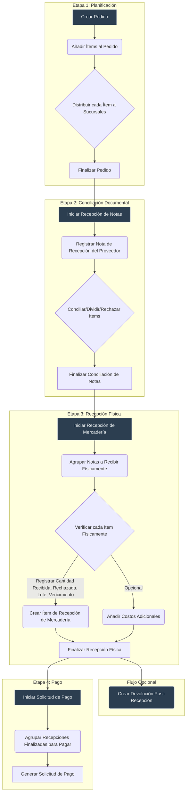

# Manual de Implementación Frontend: Flujo de Compras Refactorizado (Versión 2.0)

## 1. Introducción y Filosofía

Este documento es la guía definitiva para el desarrollo de la interfaz de usuario (UI) del módulo de compras. El nuevo backend está diseñado bajo un principio de **desacoplamiento de responsabilidades**, separando claramente la *planificación* (el pedido), la *realidad documental* (la nota del proveedor) y la *realidad física* (la mercadería recibida).

La UI debe reflejar esta separación, guiando al usuario a través de un flujo lógico y granular, donde cada etapa es un evento discreto y auditable. El estado del proceso se gestiona principalmente a través de la entidad `ProcesoEtapa`.

## 2. Diagrama de Flujo Conceptual



---

## 3. Flujo de Trabajo Detallado

### **Etapa 1: Creación del Pedido (Planificación)**

-   **Objetivo:** Crear una orden de compra formal con todos los detalles de los productos solicitados y su distribución planificada.
-   **Entidades Clave:** `Pedido`, `PedidoItem`, `PedidoItemDistribucion`, `ProcesoEtapa`, `PedidoSucursalInfluencia`, `PedidoSucursalEntrega`.

#### Flujo de Trabajo:
1.  **Iniciar Creación:**
    *   El usuario selecciona un `Proveedor`, `Moneda` y `FormaPago`. Si es a plazo, debe indicar los `plazoCredito` (días).
    *   La UI debe permitir seleccionar múltiples sucursales de **entrega** (`PedidoSucursalEntrega`) y de **influencia** (`PedidoSucursalInfluencia`).
    *   Al guardar esta cabecera, se crean registros en `Pedido`, `PedidoSucursalEntrega` y `PedidoSucursalInfluencia`.
    *   Simultáneamente, se crea un registro en `ProcesoEtapa` con `tipo_etapa` = `CREACION`, y `estado_etapa` = `EN_PROCESO`.

2.  **Añadir Ítems (`PedidoItem`):**
    *   El usuario busca y añade productos. Por cada uno, se crea un `PedidoItem` con:
        *   `productoId`, `cantidadSolicitada`, `precioUnitarioSolicitado`, `vencimientoEsperado`, `observacion`.
        *   **Bonificación:** La UI debe incluir un checkbox para marcar el ítem como `esBonificacion`. Si está marcado, el `precioUnitarioSolicitado` debe ser `0`.

3.  **Distribuir Ítems (`PedidoItemDistribucion`):**
    *   Por cada `PedidoItem`, la UI debe permitir su distribución a las sucursales definidas como de **entrega**.
    *   **Lógica de Discrepancia:** Si al finalizar la distribución, `sum(cantidadAsignada)` no es igual a `cantidadSolicitada`, la UI debe mostrar un diálogo: *"La cantidad distribuida (X) no coincide con la solicitada (Y). ¿Desea actualizar la cantidad solicitada a X?"*. Esto permite al usuario corregir la solicitud original basándose en la distribución.

4.  **Finalizar Etapa de Creación:**
    *   El usuario hace clic en "Finalizar Pedido".
    *   **Validación:** Solo se requiere que existan ítems en el pedido. **No es obligatorio** que todos los ítems estén distribuidos para finalizar esta etapa.
    *   **Backend:** Actualiza el `ProcesoEtapa` de `CREACION` a `COMPLETADA` y el de `RECEPCION_NOTA` a `PENDIENTE`.
    *   **UI:** El pedido se vuelve de solo lectura y avanza a la siguiente etapa.

---

### **Etapa 2: Recepción de Notas (Conciliación Documental)**

-   **Objetivo:** Registrar las facturas del proveedor y conciliarlas con el pedido original.
-   **Entidades Clave:** `NotaRecepcion`, `NotaRecepcionItem`, `NotaRecepcionItemDistribucion`, `ProcesoEtapa`.

#### Flujo de Trabajo:
1.  **Iniciar Etapa:**
    *   Al hacer clic en "Iniciar Recepción de Notas", el sistema puede proceder directamente sin validaciones de distribución.
    *   **Validación Opcional:** Si se requiere validar distribuciones, se puede implementar como una verificación opcional que informe al usuario sobre ítems pendientes sin bloquear el avance.
    *   El `ProcesoEtapa` de `RECEPCION_NOTA` pasa a `EN_PROCESO`.

2.  **Registrar Notas (`NotaRecepcion`):**
    *   El usuario registra los datos de la factura del proveedor.

3.  **Conciliar Ítems (`NotaRecepcionItem`):**
    *   La UI presenta una tabla de `PedidoItem` pendientes. La tabla debe tener **checkboxes** para selección múltiple.
    *   **Lógica de División de Ítems:** Un `PedidoItem` puede ser conciliado parcialmente en múltiples `NotaRecepcionItem` a través de diferentes notas.
        *   **Ejemplo:** Se piden 100 unidades. El usuario selecciona el `PedidoItem`. La UI muestra "100 unidades pendientes". El usuario crea un `NotaRecepcionItem` en la Nota A por 40 unidades. El `PedidoItem` original ahora mostrará "60 unidades pendientes" para futuras conciliaciones en otras notas.
    *   **Lógica de Rechazo Documental:** Para cada `NotaRecepcionItem` que se está creando/conciliando, la UI debe ofrecer las acciones:
        *   **Conciliar:** Crea el `NotaRecepcionItem` con estado `CONCILIADO`.
        *   **Rechazar:** Crea el `NotaRecepcionItem` con estado `RECHAZADO` y exige un `motivoRechazo`. Un ítem rechazado aquí no pasará a la etapa de recepción física.

    > **Filosofía Clave de Conciliación:**
    > Para mantener la integridad y trazabilidad del proceso, es fundamental seguir esta regla:
    > *   **El `PedidoItem` es Inmutable:** Representa el plan original y no debe ser modificado después de la etapa de planificación.
    > *   **La `NotaRecepcionItem` es la Realidad Documental:** Todas las variaciones (cantidad, precio, producto) o acciones (división, rechazo) se registran creando o modificando `NotaRecepcionItem`. Un `PedidoItem` puede ser conciliado por múltiples `NotaRecepcionItem` a lo largo de varias notas, consumiendo su "cantidad pendiente" sin alterarse a sí mismo.
    > *   **La `NotaRecepcionItemDistribucion` es la Distribución Documental:** Cada `NotaRecepcionItem` puede tener múltiples distribuciones que especifican a qué sucursales debe enviarse según la documentación del proveedor. Esto permite capturar la "realidad documental" de la distribución, separándola del plan original (`PedidoItemDistribucion`).

4.  **Finalizar Etapa de Conciliación:**
    *   El usuario hace clic en "Finalizar Conciliación".
    *   **Validaciones:**
        1.  Se verifica que existan notas registradas para proceder con la siguiente etapa.
        2.  **Distribución:** La distribución de sucursales es informativa; ítems sin distribución completa pueden proceder igualmente.
    *   Si las validaciones pasan, el backend actualiza los `ProcesoEtapa`.

---

### **Etapa 3: Recepción de Mercadería (Verificación Física)**

-   **Objetivo:** Registrar el evento físico de recibir productos.
-   **Entidades Clave:** `RecepcionMercaderia`, `RecepcionMercaderiaItem`, `RecepcionMercaderiaNota`.

> **Nota Importante sobre Distribuciones:** En esta etapa, el sistema debe usar las distribuciones de `NotaRecepcionItemDistribucion` como base para la recepción física, no las distribuciones originales del `PedidoItemDistribucion`. Esto asegura que la recepción física se realice contra lo que realmente dice la documentación del proveedor.

#### Flujo de Trabajo:
1.  **Crear Evento de Recepción (`RecepcionMercaderia`):**
    *   Tras iniciar la etapa, el usuario crea la cabecera del evento.
    *   **Lógica de Filtrado:** La UI debe permitir seleccionar `NotaRecepcion`s para agrupar. La consulta al backend para obtener esta lista debe filtrar solo notas que:
        *   Pertenezcan al mismo `Proveedor`.
        *   No hayan sido completamente recepcionadas o finalizadas.

2.  **Verificar Ítems Físicos (`RecepcionMercaderiaItem`):**
    *   Para cada `NotaRecepcionItem` (que no fue rechazado en la etapa anterior), el usuario registra la realidad física.
    *   **Distribución Física:** El sistema debe mostrar las cantidades esperadas por sucursal basándose en `NotaRecepcionItemDistribucion`, no en la distribución original del pedido.
    *   **Rechazo y Modificación:** El usuario puede registrar una `cantidadRecibida` menor a la esperada y una `cantidadRechazada` con su `motivoRechazo`.
    *   **Impacto en el Costo:** El valor final a pagar por una `NotaRecepcion` **se basará en la suma de `precio * cantidadRecibida` de sus ítems**, no en el valor original de la nota. La UI debe reflejar esto en los resúmenes.

3.  **Finalizar Etapa Física:**
    *   Al finalizar, el backend crea los `MovimientoStock` y actualiza los costos. El `ProcesoEtapa` de `RECEPCION_MERCADERIA` se completa.

---

### **Etapa 4: Solicitud de Pago**

-   **Objetivo:** Agrupar recepciones finalizadas para generar una orden de pago.
-   **Entidades Clave:** `SolicitudPago`, `SolicitudPagoRecepcion`.

#### Flujo de Trabajo:
1.  **Agrupar Recepciones:**
    *   El usuario selecciona una o más `RecepcionMercaderia` con estado `FINALIZADA`.
2.  **Calcular y Guardar:**
    *   La UI calcula el `montoTotal` a pagar, que ya refleja las cantidades realmente recibidas (ver punto de "Impacto en el Costo" de la Etapa 3).
    *   Se guarda la `SolicitudPago`.
    *   Se completa el `ProcesoEtapa` final. Si todas las etapas están completas, el `Pedido` pasa a `CONCLUIDO`.

---

## 4. Propuesta de Implementación Visual (UI/UX) - v2

### **Principios Generales de Diseño**

-   **Componente Único:** Un componente principal `GestionComprasComponent` gestionará todo el flujo.
-   **Cabecera Persistente:** En la parte superior de la pantalla, una cabecera fija mostrará siempre la información clave del pedido (`Proveedor`, `Nro Pedido`, `Fecha`, `Monto Total`, `Estado del Proceso`), independientemente de la pestaña actual.
-   **Navegación por Pestañas:** Debajo de la cabecera, un `mat-tab-group` organizará el flujo de trabajo. Las pestañas se habilitarán progresivamente a medida que el usuario complete las etapas, permitiendo una navegación libre entre las pestañas ya habilitadas.
-   **Acciones en Tablas:** Para mantener las tablas limpias, todas las acciones por fila se agruparán dentro de un `mat-menu` (un botón con tres puntos `...` que despliega un menú).

### **Vista Principal: `GestionComprasComponent`**

#### **1. Cabecera Fija del Pedido**
-   **Contenido:**
    *   `Proveedor`: `[Nombre del Proveedor]`
    *   `Pedido Nro`: `[ID del Pedido]`
    *   `Fecha Creación`: `[Fecha]`
    *   `Estado`: Chip de color (`mat-chip`) indicando el estado general (Ej: `EN PLANIFICACIÓN`, `EN RECEPCIÓN`, `CONCLUIDO`).
    *   `Monto Total`: `[Suma de ítems]`
-   **Comportamiento:** Visible en todo momento.

#### **2. Navegación Principal por Pestañas (`mat-tab-group`)**

---

### **UI de la Pestaña 1: Datos del Pedido**

-   **Título de la Pestaña:** "1. Datos Generales"
-   **Contenido:**
    *   Un `formGroup` para los datos principales.
    *   Campos: `Proveedor` (autocomplete), `Moneda` (select), `FormaPago` (select).
    *   Campo condicional: `plazoCredito` (input numérico) si `FormaPago` es a plazo.
    *   Selects múltiples: `Sucursales de Entrega` y `Sucursales de Influencia`.
-   **Acciones de la Pestaña:**
    *   Botón "Guardar y Continuar" que guarda la cabecera, valida los datos y habilita y selecciona la siguiente pestaña.

---

### **UI de la Pestaña 2: Ítems del Pedido**

-   **Título de la Pestaña:** "2. Ítems del Pedido"
-   **Contenido:**
    *   Botón "Añadir Ítem" que abre un diálogo.
    *   **Tabla de Ítems (`mat-table`):**
        *   Columnas: Producto, Cantidad Solicitada, Precio, Bonificación, Vencimiento, **Distribución**, Acciones.
        *   **Columna "Distribución"**: Mostrará un chip (`mat-chip`) de color para indicar el estado:
            *   Verde: "Completa"
            *   Naranja: "Incompleta"
            *   Rojo: "Pendiente"
        *   **Columna "Acciones" (`mat-menu`):**
            *   "Distribuir Ítem"
            *   "Editar Ítem"
            *   "Eliminar Ítem"
-   **Diálogos:**
    *   Se mantienen los diálogos de "Añadir/Editar Ítem" y "Distribuir Ítem" de la propuesta anterior.
-   **Acciones de la Pestaña:**
    *   Botón "Finalizar Planificación" para avanzar a la siguiente etapa principal.

---

### **UI de la Pestaña 3: Conciliación Documental**

-   **Título de la Pestaña:** "3. Recepción de Notas"
-   **Contenido:**
    *   Botón de inicio "Iniciar Conciliación" si la etapa está pendiente.
    *   **Layout de dos paneles (visible si está `EN_PROGRESO`):**
        1.  **Panel Izquierdo (60% ancho): Ítems del Pedido Pendientes de Conciliar**
            *   **Tabla (`mat-table`):** Muestra `PedidoItem` con cantidad > 0 por conciliar.
            *   **Selección:** Checkbox en cada fila y un checkbox "Seleccionar Todos" en la cabecera.
            *   **Columnas:** Checkbox, Producto, Cant. Pendiente, **Estado Distribución**, Acciones (`mat-menu`).
            *   **Indicador de Distribución:** Un icono informativo junto a los ítems con distribución "Incompleta" o "Pendiente" (solo informativo, no bloquea el proceso).
            *   **Acciones en Ítems (`mat-menu`):**
                *   "Editar Ítem" (abre diálogo)
                *   "Dividir Ítem" (abre diálogo para conciliación parcial)
                *   "Rechazar Ítem" (abre diálogo para rechazo documental)
            *   **Botones de Acción (encima de la tabla):**
                *   "Crear nueva nota para ítems" (habilitado si se seleccionan ítems).
                *   "Asignar ítems a la nota" (habilitado si se seleccionan ítems Y una nota en el panel derecho).
                *   "Añadir Nuevo Ítem al Pedido" (botón para casos excepcionales).

        2.  **Panel Derecho (40% ancho): Notas de Recepción Registradas**
            *   **Tabla (`mat-table`):** Muestra las `NotaRecepcion` creadas.
            *   **Selección:** Al hacer clic en una fila, esta cambia de color para indicar la selección. Solo se puede seleccionar una a la vez.
            *   **Columnas:** Nro. Factura, Fecha, Total, Acciones (`mat-menu`).
            *   **Acciones en Notas (`mat-menu`):**
                *   "Editar Nota e Ítems" (abre diálogo unificado para editar la cabecera de la nota y gestionar los ítems asignados).
                *   "Eliminar Nota" (con confirmación).

-   **Flujo de Trabajo y Diálogos:**
    > **Filosofía Clave de Conciliación (Aplicada a la UI):**
    > Las acciones de la UI ("Dividir Ítem", "Rechazar Ítem", "Editar Ítem") **nunca deben modificar el `PedidoItem` original**. Su propósito es abrir diálogos que faciliten la creación y modificación de `NotaRecepcionItem` que reflejen con precisión la factura del proveedor. Esto asegura que la comparación entre lo planificado y lo documentado sea siempre clara.
    
    1.  **Asignar a Nota Existente:** Usuario selecciona ítems (izquierda) -> selecciona nota (derecha) -> clic en "Asignar ítems a la nota". El sistema asigna automáticamente los ítems, copiando los datos.
    2.  **Asignar a Nota Nueva:** Usuario selecciona ítems (izquierda) -> clic en "Crear nueva nota para ítems". Se abre un diálogo para crear la nota, y al confirmar, los ítems se asignan.
    3.  **Modificar Asignación:** Para modificar cantidad/precio de un ítem en una nota, el usuario debe usar la acción "Editar Nota e Ítems" y editarlo desde ahí. El diálogo unificado debe mostrar claramente qué ítems tienen distribución pendiente.
    
    **Diálogo Unificado "Editar Nota e Ítems":**
    -   **Layout del Formulario (3 filas):**
        *   **Fila 1:** Tipo Boleta, Número, Timbrado
        *   **Fila 2:** Fecha, Moneda, Cotización
        *   **Fila 3:** Card con información adicional (Total de ítems a vincular, Monto total, Estado)
    -   **Lista de Ítems:** Visible solo si la nota ya existe. Permite gestionar los ítems asignados a la nota.
    -   **Funcionalidad:** Fusiona la edición de la cabecera de la nota con la gestión de sus ítems en una sola interfaz.

-   **Acciones de la Pestaña:**
    *   Botón "Finalizar Conciliación". Realiza validaciones estrictas antes de avanzar.

---

### **UI de la Pestaña 4: Recepción de Mercadería**

-   **Título de la Pestaña:** "4. Verificación Física"

-   **Contenido (Fase de Configuración):**
    *   Si la etapa está `EN_PROGRESO`, primero se muestra una pantalla de configuración.
    1.  **Selección de Sucursales:**
        *   Un campo `mat-select` múltiple para que el usuario elija una o más sucursales para la recepción.
        *   Los ítems a recibir se filtrarán según esta selección.
    2.  **Selección de Modo de Recepción:**
        *   Un `mat-button-toggle-group` para que el usuario elija el modo de trabajo:
            *   **Opción A: "Agrupar por Notas"**
            *   **Opción B: "Agrupar por Productos"**
    3.  **Botón de Inicio:**
        *   Un botón "Iniciar Verificación" que se habilita una vez que se han seleccionado sucursales y un modo.

-   **Layout (Modo "Agrupar por Notas"):**
    *   Una vez iniciada la verificación en este modo, se presenta un layout de dos paneles.
    1.  **Panel Derecho: Lista de Notas**
        *   Muestra una tabla con las `NotaRecepcion` que tienen ítems pendientes de recibir para las sucursales seleccionadas.
        *   Al hacer clic, la nota se resalta, indicando que está seleccionada, y se carga su contenido en el panel izquierdo.
    2.  **Panel Izquierdo: Ítems de la Nota Seleccionada**
        *   **Tabla (`mat-table`):** Muestra los `NotaRecepcionItem` de la nota y sucursales seleccionadas.
        *   **Columnas:** Producto, Cant. Esperada, Cant. Recibida, Sucursal, Acciones (`mat-menu`).
        *   **Acciones en Ítems (`mat-menu`):**
            *   **"Verificar Ítem":** Abre el diálogo de verificación.
            *   **"Rechazar Ítem":** Abre el diálogo de rechazo.

-   **Layout (Modo "Agrupar por Productos"):**
    *   *Propuesta:* Una única tabla que agrupa todos los ítems de todas las notas por producto.
    *   **Tabla (`mat-table`):**
        *   **Columnas:** Producto, Cant. Total Esperada, Cant. Total Recibida, Acciones (`mat-menu`).
        *   **Acciones en Ítems (`mat-menu`):**
            *   **"Verificar Producto":** Abre un diálogo similar al de "Verificar Ítem", pero podría mostrar un desglose de las cantidades por nota de origen.

-   **Diálogos Clave:**
    1.  **Diálogo "Verificar Ítem":**
        *   **Título:** "Verificar: [Nombre del Producto]".
        *   **Contenido:** Una tabla simple o lista que muestra las cantidades **por sucursal** (de las seleccionadas en la configuración).
        *   **Columnas del Diálogo:** Sucursal, Cantidad Esperada, Cantidad Recibida (input numérico), Cantidad Rechazada (input numérico).
        *   **Lógica:**
            *   Las cantidades `Recibida` y `Rechazada` vienen pre-cargadas (`Recibida` = `Esperada`, `Rechazada` = `0`).
            *   Si el usuario modifica cualquier cantidad, aparece un campo de texto obligatorio `Motivo de la Modificación`.
            *   El usuario puede aceptar con un solo clic si todo está correcto.
    2.  **Diálogos "Rechazar Ítem":**
        *   Permite registrar el rechazo total o parcial de un ítem, exigiendo un motivo.

-   **Acciones de la Pestaña:**
    *   Botón "Finalizar Recepción Física".

---

### **UI de la Pestaña 5: Solicitud de Pago**

-   **Título de la Pestaña:** "5. Solicitud de Pago"
-   **Contenido:**
    *   Botón de inicio "Iniciar Solicitud de Pago".
    *   **Layout (visible si está `EN_PROGRESO`):**
        1.  **Tabla de Notas Disponibles (`mat-table`):**
            *   Muestra las `NotaRecepcion` con estado `FINALIZADA` que aún no han sido incluidas en una solicitud de pago.
            *   **Selección:** Checkbox en cada fila y un checkbox "Seleccionar Todos" en la cabecera.
            *   **Columnas:** Checkbox, Nro. Factura, Fecha, Monto a Pagar (calculado en base a la mercadería recibida), Estado.
            *   La tabla debe ser paginada y soportar filtros en el backend.
        2.  **Botón de Acción (encima de la tabla):**
            *   "Crear Solicitud de Pago" (habilitado si se selecciona al menos una nota).

-   **Diálogos:**
    1.  **Diálogo "Crear Solicitud de Pago":**
        *   **Título:** "Confirmar y Generar Solicitud de Pago".
        *   **Contenido (Formulario):**
            *   `Proveedor`: `[Nombre del Proveedor]` (Solo lectura).
            *   `Total a Pagar`: `[Suma de los montos de las notas seleccionadas]` (Solo lectura).
            *   `Moneda`: `mat-select` pre-cargado con la moneda del pedido (editable).
            *   `Forma de Pago`: `mat-select` pre-cargado con la forma de pago del pedido (editable).
            *   `Plazo (días)`: `input` numérico, visible y editable si la forma de pago es a crédito.
        *   **Botones del Diálogo:**
            *   "Cancelar".
            *   "Generar Solicitud".

-   **Acciones de la Pestaña:**
    *   Texto indicativo: "El pedido se marcará como 'Concluido' una vez que todas las solicitudes de pago asociadas sean procesadas."

---

## 5. Estándares Técnicos y de Estilo

Esta sección define las reglas obligatorias y las guías de estilo para asegurar la consistencia, el rendimiento y la mantenibilidad de la aplicación.

### **Reglas Técnicas Obligatorias**

1.  **Prohibido el Uso de Funciones/Getters en Templates:**
    *   **Regla:** Nunca se deben usar llamadas a funciones, métodos o `getters` directamente en el template HTML (`*.html`). Esto incluye `*ngIf`, `*ngFor`, `[class]`, `{{...}}`, etc.
    *   **Razón:** Angular evalúa estas expresiones en cada ciclo de detección de cambios, causando graves problemas de rendimiento.
    *   **Solución:** Acceder directamente al objeto en el template, ejemplo, en vez de usar {{getNombre(persona)}}, directamente en el template {{persona.nombre}}. Si esto no es posible utilizar propiedades pre-calculadas en el componente (`.ts`). Cuando los datos cambien, recalcular los valores en una única función (ej. `updateComputedProperties()`) y almacenarlos en propiedades simples. Los templates solo deben hacer binding a estas propiedades.

2.  **Paginación y Filtros en el Backend:**
    *   **Regla:** Todas las listas y tablas de datos deben ser paginadas. La lógica de paginación y filtrado debe residir exclusivamente en el backend.
    *   **Razón:** Cargar grandes volúmenes de datos en el frontend para luego filtrarlos consume una cantidad excesiva de memoria y ancho de banda, y degrada la experiencia del usuario.
    *   **Solución:** Los componentes de frontend deben enviar los parámetros de paginación (página, tamaño) y los criterios de filtro al API. El backend se encarga de realizar la consulta a la base de datos y devolver solo el subconjunto de datos solicitado.

3.  **Uso del Componente Genérico de Búsqueda:**
    *   **Regla:** Para todas las búsquedas con diálogos, usar el componente `SearchListDialogComponent` ubicado en `src/app/shared/components/search-list-dialog/`.
    *   **Configuración:** Definir `TableData[]` para las columnas, proporcionar la query GraphQL, y manejar el resultado en `afterClosed()`.
    *   **Funcionalidades:** El componente incluye paginación automática, funcionalidad de búsqueda, navegación por teclado, y UI consistente.
    *   **Ejemplo de Uso:**
        ```typescript
        // Definir columnas de la tabla
        let tableData: TableData[] = [
          { id: "id", nombre: "Id" },
          { id: "nombre", nombre: "Nombre" },
          { id: "descripcion", nombre: "Descripción" }
        ];
        
        // Configurar datos del diálogo
        let data: SearchListtDialogData = {
          query: this.searchQuery, // GraphQL query
          tableData: tableData,
          titulo: "Buscar elementos",
          search: true,
          queryData: { texto: this.searchControl.value },
          inicialSearch: true,
          paginator: true
        };
        
        // Abrir diálogo y manejar resultado
        this.matDialog.open(SearchListDialogComponent, {
          data: data,
          width: "60%",
          height: "80%"
        }).afterClosed().subscribe((result) => {
          if (result != null) {
            // Manejar selección
          }
        });
        ```

### **Guía de Estilo Visual Explícita**

Para mantener una apariencia visual coherente, los nuevos componentes deben seguir los siguientes patrones de estilo.

#### **1. Colores Principales**

| Uso                  | Color Hex | Variable (si aplica) |
| -------------------- | --------- | -------------------- |
| Fondo Primario       | `#2d2d2d` | -                    |
| Fondo Secundario     | `#3a3a3a` | -                    |
| Acento Naranja       | `#f57c00` | -                    |
| Texto Primario       | `#ffffff` | -                    |
| Texto Secundario     | `#f0f0f0` | -                    |
| Texto Tenue          | `#bbbbbb` | -                    |
| Borde Primario       | `#555555` | -                    |
| Verde (Éxito)        | `#4caf50` | -                    |
| Rojo (Error/Alerta)  | `#f44336` | -                    |

#### **2. Cabecera Principal (Componente `GestionComprasComponent`)**

La cabecera debe usar un fondo con gradiente.

```scss
.pedido-header .header-card {
  background: linear-gradient(135deg, #667eea89 0%, #764ba29a 100%);
  color: #ffffff;
  box-shadow: 0 4px 12px rgba(0, 0, 0, 0.3);
  border-radius: 8px;
}

.pedido-header .mat-card-title {
  font-size: 1.75rem;
  font-weight: 500;
}

.info-label {
  color: #f57c00;
  font-size: 1.2rem;
  font-weight: 600;
  text-transform: uppercase;
}
```

#### **3. Diálogos**

La cabecera de los diálogos debe replicar el gradiente principal.

```scss
.dialog-header {
  background: linear-gradient(135deg, #667eea 0%, #764ba2 100%);
  padding: 20px 24px;

  h2 {
    margin: 0;
    font-size: 22px;
    font-weight: 600;
    color: #ffffff;
    text-shadow: 0 1px 2px rgba(0, 0, 0, 0.3);
  }
}

.dialog-content {
  background-color: #2d2d2d;
  padding: 16px;
}
```

#### **4. Tablas (`mat-table`)**

Las tablas deben tener un estilo oscuro y limpio, con un resaltado claro para las filas seleccionadas o activas.

```scss
.mat-table {
  background-color: transparent;
}

.mat-header-cell {
  color: #f57c00; // Naranja de acento para cabeceras
  font-size: 14px;
  font-weight: 600;
  text-transform: uppercase;
}

.mat-cell {
  color: #f0f0f0; // Texto primario
  border-bottom-color: #555555; // Borde sutil
}

// Estilo para una fila seleccionada
.mat-row.selected-row, .mat-row:hover {
  background-color: rgba(245, 124, 0, 0.15); // Naranja con opacidad
}

// Estilo para el paginador
.mat-paginator {
  background-color: #3a3a3a;
  color: #bbbbbb;
}
```

#### **5. Botones (`mat-button`)**

Los botones deben seguir una jerarquía visual clara.

```scss
// Botón primario (Ej: Finalizar, Generar)
button[color="accent"].mat-raised-button {
  background-color: #f57c00;
  color: white;
  font-weight: 600;
}

// Botón secundario (Ej: Añadir)
button[color="primary"].mat-raised-button {
  background-color: #667eea;
  color: white;
}

// Botón de peligro/cancelación
button[color="warn"].mat-raised-button {
  background-color: #f44336;
  color: white;
}

// Botón estándar/de texto
button.mat-button {
  color: #f0f0f0;
}
```

#### **6. Formularios (`mat-form-field`)**

Los campos de formulario deben ser claramente visibles sobre el fondo oscuro.

```scss
.mat-form-field {
  // Color de la etiqueta flotante y la línea inferior cuando está activo
  ::ng-deep .mat-form-field-outline-thick,
  ::ng-deep .mat-form-field.mat-focused .mat-form-field-label {
    color: #667eea !important;
  }

  // Color del texto del input
  ::ng-deep .mat-input-element {
    color: #ffffff;
  }

  // Color de la etiqueta estándar
  ::ng-deep .mat-form-field-label {
    color: rgba(255, 255, 255, 0.7);
  }

  // Color de la línea inferior
  ::ng-deep .mat-form-field-underline {
    background-color: rgba(255, 255, 255, 0.42);
  }
}
```

#### **7. Chips (`mat-chip`)**

Los chips se usan para mostrar estados o contadores.

```scss
.mat-chip {
  font-weight: 600;

  &.estado-activo {
    background-color: #4caf50; // Verde
    color: white;
  }

  &.estado-pendiente, &.distribution-pending {
    background-color: #f57c00; // Naranja
    color: white;
  }

  &.estado-cancelado {
    background-color: #f44336; // Rojo
    color: white;
  }
}
```

---

## 6. Nueva Entidad: NotaRecepcionItemDistribucion

### **Propósito y Filosofía**

La entidad `NotaRecepcionItemDistribucion` es una mejora crítica que cierra un "gap" importante en el flujo de distribución del sistema. Su propósito es capturar la **"realidad documental"** de la distribución, separándola del plan original (`PedidoItemDistribucion`).

### **Problema que Resuelve**

**Antes de esta entidad:**
- El sistema solo tenía `PedidoItemDistribucion` (plan original).
- No había forma de registrar si el proveedor especificaba una distribución diferente en su factura.
- La recepción física se basaba en el plan original, no en lo que realmente decía la documentación.

**Después de esta entidad:**
- **Flujo completo de distribución:** `PedidoItemDistribucion` (Plan) → `NotaRecepcionItemDistribucion` (Documento) → `RecepcionMercaderiaItem` (Realidad Física).
- **Trazabilidad completa:** Se puede comparar lo planificado vs. lo documentado vs. lo recibido.
- **Flexibilidad operativa:** El proveedor puede cambiar la distribución en su factura sin corromper el plan original.

### **Estructura de la Entidad**

```sql
CREATE TABLE operaciones.nota_recepcion_item_distribucion (
    id BIGSERIAL PRIMARY KEY,
    nota_recepcion_item_id BIGINT NOT NULL,
    sucursal_entrega_id BIGINT NOT NULL,
    cantidad DOUBLE PRECISION NOT NULL,
    creado_en TIMESTAMP DEFAULT CURRENT_TIMESTAMP,
    usuario_id BIGINT
);
```

### **Integración en el Flujo**

1. **Etapa de Conciliación Documental:**
   - Cuando se crea un `NotaRecepcionItem`, se debe distribuir usando `NotaRecepcionItemDistribucion`.
   - La UI debe permitir al usuario especificar a qué sucursales va cada cantidad según la factura.

2. **Etapa de Recepción Física:**
   - El sistema debe usar `NotaRecepcionItemDistribucion` como base para mostrar las cantidades esperadas por sucursal.
   - Los `RecepcionMercaderiaItem` se crean basándose en estas distribuciones documentales.

### **Implementación Completada**

✅ **Backend:**
- Entidad Java: `NotaRecepcionItemDistribucion.java`
- Repositorio: `NotaRecepcionItemDistribucionRepository.java`
- Servicio: `NotaRecepcionItemDistribucionService.java`
- GraphQL Resolver: `NotaRecepcionItemDistribucionGraphQL.java`
- Schema GraphQL: `nota-recepcion-item-distribucion.graphqls`
- Migración: `V78__create_nota_recepcion_item_distribucion.sql`

✅ **Frontend:**
- Modelo TypeScript: `nota-recepcion-item-distribucion.model.ts`
- Queries GraphQL: Agregadas a `graphql-query.ts`
- Servicios Apollo: `GetNotaRecepcionItemDistribucionGQL`, `SaveNotaRecepcionItemDistribucionGQL`, etc.
- Métodos en PedidoService: `onGetNotaRecepcionItemDistribucionesByNotaRecepcionItemId()`, etc.

### **Ejemplo de Uso**

```typescript
// Obtener distribuciones de un ítem de nota
this.pedidoService.onGetNotaRecepcionItemDistribucionesByNotaRecepcionItemId(notaRecepcionItemId)
  .subscribe(distribuciones => {
    // Mostrar distribuciones por sucursal
    distribuciones.forEach(dist => {
      console.log(`Sucursal: ${dist.sucursalEntrega.nombre}, Cantidad: ${dist.cantidad}`);
    });
  });

// Guardar nuevas distribuciones
const distribuciones: NotaRecepcionItemDistribucionInput[] = [
  { notaRecepcionItemId: 1, sucursalEntregaId: 1, cantidad: 5 },
  { notaRecepcionItemId: 1, sucursalEntregaId: 2, cantidad: 3 }
];

this.pedidoService.onSaveNotaRecepcionItemDistribuciones(distribuciones)
  .subscribe(result => {
    console.log('Distribuciones guardadas:', result);
  });
```

---

## 6. Manejo de Cantidades y Presentaciones

### **Principio Fundamental: Cantidades en Unidad Base**

**Regla de Oro:** Todas las cantidades en la base de datos se almacenan en la **unidad base del producto**, nunca por presentación.

**Ejemplo Práctico:**
- **Producto:** Shampoo (unidad base = 1 botella)
- **Presentación de Compra:** Caja de 6 botellas
- **Usuario ingresa:** 10 cajas
- **Sistema guarda:** 60 botellas (10 × 6)
- **Precio unitario:** Siempre por botella (unidad base)

### **Beneficios de este Enfoque**

1. **Cero Ambigüedad:** `cantidad` siempre significa lo mismo, independientemente de la presentación
2. **Facilidad de Cálculo:** `Costo Total = cantidad × precioUnitario` (ambos en unidades base)
3. **Flexibilidad:** Permite cantidades no múltiplos exactos de la presentación si es necesario
4. **Consistencia:** Inventario, ventas y compras manejan las mismas unidades

### **Trazabilidad de Presentaciones**

El sistema registra la presentación en cada etapa del flujo para mantener trazabilidad completa:

1. **`PedidoItem.presentacionCreacion`**: Presentación solicitada al proveedor
2. **`NotaRecepcionItem.presentacionEnNota`**: Presentación que el proveedor factura  
3. **`RecepcionMercaderiaItem.presentacionRecibida`**: Presentación que se recibe físicamente

**Ejemplo de Escenario Complejo:**
```
Pedido:     10 cajas de 6 → cantidadSolicitada: 60, presentacionCreacion: "Caja x6"
Factura:    5 cajas de 12 → cantidadEnNota: 60, presentacionEnNota: "Caja x12"  
Recepción:  5 cajas de 12 → cantidadRecibida: 60, presentacionRecibida: "Caja x12"
```

### **Implementación en Frontend**

#### **Componente `add-edit-item-dialog`**

**Campos del Formulario:**
- **`cantidadPorPresentacion`**: Lo que ve y edita el usuario
- **`cantidadSolicitada`**: Calculado automáticamente (cantidad × presentación.cantidad)
- **`presentacion`**: Selección de la presentación de compra

**Lógica de Conversión:**
```typescript
private updateCantidadBase(cantidadPorPresentacion: number): void {
  const presentacion = this.itemForm.get("presentacion")?.value;
  if (presentacion && presentacion.cantidad > 0) {
    const cantidadEnUnidadesBase = cantidadPorPresentacion * presentacion.cantidad;
    this.itemForm.get("cantidadSolicitada")?.setValue(cantidadEnUnidadesBase, { emitEvent: false });
  }
}
```

**Experiencia de Usuario:**
- Usuario ve: "Cantidad por Presentación: 10"
- Sistema muestra hint: "= 60 unidades base"
- Sistema guarda: `cantidadSolicitada: 60`

#### **Visualización en Tablas**

```html
<!-- Mostrar tanto la cantidad por presentación como las unidades base -->
<td>{{ item.cantidadSolicitada / item.presentacionCreacion.cantidad | number }} 
    ({{ item.cantidadSolicitada | number }} unidades)</td>
```

### **Manejo de Discrepancias en Recepción**

El sistema maneja situaciones reales donde la recepción no coincide con lo planificado:

**Campos para Discrepancias:**
- `cantidadRecibida`: Cantidad aceptada e ingresada al inventario (unidades base)
- `cantidadRechazada`: Cantidad rechazada (unidades base)
- `motivoRechazo`: Razón del rechazo ("VENCIDO", "AVERIADO", "FALTANTE", etc.)
- `observaciones`: Detalles adicionales

**Ejemplos de Uso:**
```typescript
// Producto completamente vencido
{
  cantidadRecibida: 0,
  cantidadRechazada: 60,
  motivoRechazo: "VENCIDO",
  observaciones: "Lote completo vencido hace 2 meses"
}

// Faltante en el envío
{
  cantidadRecibida: 54,
  cantidadRechazada: 6,
  motivoRechazo: "FALTANTE",
  observaciones: "Caja rota, 6 unidades perdidas"
}

// Producto averiado
{
  cantidadRecibida: 57,
  cantidadRechazada: 3,
  motivoRechazo: "AVERIADO",
  observaciones: "3 botellas con tapa rota"
}
```

### **Migración V80: Campos de Presentación**

**Cambios en Base de Datos:**
- `nota_recepcion_item.presentacion_en_nota_id`: Presentación en la factura del proveedor
- `recepcion_mercaderia_item.presentacion_recibida_id`: Presentación física recibida

**Campos Agregados:**
- `recepcion_mercaderia_item.cantidad_rechazada`: Para registrar rechazos
- `recepcion_mercaderia_item.motivo_rechazo`: Razón del rechazo

**Actualización de Modelos:**
- ✅ Backend: Entidades Java actualizadas
- ✅ Frontend: Modelos TypeScript actualizados  
- ✅ GraphQL: Schemas actualizados
- ✅ Componentes: `add-edit-item-dialog` corregido para usar unidades base

---

## 7. Checklist de Implementación

Esta es la lista de tareas detallada para la construcción del nuevo módulo de compras. Se debe seguir en orden para asegurar una implementación estructurada.

### **Fase 1: Migración de Stepper a Tabs y Estructura Principal** 🔄 **EN PROGRESO**
-   [ ] **Tarea M.1 (Layout):** Reemplazar el componente `<mat-horizontal-stepper>` por un `<mat-tab-group>` en `gestion-compras.component.html`. Cada `<mat-step>` se convertirá en un `<mat-tab>`.
-   [ ] **Tarea M.2 (Lógica de Habilitación):** Implementar la propiedad `[disabled]` en cada `<mat-tab>`. La lógica deberá seguir las reglas definidas por el estado en `ProcesoEtapa` (ej. la pestaña de "Ítems" se habilita solo si el pedido ya fue creado).
-   [ ] **Tarea M.3 (Gestión de Estado):** En `gestion-compras.component.ts`, crear nuevas propiedades booleanas (`tabItemsHabilitado`, `tabNotasHabilitado`, etc.) para controlar el estado de los tabs de forma clara y declarativa.
-   [ ] **Tarea M.4 (Limpieza de Código):** Eliminar todas las propiedades y métodos relacionados con el stepper, como `currentStepIndex`, `isLinear`, `onStepChange` y la familia de propiedades `stepXCompleted`.
-   [ ] **Tarea M.5 (Navegación Programática):** Implementar la selección automática de la siguiente pestaña relevante después de una acción clave (ej. al guardar la cabecera, cambiar el foco a la pestaña "Ítems").
-   [x] **Layout:** Crear el componente `GestionComprasComponent` que contendrá toda la lógica.
-   [x] **Layout:** Implementar la cabecera fija superior y el `mat-horizontal-stepper`.
-   [x] **Mock Data:** Crear un servicio mock o un objeto local que provea un `Pedido` de ejemplo con un `ProcesoEtapa` inicial.
-   [x] **Lógica UI:** Cargar el pedido mock y desarrollar la lógica que controla el estado de los tabs (cuál está activo, cuáles están completados o bloqueados) basándose en `ProcesoEtapa`.
-   [x] **Integración:** Registrar el componente en `OperacionesModule` y configurar en `tab.service.ts`.

**Estado:** ✅ **COMPLETADA PARCIALMENTE** - La estructura base está lista. Las nuevas tareas se enfocan en la migración de la navegación.

### **Fase 2: Planificación del Pedido (Pestañas 1 y 2)** 🔄 EN PROGRESO

#### Pestaña 1: Datos Generales ✅ COMPLETADA
-   [x] **Layout:** Crear el formulario reactivo para los datos de la cabecera (Proveedor, Moneda, Forma de Pago, etc.).
-   [x] **Mock Data:** Rellenar los `mat-select` (Moneda, Forma de Pago) con datos falsos.
-   [x] **Integración Backend (Plan de Acción):**
    -   **Tarea B.1 (Queries de Búsqueda):**
        -   [x] ~~Crear/verificar query `proveedores(texto: String)` en `ProveedorGraphQL`.~~ **EXISTENTE**
        -   [x] ~~Crear/verificar query `vendedores(texto: String)` en `VendedorGraphQL`.~~ **EXISTENTE**
    -   **Tarea B.2 (Queries de Listado):**
        -   [x] ~~Crear/verificar query `monedas` en `MonedaGraphQL`.~~ **EXISTENTE**
        -   [x] ~~Crear/verificar query `formasPago` en `FormaPagoGraphQL`.~~ **EXISTENTE**
        -   [x] ~~Crear/verificar query `sucursales` en `SucursalGraphQL`.~~ **EXISTENTE**
    -   **Tarea F.1 (Integración Frontend):**
        -   [x] Implementar búsqueda de proveedor usando `SearchListDialogComponent`.
        -   [x] Implementar búsqueda de vendedor usando `SearchListDialogComponent`.
        -   [x] Cargar datos reales en `mat-select` de Moneda, Forma de Pago y Sucursal.
        -   [x] Actualizar `loadInitialData()` para usar servicios backend reales.
        -   [x] Implementar métodos `display*()` para mostrar datos en formularios.
        -   [x] Implementar validación condicional para plazo de crédito.
        -   [x] Conectar búsquedas con botones de búsqueda en inputs.
    -   **Tarea B.3 (Mutación de Guardado):**
        -   [x] ~~Crear mutación `savePedido` en `PedidoGraphQL`.~~ **EXISTENTE COMO `savePedidoFull`**
        -   [x] Crear archivos GraphQL centralizados (`graphql-query.ts`, `pedido-item-graphql-query.ts`).
        -   [x] Implementar servicio `SavePedidoFullGQL` en frontend.
        -   [x] Implementar lógica de guardado en `gestion-compras.component.ts`.
        -   [x] Conectar botón "Guardar y Continuar" de la Pestaña 1 para guardar cabecera.
        -   [x] Implementar navegación automática a la Pestaña 2 después del guardado.
        -   [x] Actualizar header dinámicamente con datos del formulario y pedido guardado.

**Estado:** ✅ **COMPLETADA** - Formulario funcional con validaciones, búsquedas integradas, guardado backend y navegación implementados.

#### Pestaña 2: Ítems del Pedido ✅ LAYOUT COMPLETADO
-   [x] **Layout:** Crear la tabla de ítems (`mat-table`) con paginación y el `mat-menu` para las acciones por fila.
-   [ ] **Layout:** Crear el diálogo "Añadir/Editar Ítem", incluyendo todos sus campos, validaciones y la navegación por tabs interna.
-   [ ] **Layout:** Crear el diálogo "Distribuir Ítem" para asignar cantidades a las sucursales.
-   [x] **Mock Data:** Conectar la tabla de ítems a una lista de `PedidoItem` falsos del pedido mock.
-   [x] **Lógica UI:** Implementar métodos de acción (añadir, editar, distribuir, eliminar ítems).
-   [x] **Propiedades Computadas:** Implementar contadores y estados calculados para evitar funciones en templates.
-   [ ] **Integración Backend (Plan de Acción):**
    -   **Tarea B.1 (Lógica de Distribución - CRÍTICO):**
        -   [x] Crear `PedidoItemDistribucionGraphQL.java`.
        *   [x] Crear input `PedidoItemDistribucionInput.java`.
        *   [x] Implementar mutación `savePedidoItemDistribuciones(pedidoItemId, distribuciones)`.
        -   [x] **COMPLETADO:** Crear `NotaRecepcionItemDistribucionGraphQL.java` para la distribución documental.
        *   [x] **COMPLETADO:** Crear input `NotaRecepcionItemDistribucionInput.java`.
        *   [x] **COMPLETADO:** Implementar mutaciones para gestionar `NotaRecepcionItemDistribucion`.
    -   **Tarea F.1 (Cargar Ítems):**
        *   [ ] Conectar tabla de ítems a la query `pedidoItemPorPedidoPage`.
    -   **Tarea F.2 (Diálogos de Ítem):**
        *   [ ] Usar `pdv-search-producto-dialog.component.ts` para la búsqueda de productos.
        *   [ ] Conectar diálogo "Añadir/Editar Ítem" a la mutación `savePedidoItem`.
        *   [ ] Conectar diálogo "Distribuir Ítem" a la nueva mutación `savePedidoItemDistribuciones`.
    -   **Tarea F.3 (Acciones):**
        *   [ ] Conectar botón "Eliminar" a la mutación `deletePedidoItem`.
        *   [ ] Conectar botón "Finalizar Planificación" a la mutación `finalizarCreacionPedido`.

**Estado:** ✅ **LAYOUT COMPLETADO** - Tabla funcional con mock data, acciones implementadas. Pendiente: diálogos e integración backend.

> **Nota Importante:** La lógica de validación ha sido actualizada para **no requerir distribuciones completas** antes de finalizar la planificación. El botón "Finalizar Planificación" ahora solo requiere que existan ítems en el pedido.

### **Fase 3: Recepción de Notas (Pestaña 3)** 🔄 EN PROGRESO
-   [x] **Layout:** Implementar interfaz de dos paneles para conciliación documental.
-   [x] **Layout:** Implementar tabla de `PedidoItem` pendientes (panel izquierdo).
-   [x] **Layout:** Implementar tabla de `NotaRecepcion` (panel derecho) con acciones.
-   [x] **Layout:** Crear diálogo "Añadir/Editar Nota" para la cabecera de la nota (`NotaRecepcion`).
-   [ ] **Layout:** Crear diálogo de **Conciliación de Ítem**. Este diálogo debe permitir:
    -   Modificar `cantidad` y `precio` para crear el `NotaRecepcionItem` (para manejar discrepancias).
    -   Dividir la cantidad de un `PedidoItem` (conciliación parcial).
    -   Marcar el `NotaRecepcionItem` como `RECHAZADO`, solicitando un motivo.
    -   **NUEVA FUNCIONALIDAD:** Distribuir el `NotaRecepcionItem` a sucursales usando `NotaRecepcionItemDistribucion`.
-   [x] **Modelo:** Crear modelo `NotaRecepcion` (anteriormente `NotaProveedor`) con enums como `NotaRecepcionEstado`.
-   [x] **Modelo:** Crear modelo `NotaRecepcionItemDistribucion` para capturar la distribución documental.
-   [x] **Modelo:** Crear modelo `